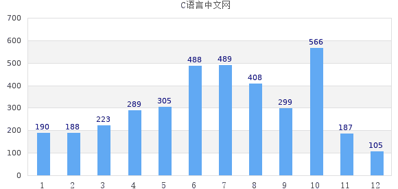

# PHP 使用 JpGraph 创建图像

> 原文：[`c.biancheng.net/view/8062.html`](http://c.biancheng.net/view/8062.html)

在介绍完 JpGraph 的安装配置之后，就可以使用 JpGraph 来创建图像了。为了更好的使用 JpGraph，首先我们来了解一下使用 JpGraph 编写生成图像的代码时通常需要哪些步骤。

#### 1) 包含所需要的类库文件

首先我们需要使用 require_once() 或者 include_once() 等函数将我们需要使用的类库文件引入到当前的代码中。例如：

include_once("./src/jpgraph.php");             // JpGraph 类的主类
include_once("./src/jpgraph_bar.php");      // JpGraph 类的柱状图扩展
include_once("./src/jpgraph_line.php");     // JpGraph 类的折线图扩展
include_once("./src/jpgraph_pie.php");      // JpGraph 类的饼状图扩展
include_once("./src/jpgraph_pie3d.php");  // JpGraph 类的 3D 饼状图扩展

#### 2) 初始化数据

引入需要的文件后，接下来就可以初始化图表中需要的数据了，如下所示：

$data = array();

这些数据可以是 PHP 程序中固定的数据；也可以是存储在数据库或者文本文件中的数据；还可以是通过 URL 参数传递的数据。

#### 3) 创建 Graph 类实例

有了所需的数据，接下来就需要来创建 Graph 类的实例了，我们可以通过创建实例的过程来设置生成图像的尺寸，如下所示：

$graph = new Graph(400, 500);

#### 4) 设置标题及其字体、颜色、位置

JpGraph 中提供了很多可以设置的参数，以便我们可以制作成多种多样的图像，例如下面这些：

$graph->title->Set('C 语言中文网');                                             // 图表标题文本
$graph->title->SetColor('white');                                              // 图表标题颜色
$graph->title->SetFont(FF_VERDANA,FS_BOLD,14);                // 图表标题字体

$graph->xaxis->title->Set('C 语言中文网');                                // X 轴标题文本
$graph->xaxis->title->SetColor('black');                                  // X 轴标题颜色
$graph->xaxis->title->SetFont(FF_VERDANA,FS_BOLD,10);    // X 轴标题字体
$graph->xaxis->SetTickLabels($xdata);                                   // 设置 X 轴标志数据(每个数据的标志)
$graph->xaxis->SetColor('black','white');                                // X 轴颜色
$graph->xaxis->SetFont(FF_VERDANA, FS_NORMAL,8);        // X 轴字体

$graph->yaxis->title->Set('C 语言中文网');                               // Y 轴标题文本
$graph->yaxis->title->SetColor('black');                                 // Y 轴标题颜色
$graph->yaxis->title->SetFont(FF_VERDANA,FS_BOLD,10);   // Y 轴标题字体
$graph->yaxis->SetColor('black','white');                                // Y 轴颜色
$graph->yaxis->SetFont(FF_VERDANA, FS_NORMAL,8);        // Y 轴字体

#### 5) 创建对应的图像实例

设置好图标的各个参数后，就可以创建指定图标的实例了，可以是折线图、柱形图、饼状图，3D 饼状图等，如下所示：

$bar = new BarPlot($data);                  //创建一个柱形图对象
$line = new LinePlot($data);                //创建折线图对象
$pieplot = new PiePlot3D($data);        //创建 3D 饼状图对象

#### 6) 将数据添加到图像上

$graph->Add();

#### 7) 显示图像

$graph->Stroke();

至此一个简单的图形就完成了

注意：JpGraph 会默认将汉字编码认定为 GB2312，并将之转化为 UTF-8 格式后再显示。所以如果文件的编码格式为 GB2312，只需将 SetFont() 方法的第一个参数设置为 FF_SIMSUN 即可，如果是 UTF-8 编码，则需要把汉字编码转化为 GB2312，这样汉字才能正常显示，转换编码方式可以使用 `iconv("UTF-8","GB2312",$x);`。

【示例】下面通过一个简单的示例来演示一下如何使用 JpGraph 类库来生成图表。

```

<?php
    //引入 jpgraph 相关类文件
    include("./src/jpgraph.php");
    include("./src/jpgraph_bar.php");
    //设定数据，当然也可以从数据库查询得到
    $datay=array(190,188,223,289,305,488,489,408,299,566,187,105);
    $graph=new Graph(600,300,"auto");//创建画布对象大小
    $graph->setScale("textlin"); //设置刻度样式，X 轴和 Y 轴
    $graph->yaxis->scale->SetGrace(20);
    $graph->SetShadow(); //创建画布阴影
    $graph->img->setMargin(40,30,30,40);//设置生成的图形与画布边缘的距离，顺序为左右上下
    $bplot=new BarPlot($datay);//创建矩形对象
    $bplot->SetFillcolor('orange');//设置柱形图颜色
    $graph->Add($bplot);//将柱形图添加到图像中
    $bplot->value->Show();//设置显示数字
    $bplot->value->SetFormat('%d');//在柱形图中显示格式化的图书销量
    $graph->SetMarginColor("lightblue");//设置画布背景色为淡蓝色
    $graph->title->Set(iconv('utf-8', 'gb2312', 'C 语言中文网'));//创建标题
    //设置 X 坐标轴文字
    $a=array("1 月","2 月","3 月","4 月","5 月","6 月","7 月","8 月","9 月","10 月","11 月","12 月");
    $graph->xaxis->SetTickLabels($a);//设置 X 轴
    $graph->title->SetFont(FF_SIMSUN);//设置标题的字体为"黑体",SetFont(x,x,x)第一个参数为字体，第二个参数为字     型，第三个参数为字号。
    $graph->xaxis->SetFont(FF_SIMSUN);//设置 X 轴的字体
    $graph->Stroke();//输出图像
?>
```

运行结果如下图所示：


图：使用 JpGraph 生成图表

提示：想要正常的在浏览器中输出图像需要先打开 JpGraph 的缓存功能，只需要我们在 jpg-config.inc.php 文件中将`define('CACHE_DIR','/tmp/jpgraph_cache/');`的注释解开；
然后修改 `define('USE_CACHE',False);` 为 `define('USE_CACHE',True);` 即可。

最后需要注意的是，JpGraph 缓存文件不允许重复写入，也就是说在调整代码后，刷新页面并不会更新图表的内容，需要手动删除缓存文件才行，缓存文件位于顶级目录下的 /tmp/jpgraph_cache/ 中，例如：如果我们的代码在 D 盘的某个目录中，则缓存文件位于 D:\tmp\jpgraph_cache 中。