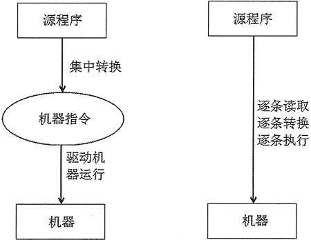

# Python 程序运行机制详解（入门必读）

Python 是一门解释型的编程语言，因此它具有解释型语言的运行机制。

计算机程序，其实就是一组计算机指令集，能真正驱动机器运行的是机器指令，但让普通开发者直接编写机器指令是不现实的，因此就出现了计算机高级语言。高级语言允许使用自然语言（通常就是英语）来编程，但高级语言的程序最终必须被翻译成机器指令来执行。

高级语言按程序的执行方式可以分为编译型和解释型两种。

编译型语言是指使用专门的编译器，针对特定平台（操作系统）将某种高级语言源代码一次性“翻译”成可被该平台硬件执行的机器码（包括机器指令和操作数），并包装成该平台所能识别的可执行程序的格式，这个转换过程称为编译（Compile）。编译生成的可执行程序可以脱离开发环境，在特定的平台上独立运行。

有些程序编译结束后，还可能需要对其他编译好的目标代码进行链接，即组装两个以上的目标代码模块生成最终的可执行程序，通过这种方式实现低层次的代码复用。

因为编译型语言是一次性编译成机器码的，所以可以脱离开发环境独立运行，而且通常运行效率较高。但因为编译型语言的程序被编译成特定平台上的机器码，因此编译生成的可执行程序通常无法移植到其他平台上运行，如果需要移植，则必须将源代码复制到特定平台上，针对特定平台进行修改，至少需要采用特定平台上的编译器重新编译。

现有的 C 、C++、Objective-C、Pascal 等高级语言都属于编译型语言。

解释型语言是指使用专门的解释器对源程序逐行解释成特定平台的机器码并立即执行的语言。解释型语言通常不会进行整体性的编译和链接处理，解释型语言相当于把编译型语言中的编译和解释过程混合到一起同时完成。

可以这样认为，每次执行解释型语言的程序都需要进行一次编译，因此解释型语言的程序运行效率通常较低，而且不能脱离解释器独立运行。但解释型语言有一个优势，就是跨平台比较容易，只需提供特定平台的解释器即可，每个特定平台上的解释器都负责将源程序解释成特定平台的机器指令。解释型语言可以方便地实现源程序级的移植，但这是以牺牲程序执行效率为代价的。

编译型语言和解释型语言的对比如图 1 所示。

图 1 编译型语言和解释型语言
此外，还有一种伪编译型语言，如 Visual Basic，它属于半编译型语言，并不是真正的编译型语言。它首先被编译成 P- 代码，并将解释引擎封装在可执行程序内，当运行程序时，P- 代码会被解析成真正的二进制代码。

从表面上看，Visual Basic 可以编译生成可执行的 EXE 文件，而且这个 EXE 文件也可以脱离开发环境，在特定平台上运行，非常像编译型语言。实际上，在这个 EXE 文件中，既有程序的启动代码，也有链接解释程序的代码，而这部分代码负责启动 Visual Basic 解释程序，再对 Visual Basic 代码进行解释井执行。

Python 语言属于解释型语言，因此运行 Python 程序时需要使用特定的解释器进行解释、执行。

解释型的 Python 语言天生具有跨平台的能力，只要为 Python 提供相应平台的解释器即可。

接下来将会介绍为不同平台安装 Python 解释器。