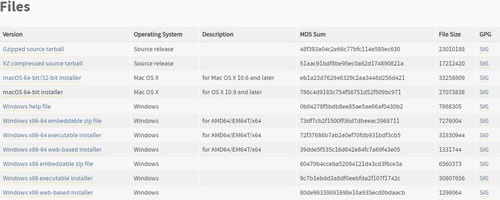
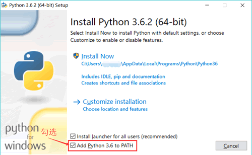
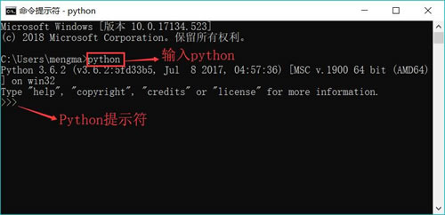

# Python 下载和安装过程详解（包含所有平台）

在开发 Python 程序之前，必须先完成一些准备工作，也就是在计算机上安装并配置 Python 解释器。

## 在 Windows 上安装 Python

在 Windows 上安装 Python 请按如下步骤进行。

首先，登录 [`www.python.org/downloads/`](https://www.python.org/downloads/) 页面，可以在该页面上看到两类下载链接，分别是 Python 3.x 和 Python 2.x 版本。由此可以看出，Python 同时维护 3.x 和 2.x 两个版本，这样既可让早期项目继续使用 Python 2.x，也可让新的项目使用 Python 3.x 。

在该页面下方的“Looking for a specific release？”列表中选择“Python 3.6.x”，可以看到如图 1 所示的下载列表。

图 1 下载 Python 的安装程序（[点此查看高清大图](http://c.biancheng.net/uploads/allimg/190210/2-1Z210135A0W8.jpg)）
在下载列表中以“Windows x86-64”开头的链接才是 64 位的 Python 安装程序；以“Windows x86”开头的链接是 32 位的 Python 安装程序。

根据 Windows 系统平台下载合适的安装程序（64 位的平台下载 64 位的安装程序，32 位的平台下载 32 位的安装程序），本教程以 64 位的安装程序为例，下载完成后得到 python-3.6.x-amd64.exe 安装文件。

如果在“Looking for a specific release？”列表中选择“Python 2.7.x”，也可以看到类似如图 1 所示的下载页面，通过这种方式下载平台对应的 Python 2.7.x 安装程序，下载完成后会得到一个 python-2.7.x.amd64.msi 安装文件。

双击 python-3.6.x-amd64.exe 文件，系统将会开启 Python 安装向导，如图 2 所示。

图 2 Python 安装向导
勾选“Add Python 3.6 to PATH” 复选框，可以将 Python 命令工具所在目录添加到系统 Path 环境变量中；单击“Customize installation”，可以在安装时指定自定义的安装路径。单击该选项即可开始安装。

在接下来的安装界面中只要改变 Python 的安装路径（建议安装在指定盘符的根路径下，比如安装在 D:\Python\ 目录下），其他地方使用默认选项即可。

安装完成后，启动 Windows 的命令行程序，在命令行窗口中输入“python”命令（字母 p 是小写的），如果出现 Python 提示符（>>>），就说明安装成功了，如图 3 所示。

图 3 Python 安装成功示意图
使用 python 命令启动的就是 Python 的交互式解释器，如果要退出交互式解释器，则可按“Ctrl+Z”快捷键或使用 exit() 命令。

使用 python-2.7.x.amd64.msi 文件安装 Python 解释器，同以上方式完全一样，根据选择安装其中一个即可。

在 Windows 的“开始”菜单中也可找到 Python 3.x 和 Python 2.x 的菜单组，在这些菜单组中可找到 Python 提供的 IDLE 工具，该工具是一个简易开发环境，提供了简易的 Python 编辑工具，编辑完成后按 F5 键即可运行 Python 程序。

## 在 Linux 上安装 Python

在通常情况下，Linux 系统默认自带了 Python 开发环境。下面以 Ubuntu 为例来介绍在 Linux 系统上安装 Python 的步骤。

首先，通过系统的 Terminal（可通过“Ctrl+Alt+T”快捷键）启动命令窗口，在该命令行窗口中输入 python 命令（注意，字母 p 是小写的）。

```
$ python
Python 2.7.12 (default, Dec 4 2017, 14:50:18)
[GCC 5.4.0 20160609] on linux2
Type "help","copyright","credits" or "license" for more information.
>>
```

上面的命令行同样显示了 Python 提示符（>>>），这表明该 Ubuntu 系统上已经存在 Python 2 开发环境，直接执行 python 命令来启动 Python 2 开发环境。

使用 python 命令启动的是 Python 的交互式解释器，如果希望退出该交互式解释器，则可按“Ctrl+D”快捷键或使用 exit() 命令。

如果要检查在 Ubuntu 系统上是否安装了 Python 3，则可在 Terminal 命令行窗口中输入 python3 命令。

```
$ Python3
Python 3.5.2 (default , Nov 23 2017 , 16:37:01)
[GCC 5.4.0 20160609] on linux2
Type "help","copyright","credits" or "license" for more information.
>>>
```

如果上面的命令行同样显示了 Python 提示符（>>>），则表明该 Ubuntu 系统上已经存在 Python 3 开发环境，执行 python 3 命令来启动 Python 3 开发环境。

如果嫌 Ubuntu 系统内置的 Python 3 版本不够新，或者希望安装指定版本的 Python 交互式解释器，那么只要执行如下两条简单的命令即可：

$sudo apt-get update
$sudo apt-get install python3.6

上面的第一条命令指定更新 /etc/apt/sources.list 和 /etc/apt/sources.list.d 所列出的源地址，这样保证能获得最新的软件包；第二条命令则指定安装 Python 3.6。

在成功执行上面的命令之后，再次在 Temlinal 命令行窗口中输入 python3 命令，即可看到 Python 3 交互式解释器更新到 Python 3.6。

## 在 Mac OS X 上安装 Python

最新版的 Mac OS X 系统通常己经安装了 Python 2 ，为了检查系统中是否己安装 Python，启动该系统的终端窗口（Terminal），在该窗口中输入“python”命令，将会看到系统提示 Python 2.x 己安装成功：

```
$ python
Python 2.7.10 (default , Jul 15 2017 , 17:16:57)
[GCC 4.2.1 Compatible Apple LLVM 9.0.0 (clang-900.0.31)] on darwin
Type "help","copyright","credits" or "license" for more information.
>>>
```

从上面的运行结果可以看出，该 Mac OS X 系统己经安装了 Python 2.7.10。

如果要检查 Mac OS X 上是否安装了 Python 3，可以在终端窗口中输入“python3” 命令，如果系统提示“command not found”，则表明该系统暂未安装 Python 3。

在 Mac OS X 上安装 Python 3 请按如下步骤进行。

登录 [`www.python.org/downloads/`](https://www.python.org/downloads/) 页面，在该页面下方的“Looking for a specific release？”列表中选择 “Python 3.6.x”，可以看到如图 1 所示的下载列表。

在下载列表中单击以“Mac OS X”开头的链接（在 Mac OS X 平台上 Python 安装程序同时兼容 32 位和 64 位系统），下载完成后得到一个 python-3.6.4-macosx10.6.pkg 安装包。

双击 python-3.6.4-macosx10.6.pkg 文件，系统将会开启 Python 安装向导，按照安装向导一步一步向下安装，一切保持默认即可。

安装完成后，电脑上将同时存在 Python 3.x 和 Python 2.x 的运行环境，直接在命令行窗口中输入“python”命令将会运行 Python 2；在命令行窗口中输入“python3”命令将会运行 Python3。

```
$ python3
Python 3.6.4 (v3.6.4:d48ecebad5, Dec 18 2017, 21:07:28)
[GCC 4.2.1 (Apple Inc. build 5666) (dot 3)] on darwin
Type "help","copyright","credits" or "license" for more information.
>>>
```

与 Windows 平台类似的是，安装 Python 3 之后，在 Mac OS X 的程序列表中同样会多出一个 IDLE 工具，该工具就是 Python 3 的简易开发环境。