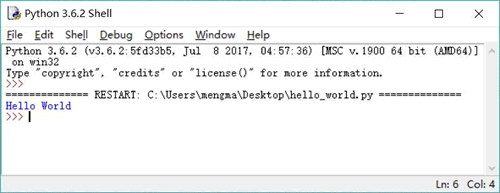
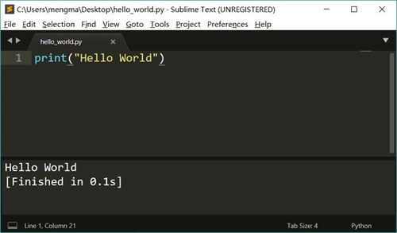

# 第一个最基础的 Python 程序

接下来按照惯例开始编写第一个 Python 程序：Hello World。

在安装 Python 时己经提供了一个简单的编辑工具：IDLE，开发者使用 IDLE 即可编写 Python 程序。

如果开发者不习惯使用 IDLE，则可使用任何熟悉的无格式文本编辑器编写 Python 程序，在 Windows 操作系统上可使用 EditPlus、Notepad++、UltraEdit 等程序；在 Linux 平台上可使用 vim、gedit 等工具；在 Mac OS X 上可使用 TextEdit、Sublime Text 等工具。

编写 Python 程序不要使用写字板，更不可使用 Word 等文档编辑器。因为写字板、Word 等工具是有格式的编辑器，当使用它们编辑一份文档时，这个文档中会包含一些隐藏的格式化字符，这些隐藏的字符会导致程序无法正常编译、运行。

在记事本中新建一个文本文件，并在该文件中输入如下代码：

print ("Hello World")

该 Python 程序只要一行代码，这行代码用于在屏幕（不是打印机）上输出一行简单的字符串。在编辑上面的 Python 文件时，请严格注意程序中单词的大小写，Python 程序严格区分大小写。

注意：Python 程序不要求语句使用分号结尾，当然也可以使用分号，但并没有实质的作用（除非同一行有更多的代码），而且这种做法也不是 Python 推荐的。

上面程序中的 print 在 Python 3 中是一个函数，而"Hello World"是传给该函数的一个参数，简而言之，这是一行“调用函数”的代码。

上面代码在 Python 2 中则应该写成如下形式：

print "Hello World"

此时的 print 不是函数，而是一条输出语句，后面的"Hello World"则是被输入的字符串。将上面文本文件保存为 hello_world.py，该文件就是 Python 程序的源程序。

## 使用 IDLE 运行 Python 程序

如果使用 IDLE 工具编辑 Python 程序，那么运行 Python 程序非常容易，在该工具的主菜单中单击"Run"->"Run Module"菜单项（或直接按 F5 键），即可运行编辑器内的 Python 程序。

运行后的效果如图 1 所示：

图 1 使用 IDLE 运行 Python 程序

## 使用命令行工具运行 Python 程序

运行 Python 程序实际上使用的是“python”命令，启动命令行窗口，进入 hello_world.py 所在的位置，在命令行窗口中直接输入如下命令：

python hello_world.py

运行上面的命令，将看到如下输出结果：

Hello World

这表明 Python 程序运行成功。

可以看出，使用“python ”命令的语法非常简单，该命令的语法格式如下：

python <Python 源程序路径>

当进入 Python 源程序所在位置运行该命令时，可以只输入文件名即可，这相当于使用文件名作为相对路径。

注意：Windows 系统不区分大小写，在 Windows 平台上输入 Python 源程序路径时可以不区分大小写，Mac OS X 或 Linux 系统都区分大小写，因此在这两个平台上输入 Python 源程序路径时一定要注意大小写问题。

如果在 Mac OS X 上使用 Sublime Text 编辑 Python 程序，可以集成“python”命令来运行 Python 程序，从而避免每次都启动终端窗口。

在 Sublime Text 工具中集成运行 Python 程序的“python”命令，可按如下步骤进行：

1.  在 Sublime Text 的主菜单中选择“Tools”->“Build System”->“New Build System...”菜单项，Sublime Text 工具将会打开一个新的配置文件，将该配置文件中的内容改为如下形式：

    {
    "cmd":["python3","-u","$file"]
    }

    上面文件指定运行“python3”命令来解释运行当前文件（$file 代表当前文件）。将该配置命名为“Python3.sublime-build”，并保存在默认目录下（当选择保存时 Sublime Text 默认打开的目录） 。

    Python3.sublime.build 就是 Sublime Text 自定义构建系统的配置文件，该文件默认保存在 /Users/用户名/Library/Application Support/Sublime Text 3/Packages/User 目录下。

2.  重启 Sublime Text 工具，此时即可在 Sublime Text 的“Tools->Build System”菜单中看到新增的“Python 3”菜单项，勾边该菜单项，就是告诉 Sublime Text 将要使用前一步定义的配置文件。
3.  选择 Sublime Text 的“Tools->Build”菜单项（或按“command+B”快捷键），即可运行当前打开的 Python 程序。在 Sublime Text 窗口底部将会显示运行结果，如图 2 所示。
    图 2 在 Sublime Text 中集成 Python 工具

上面介绍的方法是在 Sublime Text 中集成“python3”命令，实际上也可按该步骤“集成 python2”命令。