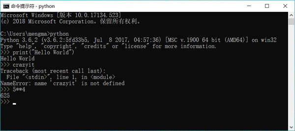

# Python 交互式解释器及用法

为了让开发者能快速学习、测试 Python 的各种功能，Python 提供的“python”命令不仅能用于运行 Python 程序，也可作为一个交互式解释器一一开发者逐行输入 Python 代码，它逐行解释执行。

当输入“python”命令时，可以看到如下输出结果：

```
C:\Users\mengma>python
Python 3.6.2 (v3.6.2:5fd33b5,Jul 8 2017, 04:57:36) [MSC v.1900 64 bit (AMD64)] on win32
Type "help","copyright","credits" or "license" for more information.
>>>
```

交互式解释器提示当前使用的是 Python 3.6.2，后面的“>>>”就是交互式解释器的提示符。

接下来用户可在该提示符后输入如下命令：

>>print ("Hello World")

按回车键后，交互式解释器就会解释执行这行代码，生成如下输出结果：

Hello World
>>>

从上面的输出结果可以看出，交互式解释器执行完 print("Hello World") 之后，再次显示“>>>”，用于提示用户可以再次输入 Python 命令。

如果随便输入一段内容，例如输入 crazyit，将可以看到如下输出结果：

```
>>>crazyit
Traceback (most recent call last ) :
    File "<stdin>", line 1，in<module>
NameError: name 'crazyit' is not defined
>>>
```

交互式解释器提示 crazyit 没有定义。这表明该交互式解释器完全可作为一个“快速演练场”，既可用于学习各种新语法，也可用于测试各种功能。

再比如输入 5**4（其中**是乘方运算符），可以看到如下输出：

>>> 5**4
625
>>>

从上面的输出结果可以看出，交互式解释器帮我们计算了 5 的 4 次方的结果。

需要说明的是，如果直接在 Python 程序中写中写 5**4 不会有任何效果，这是因为 5**4 只是表示一次计算，既没有让 Python 输出计算结果，也没有将该结果赋值给任何变量。但交互式解释器总是将所有表达式的值打印出来，这样才能与开发者交互，所以可以看到 5**4 的结果是 625。

实际上，你可以在其中输入任何复杂的算式（甚至包括复数运算，Python 支持复数运算），交互式解释器总可以帮你得到正确的结果。这也是很多非专业程序员喜欢 Python 的一个原因：即使你不是程序员，但只要输入想执行的运算，交互式解释器就能告诉你正确的答案。

从这个角度来看，Python 的交互式解释器相当于一个功能无比强大的“计算器”，比 Windows 、Mac OS X 系统自带的计算器的功能强大多了，让我们就从这个强大的“计算器”开始学习 Python 编程吧。

交互式解释器的运行效果如图 1 所示：

图 1 交互式解释器