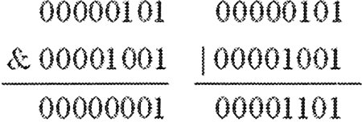
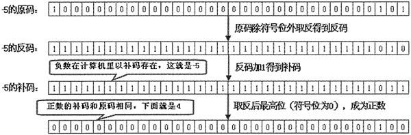
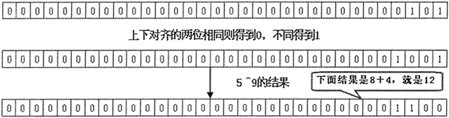
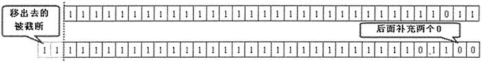
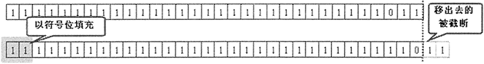

# Python 位运算符详解

位运算符通常在图形、图像处理和创建设备驱动等底层开发中使用。使用位运算符可以直接操作数值的原始 bit 位，尤其是在使用自定义的协议进行通信时，使用位运算符对原始数据进行编码和解码也非常有效。

位运算符对于初学者来说有些难度，因此初学者可先跳过本节内容。

Python 支持的位运算符有如下 6 个：

*   ＆：按位与。
*   |：按位或。
*   ^：按位异或。
*   ~：按位取反。
*   <<：左位移运算符。
*   >>：右位移运算符。

位运算符的运算法则如表 1 所示：

表 1 位运算符的运算法则

| 第一个操作数 | 第二个操作数 | 按位与 | 按位或 | 按位异或 |
| 0 | 0 | 0 | 0 | 0 |
| 0 | 1 | 0 | 1 | 1 |
| 1 | 0 | 0 | 1 | 1 |
| 1 | 1 | 1 | 1 | 0 |

按位非只需要一个操作数，这个运算符将把操作数在计算机底层的二进制码按位取反。如下代码测试了按位与和按位或的运行结果：

```
# 将输出 1
print(5 & 9)
# 将输出 13
print(5 | 9)
```

程序执行的结果是：5&9 的结果是 1，5|9 的结果是 13。下面介绍运算过程。

5 的二进制码是 00000101（省略了前面的 24 个 0），而 9 的二进制码是 00001001（省略了前面的 24 个 0）。运算过程如图 2 所示：

图 2 按位与和按位或的运算过程
下面是按位取反和按位异或的执行代码：

```
a = -5
# 将输出 4
print( ~a)
# 将输出 12
print(5 ^ 9)
```

程序执行 ~-5 的结果是 4，执行 5⁹ 的结果是 12。下面通过图 3 来介绍 ~-5 的运算过程：

图 3 ~-5 的运算过程（[点此查看高清大图](http://c.biancheng.net/uploads/allimg/190211/2-1Z2111H00EK.jpg)）
上面的运算过程涉及与计算机存储相关的内容。首先我们要明白：所有数值在计算机底层都是以二进制形式存在的，原码是直接将一个数值换算成二进制数。有符号整数的最高位是符号位，符号位为 0 代表正数，符号位为 1 代表负数。无符号整数则没有符号位，因此无符号整数只能表示 0 和正数。

为了方便计算，计算机底层以补码的形式保存所有的整数。补码的计算规则是：正数的补码和原码完全相同，负数的补码是其反码 +1；反码是对原码按位取反，只是最高位（符号位）保持不变。

5 ^ 9 进行的是异或运算，运算过程如图 4 所示。

图 4 5 ^ 9 的运算过程
左移运算符是将操作数的二进制码整体左移指定位数，左移后右边空出来的位以 0 来填充。例如如下代码：

```
# 输出 20
print(5 << 2)
# 输出-20
print(-5 << 2)
```

图 5 示范了 -5 左移两位的运算过程。

图 5 -5 左移两位的运算过程
在图 5 中，上面的 32 位数是 -5 的补码，左移两位后得到一个二进制补码，这个二进制补码的最高位是 1，表明是一个负数，换算成十进制数就是 -20。

Python 的右移运算符为：>>。对于“>>”运算符而言，把第一个操作数的二进制码右移指定位数后，左边空出来的位以原来的符号位来填充。即如果第一个操作数原来是正数，则左边补 0；如果第一个操作数是负数，则左边补 1。

请看下面代码：

```
b = -5
# 输出-2
print(b >> 2)
```

图 6 给出了-5 >> 2 的运算过程。

图 6 -5>>2 的运算过程
从图 6 来看，-5 右移两位后左边空出两位，空出来的两位以符号位来填充。从图 6 可以看出，右移运算后得到的结果的正负与第一个操作数的正负相同。右移后的结果依然是一个负数，这是一个二进制补码，换算成十进制数就是 -2。

必须指出的是，位移运算符只适合对整型数进行运算。

在进行位移运算时，不难发现，左移 n 位就相当于来以 2 的 n 次方，右移 n 位则相当于除以 2 的 n 次方（如果不能整除，实际返回的结果是小于除得结果数值的最大整数的）。不仅如此，进行位移运算只是得到了一个新的运算结果，而原来的操作数本身是不会改变的。