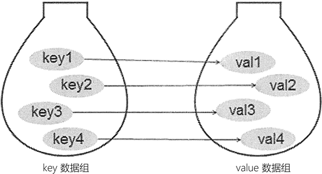

# Python 字典及基本操作（超级详细）

字典也是 Python 提供的一种常用的数据结构，它用于存放具有映射关系的数据。

比如有份成绩表数据，语文：79，数学：80，英语：92，这组数据看上去像两个列表，但这两个列表的元素之间有一定的关联关系。如果单纯使用两个列表来保存这组数据，则无法记录两组数据之间的关联关系。

为了保存具有映射关系的数据，Python 提供了字典，字典相当于保存了两组数据，其中一组数据是关键数据，被称为 key；另一组数据可通过 key 来访问，被称为 value。形象地看，字典中 key 和 value 的关联关系如图 1 所示：

图 1 字典保存的关联数据
由于字典中的 key 是非常关键的数据，而且程序需要通过 key 来访问 value，因此字典中的 key 不允许重复。

程序既可使用花括号语法来创建字典，也可使用 dict() 函数来创建字典。实际上，dict 是一种类型，它就是 Python 中的字典类型。

在使用花括号语法创建字典时，花括号中应包含多个 key-value 对，key 与 value 之间用英文冒号隔开；多个 key-value 对之间用英文逗号隔开。

如下代码示范了使用花括号语法创建字典：

```
scores = {'语文': 89, '数学': 92, '英语': 93}
print(scores)
# 空的花括号代表空的 dict
empty_dict = {}
print(empty_dict)
# 使用元组作为 dict 的 key
dict2 = {(20, 30):'good', 30:'bad'}
print(dict2)
```

上面程序中第 1 行代码创建了一个简单的 dict，该 dict 的 key 是字符串，value 是整数；第 4 行代码使用花括号创建了一个空的字典；第 7 行代码创建的字典中第一个 key 是元组，第二个 key 是整数值，这都是合法的。

需要指出的是，元组可以作为 dict 的 key，但列表不能作为元组的 key。这是由于 dict 要求 key 必须是不可变类型，但列表是可变类型，因此列表不能作为元组的 key。

在使用 dict() 函数创建字典时，可以传入多个列表或元组参数作为 key-value 对，每个列表或元组将被当成一个 key-value 对，因此这些列表或元组都只能包含两个元素。例如如下代码：

```
vegetables = [('celery', 1.58), ('brocoli', 1.29), ('lettuce', 2.19)]
# 创建包含 3 组 key-value 对的字典
dict3 = dict(vegetables)
print(dict3) # {'celery': 1.58, 'brocoli': 1.29, 'lettuce': 2.19}
cars = [['BMW', 8.5], ['BENS', 8.3], ['AUDI', 7.9]]
# 创建包含 3 组 key-value 对的字典
dict4 = dict(cars)
print(dict4) # {'BMW': 8.5, 'BENS': 8.3, 'AUDI': 7.9}
```

如果不为 dict() 函数传入任何参数，则代表创建一个空的字典。例如如下代码：

```
# 创建空的字典
dict5 = dict()
print(dict5) # {}
```

还可通过为 dict 指定关键字参数创建字典，此时字典的 key 不允许使用表达式。例如如下代码：

```
# 使用关键字参数来创建字典
dict6 = dict(spinach = 1.39, cabbage = 2.59)
print(dict6) # {'spinach': 1.39, 'cabbage': 2.59}
```

上面粗体字代码在创建字典时，其 key 直接写 spinach、cabbage，不需要将它们放在引号中。

## 字典的基本用法

对于初学者而言，应牢记字典包含多个 key-value 对，而 key 是字典的关键数据，因此程序对字典的操作都是基于 key 的。基本操作如下：

*   通过 key 访问 value 。
*   通过 key 添加 key-value 对。
*   通过 key 删除 key-value 对。
*   通过 key 修改 key-value 对。
*   通过 key 判断指定 key-value 对是否存在。
*   通过 key 访问 value 使用的也是方括号语法，就像前面介绍的列表和元组一样，只是此时在方括号中放的是 key，而不是列表或元组中的索引。

如下代码示范了通过 key 访问 value：

```
scores = {'语文': 89}
# 通过 key 访问 value
print(scores['语文'])
```

如果要为 dict 添加 key-value 对，只需为不存在的 key 赋值即可：

```
# 对不存在的 key 赋值，就是增加 key-value 对
scores['数学'] = 93
scores[92] = 5.7
print(scores) # {'语文': 89, '数学': 93, 92: 5.7}
```

如果要删除宇典中的 key-value 对，则可使用 del 语句。例如如下代码：

```
# 使用 del 语句删除 key-value 对
del scores['语文']
del scores['数学']
print(scores) # {92: 5.7}
```

如果对 dict 中存在的 key-value 对赋值，新赋的 value 就会覆盖原有的 value，这样即可改变 dict 中的 key-value 对。例如如下代码：

```
cars = {'BMW': 8.5, 'BENS': 8.3, 'AUDI': 7.9}
# 对存在的 key-value 对赋值，改变 key-value 对
cars['BENS'] = 4.3
cars['AUDI'] = 3.8
print(cars) # {'BMW': 8.5, 'BENS': 4.3, 'AUDI': 3.8}
```

如果要判断字典是否包含指定的 key，则可以使用 in 或 not in 运算符。需要指出的是，对于 dict 而言，in 或 not in 运算符都是基于 key 来判断的。例如如下代码：

```
# 判断 cars 是否包含名为'AUDI'的 key
print('AUDI' in cars) # True
# 判断 cars 是否包含名为'PORSCHE'的 key
print('PORSCHE' in cars) # False
print('LAMBORGHINI' not in cars) # True
```

通过上面介绍可以看出，字典的 key 是它的关键。换个角度来看，字典的 key 就相当于它的索引，只不过这些索引不一定是整数类型，字典的 key 可以是任意不可变类型。

可以这样说，字典相当于索引是任意不可变类型的列表：而列表则相当于 key 只能是整数的字典。因此，如果程序中要使用的字典的 key 都是整数类型，则可考虑能否换成列表。

此外，还有一点需要指出，列表的索引总是从 0 开始、连续增大的；但字典的索引即使是整数类型，也不需要从 0 开始，而且不需要连续。因此，列表不允许对不存在的索引赋值：但字典则允许直接对不存在的 key 赋值，这样就会为字典增加一个 key-value 对。

列表不允许对不存在的索引赋值，但字典则允许直接对不存在的 key 赋值。

## 字典的常用方法

字典由 dict 类代表，因此我们同样可使用 dir(dict) 来查看该类包含哪些方法。在交互式解释器中输入 dir(dict) 命令，将看到如下输出结果：

>>> dir(dict)
['clear', 'copy', 'fromkeys', 'get', 'items', 'keys', 'pop', 'popitem', 'setdefault', 'update', 'values']
>>>

下面介绍 dict 的一些方法。

#### clear()方法

clear() 用于清空字典中所有的 key-value 对，对一个字典执行 clear() 方法之后，该字典就会变成一个空字典。例如如下代码：

```
cars = {'BMW': 8.5, 'BENS': 8.3, 'AUDI': 7.9}
print(cars) # {'BMW': 8.5, 'BENS': 8.3, 'AUDI': 7.9}
# 清空 cars 所有 key-value 对
cars.clear()
print(cars) # {}
```

#### get()方法

get() 方法其实就是根据 key 来获取 value，它相当于方括号语法的增强版，当使用方括号语法访问并不存在的 key 时，字典会引发 KeyError 错误；但如果使用 get() 方法访问不存在的 key，该方法会简单地返回 None，不会导致错误。例如如下代码：

```
cars = {'BMW': 8.5, 'BENS': 8.3, 'AUDI': 7.9}
# 获取'BMW'对应的 value
print(cars.get('BMW')) # 8.5
print(cars.get('PORSCHE')) # None
print(cars['PORSCHE']) # KeyError
```

#### update()方法

update() 方法可使用一个字典所包含的 key-value 对来更新己有的字典。在执行 update() 方法时，如果被更新的字典中己包含对应的 key-value 对，那么原 value 会被覆盖；如果被更新的字典中不包含对应的 key-value 对，则该 key-value 对被添加进去。例如如下代码：

```
cars = {'BMW': 8.5, 'BENS': 8.3, 'AUDI': 7.9}
cars.update({'BMW':4.5, 'PORSCHE': 9.3})
print(cars)
```

从上面的执行过程可以看出，由于被更新的 dict 中己包含 key 为“AUDI”的 key-value 对，因此更新时该 key-value 对的 value 将被改写；但如果被更新的 dict 中不包含 key 为“PORSCHE”的 key-value 对，那么更新时就会为原字典增加一个 key-value 对。

#### items()、keys()、values()

items()、keys()、values() 分别用于获取字典中的所有 key-value 对、所有 key、所有 value。这三个方法依次返回 dict_items、dict_keys 和 dict_values 对象，Python 不希望用户直接操作这几个方法，但可通过 list() 函数把它们转换成列表。如下代码示范了这三个方法的用法：

```
cars = {'BMW': 8.5, 'BENS': 8.3, 'AUDI': 7.9}
# 获取字典所有的 key-value 对，返回一个 dict_items 对象
ims = cars.items()
print(type(ims)) # <class 'dict_items'>
# 将 dict_items 转换成列表
print(list(ims)) # [('BMW', 8.5), ('BENS', 8.3), ('AUDI', 7.9)]
# 访问第 2 个 key-value 对
print(list(ims)[1]) # ('BENS', 8.3)
# 获取字典所有的 key，返回一个 dict_keys 对象
kys = cars.keys()
print(type(kys)) # <class 'dict_keys'>
# 将 dict_keys 转换成列表
print(list(kys)) # ['BMW', 'BENS', 'AUDI']
# 访问第 2 个 key
print(list(kys)[1]) # 'BENS'
# 获取字典所有的 value，返回一个 dict_values 对象
vals = cars.values()
# 将 dict_values 转换成列表
print(type(vals)) # [8.5, 8.3, 7.9]
# 访问第 2 个 value
print(list(vals)[1]) # 8.3
```

从上面代码可以看出，程序调用字典的 items()、keys()、values() 方法之后，都需要调用 list() 函数将它们转换为列表，这样即可把这三个方法的返回值转换为列表。

在 Python 2.x 中，items()、keys()、values() 方法的返回值本来就是列表，完全可以不用 list() 函数进行处理。当然，使用 list() 函数处理也行，列表被处理之后依然是列表。

#### pop 方法

pop() 方法用于获取指定 key 对应的 value，并删除这个 key-value 对。如下方法示范了 pop() 方法的用法：

```
cars = {'BMW': 8.5, 'BENS': 8.3, 'AUDI': 7.9}
print(cars.pop('AUDI')) # 7.9
print(cars) # {'BMW': 8.5, 'BENS': 8.3}
```

此程序中，第 2 行代码将会获取“AUDI”对应的 value，并删除该 key-value 对。

#### popitem()方法

popitem() 方法用于随机弹出字典中的一个 key-value 对。

此处的随机其实是假的，正如列表的 pop() 方法总是弹出列表中最后一个元素，实际上字典的 popitem() 其实也是弹出字典中最后一个 key-value 对。由于字典存储 key-value 对的顺序是不可知的，因此开发者感觉字典的 popitem() 方法是“随机”弹出的，但实际上字典的 popitem() 方法总是弹出底层存储的最后一个 key-value 对。

如下代码示范了 popitem() 方法的用法：

```
cars = {'AUDI': 7.9, 'BENS': 8.3, 'BMW': 8.5}
print(cars)
# 弹出字典底层存储的最后一个 key-value 对
print(cars.popitem()) # ('AUDI', 7.9)
print(cars) # {'BMW': 8.5, 'BENS': 8.3}
```

由于实际上 popitem 弹出的就是一个元组，因此程序完全可以通过序列解包的方式用两个变量分别接收 key 和 value。例如如下代码：

```
# 将弹出项的 key 赋值给 k、value 赋值给 v
k, v = cars.popitem()
print(k, v) # BENS 8.3
```

#### setdefault()方法

setdefault() 方法也用于根据 key 来获取对应 value 的值。但该方法有一个额外的功能，即当程序要获取的 key 在字典中不存在时，该方法会先为这个不存在的 key 设置一个默认的 value，然后再返回该 key 对应的 value。

总之，setdefault() 方法总能返回指定 key 对应的 value；如果该 key-value 对存在，则直接返回该 key 对应的 value；如果该 key-value 对不存在，则先为该 key 设置默认的 value，然后再返回该 key 对应的 value。

如下代码示范了 setdefault() 方法的用法：

```
cars = {'BMW': 8.5, 'BENS': 8.3, 'AUDI': 7.9}
# 设置默认值，该 key 在 dict 中不存在，新增 key-value 对
print(cars.setdefault('PORSCHE', 9.2)) # 9.2
print(cars)
# 设置默认值，该 key 在 dict 中存在，不会修改 dict 内容
print(cars.setdefault('BMW', 3.4)) # 8.5
print(cars)
```

#### fromkeys()方法

fromkeys() 方法使用给定的多个 key 创建字典，这些 key 对应的 value 默认都是 None；也可以额外传入一个参数作为默认的 value。该方法一般不会使用字典对象调用（没什么意义），通常会使用 dict 类直接调用。例如如下代码：

```
# 使用列表创建包含 2 个 key 的字典
a_dict = dict.fromkeys(['a', 'b'])
print(a_dict) # {'a': None, 'b': None}
# 使用元组创建包含 2 个 key 的字典
b_dict = dict.fromkeys((13, 17))
print(b_dict) # {13: None, 17: None}
# 使用元组创建包含 2 个 key 的字典，指定默认的 value
c_dict = dict.fromkeys((13, 17), 'good')
print(c_dict) # {13: 'good', 17: 'good'}
```

## 使用字典格式化字符串

前面章节介绍过，在格式化字符串时，如果要格式化的字符串模板中包含多个变量，后面就需要按顺序给出多个变量，这种方式对于字符串模板中包含少量变量的情形是合适的，但如果字符串模板中包含大量变量，这种按顺序提供变量的方式则有些不合适。可改为在字符串模板中按 key 指定变量，然后通过字典为字符串模板中的 key 设置值。

例如如下程序：

```
# 字符串模板中使用 key
temp = '教程是:%(name)s, 价格是:%(price)010.2f, 出版社是:%(publish)s'
book = {'name':'Python 基础教程', 'price': 99, 'publish': 'C 语言中文网'}
# 使用字典为字符串模板中的 key 传入值
print(temp % book)
book = {'name':'C 语言小白变怪兽', 'price':159, 'publish': 'C 语言中文网'}
# 使用字典为字符串模板中的 key 传入值
print(temp % book)
```

运行上面程序，可以看到如下输出结果：

教程是:Python 基础教程, 价格是:0000099.00, 出版社是:C 语言中文网
教程是:C 语言小白变怪兽, 价格是:0000159.00, 出版社是:C 语言中文网