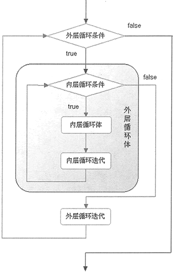

# Python（for 和 while）循环嵌套及用法

Python 程序中，如果把一个循环放在另一个循环体内，那么就可以形成循环嵌套。循环嵌套既可以是 for-in 循环嵌套 while 循环，也可以是 while 循环嵌套 do while 循环，即各种类型的循环都可以作为外层循环，各种类型的循环也都可以作为内层循环。

当程序遇到循环嵌套时，如果外层循环的循环条件允许，则开始执行外层循环的循环体，而内层循环将被外层循环的循环体来执行（只是内层循环需要反复执行自己的循环体而己）。当内层循环执行结束且外层循环的循环体也执行结束后，将再次计算外层循环的循环条件，决定是否再次开始执行外层循环的循环体。

根据上面分析，假设外层循环的循环次数为 n 次，内层循环的循环次数为 m 次，那么内层循环的循环体实际上需要执行 `n × m` 次。循环嵌套的执行流程图如图 1 所示：

图 1 循环嵌套的执行流程图
从图 1 来看，循环嵌套就是把内层循环当成外层循环的循环休。只有内层循环的循环条件为假时，才会完全跳出内层循环，才可以结束外层循环的当次循环，开始下一次循环。下面是一个循环嵌套的示例代码：

```
# 外层循环
for i in range(0, 5) :
    j = 0
    # 内层循环
    while j < 3 :
        print("i 的值为: %d , j 的值为: %d" % (i, j))
        j += 1
```

运行上面程序，将看到如下运行结果：

i 的值为: 0 , j 的值为: 0
i 的值为: 0 , j 的值为: 1
i 的值为: 0 , j 的值为: 2
......

从上面的运行结果可以看出，当进入嵌套循环时，循环变量 i 开始为 0，这时即进入了外层循环。当进入外层循环后，内层循环把 i 当成一个普通变量，其值为 0。在外层循环的当次循环中，内层循环就是一个普通循环。

实际上，嵌套循环不仅可以是两层嵌套，还可以是三层嵌套、四层嵌套……不论循环如何嵌套，都可以把内层循环当成外层循环的循环体来对待，区别只是这个循环体中包含了需要反复执行的代码。