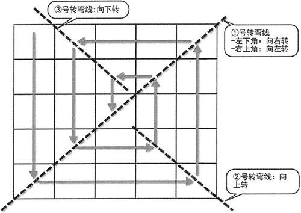

# Python 项目实战：绕圈圈面试题

下面是来自某知名公司的一道“面试题”：给定 4，应该输出如下形式的数据：

01 12 11 10
02 13 16 09
03 14 15 08
04 05 06 07

给定 5，应该输出如下形式的数据：

01 16 15 14 13
02 17 24 23 12
03 18 25 22 11
04 19 20 21 10
05 06 07 08 09

仔细观察上面的试题，不难发现程序就是“绕圈圈”填入整数，如图 1 所示：

图 1 填数规则
掌握上面的规律之后，我们打算使用列表嵌套列表（相当于二维列表）的方式来存储这些整数，将数值存入嵌套列表时需要遵守这种“绕圈圈”的规则，然后再以二维方式将这个嵌套列表打印出来。

为了控制“绕圈”，该程序的关键点就是控制绕固的拐弯点。在图 1 中标出的对角线上的位置，就是重要的拐弯点。

找到图中 ①、②、③ 号转弯线之后，可以发现如下规则：

*   位于 ① 号转弯线的行索引与列索引总和为 n - 1（即给定整数值减 1）。
*   位于 ② 号转弯线的行索引与列索引相等。
*   位于 ③ 号转弯线的行索引等于列索引减 1。

总结出上面的规则之后，接下来就可实现如下程序：

```
SIZE = 7
array = [[0] * SIZE]
# 创建一个长度 SIZE * SIZE 的二维列表
for i in range(SIZE - 1):
    array += [[0] * SIZE]
# 该 orient 代表绕圈的方向
# 其中 0 代表向下，1 代表向右，2 代表向左，3 代表向上
orient = 0
# 控制将 1~SIZE * SIZE 的数值填入二维列表中
# 其中 j 控制行索引，k 控制列索引
j = 0
k = 0
for i in range(1, SIZE * SIZE + 1) :
    array[j][k] = i
    # 如果位于图 4.2 中①号转弯线上
    if j + k == SIZE - 1 :
        # j>k，位于左下角
        if j > k :
            orient = 1
        # 位于右上角
        else :
            orient = 2
    # 如果位于图 5.2 中②号转弯线上
    elif (k == j) and (k >= SIZE / 2) :
        orient = 3
    # 如果 j 位于图 5.2 中③号转弯线上
    elif (j == k - 1) and (k <= SIZE / 2) :
        orient = 0
    # 根据方向来控制行索引、列索引的改变
    # 如果方向为向下绕圈
    if orient == 0 :
        j += 1
    # 如果方向为向右绕圈
    elif orient == 1:
        k += 1
    # 如果方向为向左绕圈
    elif orient == 2:
        k -= 1
    # 如果方向为向上绕圈
    elif orient == 3:
        j -= 1
# 采用遍历输出上面的二维列表
for i in range(SIZE) :
    for j in range(SIZE) :
        print('%02d ' % array[i][j], end = "")
    print("")
```

上面程序的重点就在于当处于转弯线上时绕圈的方向。一旦正确控制了绕圈的方向，接下来就可通过对 j（行索引）、k（列索引）的增减来控制绕圈了。

运行该程序，可以看到如下输出结果：

01 24 23 22 21 20 19
02 25 40 39 38 37 18
03 26 41 48 47 36 17
04 27 42 49 46 35 16
05 28 43 44 45 34 15
06 29 30 31 32 33 14
07 08 09 10 11 12 13