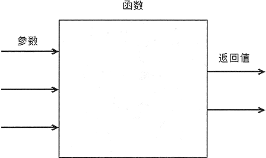

# Python 函数（函数定义、函数调用）用法详解

函数是 Python 程序的重要组成单位，一个 Python 程序可以由很多个函数组成。前面我们己经用过大量函数，如 len()、max() 等，使用函数是真正开始编程的第一步。

比如在程序中定义了一段代码，这段代码用于实现一个特定的功能。问题来了，如果下次需要实现同样的功能，难道要把前面定义的代码复制一次？如果这样做实在太傻了，这意味着每次当程序需要实现该功能时，都要将前面定义的代码复制一次。

正确的做法是，将实现特定功能的代码定义成一个函数，每次当程序需要实现该功能时，只要执行（调用）该函数即可。

通俗来讲，所谓函数，就是指为一段实现特定功能的代码“取”一个名字，以后即可通过该名字来执行（调用）该函数。

通常，函数可以接收零个或多个参数，也可以返回零个或多个值。从函数使用者的角度来看，函数就像一个“黑匣子”，程序将零个或多个参数传入这个“黑匣子”，该“黑匣子”经过一番计算即可返回零个或多个值。

对于“黑匣子”的内部细节（就是函数的内部实现细节），函数的使用者并不需要关心。就像前面在调用 len()、max()、min() 等函数时，我们只负责传入参数、接收返回值，至于函数内部的实现细节，我们并不关心。

如图 1 所示为函数调用示意图：

图 1 函数调用示意图
从函数定义者（实现函数的人）的角度来看，其至少需要想清楚以下 3 点：

1.  函数需要几个关键的需要动态变化的数据，这些数据应该被定义成函数的参数。
2.  函数需要传出几个重要的数据（就是调用该函数的人希望得到的数据），这些数据应该被定义成返回值。
3.  函数的内部实现过程。

不难看出，定义函数比调用函数要难得多，而本节正是教你如何定义函数的。不过不用担心，对于实现过程复杂的函数，定义本身就很费力，有时候实现不出来也完全正常。

## 函数定义和调用

在使用函数之前必须先定义函数，定义函数的语法格式如下：

def 函数名(形参列表):
    //由零条到多条可执行语句组成的函数
    [return [返回值]]

Python 声明函数必须使用 def 关键字，对函数语法格式的详细说明如下：

*   函数名：从语法角度来看，函数名只要是一个合法的标识符即可；从程序的可读性角度来看，函数名应该由一个或多个有意义的单词连缀而成，每个单词的字母全部小写，单词与单词之间使用下画线分隔。
*   形参列表：用于定义该函数可以接收的参数。形参列表由多个形参名组成，多个形参名之间以英文逗号（,）隔开。一旦在定义函数时指定了形参列表，调用该函数时就必须传入到应的参数值，也就是说，谁调用函数谁负责为形参赋值。

在函数体中多条可执行语句之间有严格的执行顺序，排在函数体前面的语句总是先执行，排在函数体后面的语句总是后执行。

下面程序定义了两个函数，井在程序中调用它们：

```
# 定义一个函数，声明 2 个形参
def my_max(x, y) :
    # 定义一个变量 z，该变量等于 x、y 中较大的值
    z = x if x > y else y
    # 返回变量 z 的值
    return z
# 定义一个函数，声明一个形参
def say_hi(name) :
    print("===正在执行 say_hi()函数===")
    return name + "，您好！"
a = 6
b = 9
# 调用 my_max()函数，将函数返回值赋值给 result 变量
result = my_max(a , b) # ①
print("result:", result)
# 调用 say_hi()函数，直接输出函数的返回值
print(say_hi("孙悟空")) # ②
```

上面程序中定义了两个函数：my_max() 与 say_hi()，并在程序 ① 号、② 号代码处分别调用了 my_max() 和 say_hi() 这两个函数。从下面的运行结果可以看出，当程序调用一个函数时，既可以把调用函数的返回值赋值给指定变量，也可以将函数的返回值传给另一个函数，作为另一个函数的参数。

运行上面程序，将可以看到如下运行结果：

result: 9
===正在执行 say_hi()函数===
孙悟空，您好！

在函数体中使用 return 语句可以显式地返回一个值，return 语句返回的值既可是有值的变量，也可是一个表达式。

例如上面的 my_max() 函数，实际上也可简写为如下形式：

```
def my_max(x, y) :
    # 返回一个表达式
    return x if x > y else y
```

## 为函数提供说明文档

前面介绍过可以使用 Python 内置的 help() 函数查看其他函数的帮助文档，我们也经常通过 help() 函数查看指定函数的帮助信息，这对于 Python 开发者来说非常重要。

我们还可以为函数编写说明文档，只要把一段字符串放在函数声明之后、函数体之前，这段字符串将被作为函数的部分，这个文档就是函数的说明文档。

程序既可通过 help() 函数查看函数的说明文档，也可通过函数的 __doc__ 属性访问函数的说明文档。下面程序示范了为函数编写说明文档：

```
def my_max(x, y) :
    '''
    获取两个数值之间较大数的函数。

    my_max(x, y)
        返回 x、y 两个参数之间较大的那个
    '''
    # 定义一个变量 z，该变量等于 x、y 中较大的值
    z = x if x > y else y
    # 返回变量 z 的值
    return z
# 使用 help()函数查看 my_max 的帮助文档
help(my_max)
print(my_max.__doc__)
```

上面程序使用多行字符串的语法为 my_max() 函数编写了说明文档，接下来程序既可通过 help() 函数查看该函数的说明文档，也可通过 __doc__ 属性访问该函数的说明文档。

运行上面代码，可以看到如下运行结果：

Help on function my_max in module __main__:

my_max(x, y)
    获取两个数值之间较大数的函数。

    my_max(x, y)
        返回 x、y 两个参数之间较大的那个

    获取两个数值之间较大数的函数。

    my_max(x, y)
        返回 x、y 两个参数之间较大的那个