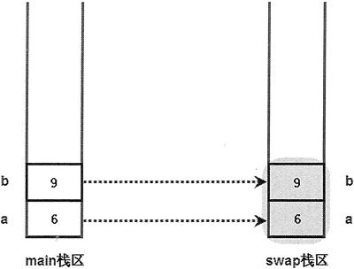

# Python 函数参数传递机制（超级详细）

Python 的参数值是如何传入函数的呢？这是由 Python 函数的参数传递机制来控制的。Python 中函数的参数传递机制都是“值传递”。所谓值传递，就是将实际参数值的副本（复制品）传入函数，而参数本身不会受到任何影响。

Python 里的参数传递类似于《西游记》里的孙悟空，它复制一个假孙悟空，假孙悟空具有的能力和真孙悟空相同，可除妖或被砍头。但不管这个假孙悟空遇到什么事，真孙悟空都不会受到任何影响。与此类似，传入函数的是实际参数值的复制品，不管在函数中对这个复制品如何操作，实际参数值本身不会受到任何影响。

下面程序演示了函数参数传递的效果：

```
def swap(a , b) :
    # 下面代码实现 a、b 变量的值交换
    a, b = b, a
    print("swap 函数里，a 的值是", \
        a, "；b 的值是", b)
a = 6
b = 9
swap(a , b)
print("交换结束后，变量 a 的值是", \
    a , "；变量 b 的值是", b)
```

运行上面程序，将看到如下运行结果：

swap 函数里，a 的值是 9 ；b 的值是 6
交换结束后，变量 a 的值是 6 ；变量 b 的值是 9

从上面的运行结果来看，在 swap() 函数里，a 和 b 的值分别是 9、6，交换结束后，变量 a 和 b 的值依然是 6、9。从这个运行结果可以看出，程序中实际定义的变量 a 和 b，并不是 swap() 函数里的 a 和 b 。

正如前面所讲的，swap() 函数里的 a 和 b 只是主程序中变量 a 和 b 的复制品。下面通过示意图来说明上面程序的执行过程。

上面程序开始定义了 a、b 两个局部变量，这两个变量在内存中的存储示意图如图 1 所示。

图 1 主栈区中 a、b 变量存储示意图
当程序执行 swap() 函数时，系统进入 swap() 函数，并将主程序中的 a、b 变量作为参数值传入 swap() 函数，但传入 swap() 函数的只是 a、b 的副本，而不是 a、b 本身。进入 swap() 函数后，系统中产生了 4 个变量，这 4 个变量在内存中的存储示意图如图 2 所示。

图 2 主栈区的变量作为参数值传入 swap() 函数后存储示意图
当在主程序中调用 swap() 函数时，系统分别为主程序和 swap() 函数分配两块栈区，用于保存它们的局部变量。将主程序中的 a、b 变量作为参数值传入 swap() 函数，实际上是在 swap() 函数栈区中重新产生了两个变量 a、b，并将主程序栈区中 a、b 变量的值分别赋值给 swap() 函数栈区中的 a、b 参数（就是对 swap() 函数的 a、b 两个变量进行初始化）。此时，系统存在两个 a 变量、两个 b 变量，只是存在于不同的栈区中而己。

程序在 swap() 函数中交换 a、b 两个变量的值，实际上是对图 2 中灰色区域的 a、b 变量进行交换。交换结束后，输出 swap() 函数中 a、b 变量的值，可以看到 a 的值为 9，b 的值为 6，此时在内存中的存储示意图如图 3 所示。

图 3 swap() 函数中 a、b 交换之后的存储示意图
对比图 3 与图 1，可以看到两个示意图中主程序栈区中 a、b 的值并未有任何改变，程序改变的只是 swap() 函数栈区中 a、b 的值。这就是值传递的实质：当系统开始执行函数时，系统对形参执行初始化，就是把实参变量的值赋给函数的形参变量，在函数中操作的并不是实际的实参变量。

根据 Python 的参数传递机制，我们知道：传入函数的只是参数的副本，因此程序在函数中对参数赋值并不会影响参数本身。如果参数本身是一个可变对象（比如列表、字典等），此时虽然 Python 采用的也是值传递方式，但许多初学者可能会对这种类型的参数传递产生一些误会。下面程序示范了这种类型的参数传递的效果：

```
def swap(dw):
    # 下面代码实现 dw 的 a、b 两个元素的值交换
    dw['a'], dw['b'] = dw['b'], dw['a']
    print("swap 函数里，a 元素的值是",\
        dw['a'], "；b 元素的值是", dw['b'])
dw = {'a': 6, 'b': 9}
swap(dw)
print("交换结束后，a 元素的值是",\
    dw['a'], "；b 元素的值是", dw['b'])
```

运行上面程序，将看到如下运行结果：

swap 函数里，a 元素的值是 9 ；b 元素的值是 6
交换结束后，a 元素的值是 9 ；b 元素的值是 6

从上面的运行结果来看，在 swap() 函数里，dw 字典的 a、b 两个元素的值被交换成功。不仅如此，当 swap() 函数执行结束后，主程序中 dw 字典的 a、b 两个元素的值也被交换了。这很容易造成一种错觉：在调用 swap() 函数时，传入 swap() 函数的就是 dw 字典本身，而不是它的复制品。但这只是一种错觉，下面还是结合示意图来说明程序的执行过程。

程序开始创建了一个字典对象，并定义了一个 dw 引用变量指向字典对象，这意味着此时内存中有两个东西：对象本身和指向该对象的引用变量。此时在系统内存中的存储示意图如图 4 所示：

图 4 主程序创建了字典对象后存储示意图
接下来主程序开始调用 swap() 函数，在调用 swap() 函数时，dw 变量作为参数传入 swap() 函数，同样采用值传递方式：把主程序中 dw 变量的值赋给 swap() 函数的 dw 形参，从而完成 swap() 函数的 dw 参数的初始化。值得指出的是，主程序中的 dw 是一个引用变量（也就是一个指针），它保存了字典对象的地址值，当把 dw 的值赋给 swap() 函数的 dw 参数后，就是让 swap() 函数的 dw 参数也保存这个地址值，即也会引用到同一个字典对象。图 5 显示了 dw 字典传入 swap() 函数后的存储示意图。

图 5 dw 字典传入 swap() 函数后存储示意图
从图 5 来看，这种参数传递方式是不折不扣的值传递方式，系统一样复制了 dw 的副本传入 swap() 函数。但由于 dw 只是一个引用变量，因此系统复制的是 dw 变量，并未复制字典本身。

当程序在 swap() 函数中操作 dw 参数时，由于 dw 只是一个引用变量，故实际操作的还是字典对象。此时，不管是操作主程序中的 dw 变量，还是操作 swap() 函数里的 dw 参数，其实操作的都是它们共同引用的字典对象，它们引用的是同一个字典对象。因此，当在 swap() 函数中交换 dw 参数所引用字典对象的 a、b 两个元素的值后，可以看到在主程序中 dw 变量所引用字典对象的 a、b 两个元素的值也被交换了。

为了更好地证明主程序中的 dw 和 swap() 函数中的 dw 是两个变量，在 swap() 函数的最后一行增加如下代码：

#把 dw 直接赋值为 None，让它不再指向任何对象
dw = None

运行上面代码，结果是 swap() 函数中的 dw 变量不再指向任何对象，程序其他地方没有任何改变。主程序调用 swap() 函数后，再次访问 dw 变量的 a、b 两个元素，依然可以输出 9、6。可见，主程序中的 dw 变量没有受到任何影响。实际上，当在 swap() 函数中增加“dw =None”代码后，在内存中的存储示意图如图 6 所示。

图 6 将 swap() 函数中的 dw 赋值为 None 后存储示意图
从图 6 来看，把 swap() 函数中的 dw 赋值为 None 后，在 swap() 函数中失去了对字典对象的引用，不可再访问该字典对象。但主程序中的 dw 变量不受任何影响，依然可以引用该字典对象，所以依然可以输出字典对象的 a、b 元素的值。

通过上面介绍可以得出如下两个结论：

1.  不管什么类型的参数，在 Python 函数中对参数直接使用“=”符号赋值是没用的，直接使用“=”符号赋值并不能改变参数。
2.  如果需要让函数修改某些数据，则可以通过把这些数据包装成列表、字典等可变对象，然后把列表、字典等可变对象作为参数传入函数，在函数中通过列表、字典的方法修改它们，这样才能改变这些数据。