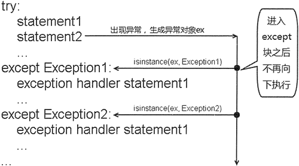

# Python try except else（异常处理）用法详解

Python 的异常处理机制可以让程序具有极好的容错性，让程序更加健壮。当程序运行出现意外情况时，系统会自动生成一个 Error 对象来通知程序，从而实现将“业务实现代码”和“错误处理代码”分离，提供更好的可读性。

## 使用 try...except 捕获异常

前面章节讲过，希望有一个非常强大的“if 块”，可以表示所有的错误情况，让程序一次处理所有的错误，也就是希望将错误集中处理。

出于这种考虑，此处试图把“错误处理代码”从“业务实现代码”中分离出来。将上面最后一段伪码改为如下伪码：

if 一切正常：
    #业务实现代码
else:
    alert 输入不合法
    goto retry

上面代码中的“if 块”依然不可表示，因为一切正常是很抽象的，无法转换为计算机可识别的代码。在这种情形下，Python 提出了一种假设，如果程序可以顺利完成，那就“一切正常”，把系统的业务实现代码放在 try 块中定义，把所有的异常处理逻辑放在 except 块中进行处理。

下面是 Python 异常处理机制的语法结构：

try:
    #业务实现代码
    ...
except (Error1, Error2, ...) as e:
    alert 输入不合法
    goto retry

如果在执行 try 块里的业务逻辑代码时出现异常，系统自动生成一个异常对象，该异常对象被提交给 Python 解释器，这个过程被称为引发异常。

当 Python 解释器收到异常对象时，会寻找能处理该异常对象的 except 块，如果找到合适的 except 块，则把该异常对象交给该 except 块处理，这个过程被称为捕获异常。如果 Python 解释器找不到捕获异常的 except 块，则运行时环境终止，Python 解释器也将退出。

不管程序代码块是否处于 try 块中，甚至包括 except 块中的代码，只要执行该代码块时出现了异常，系统总会自动生成一个 Error 对象。如果程序没有为这段代码定义任何的 except 块，则 Python 解释器无法找到处理该异常的 except 块，程序就在此退出，这就是前面看到的例子程序在遇到异常时退出的情形。

下面使用异常处理机制来改写前面章节中五子棋游戏中用户下棋部分的代码：

```
inputStr = input("请输入您下棋的坐标，应以 x,y 的格式：\n")
while inputStr != None :
    try:
        # 将用户输入的字符串以逗号（,）作为分隔符，分隔成 2 个字符串
        x_str, y_str = inputStr.split(sep = ",")
        # 如果要下棋的点不为空
        if board[int(y_str) - 1][int(x_str) - 1] != "╋":
            inputStr = input("您输入的坐标点已有棋子了，请重新输入\n")
            continue
        # 把对应的列表元素赋为"●"。
        board[int(y_str) - 1][int(x_str) - 1] = "●"
    except Exception:
        inputStr = input("您输入的坐标不合法，请重新输入，下棋坐标应以 x,y 的格式\n")
        continue
    ...
```

上面程序把处理用户输入字符串的代码都放在 try 块里执行，只要用户输入的字符串不是有效的坐标值（包括字母不能正确解析，没有逗号不能正确解析，解析出来的坐标引起数组越界……），系统就将引发一个异常对象，并把这个异常对象交给对应的 except 块处理。

except 块的处理方式是向用户提示坐标不合法，然后使用 continue 忽略本次循环剩下的代码，开始执行下一次循环。这就保证了该五子棋游戏有足够的容错性，即用户可以随意输入，程序不会因为用户输入不合法而突然退出，程序会向用户提示输入不合法，让用户再次输入。

## 异常类的继承体系

当 Python 解释器接收到异常对象时，如何为该异常对象寻找 except 块呢？注意上面程序中 except 块的 except Exception：，这意味着每个 except 块都是专门用于处理该异常类及其子类的异常实例。

当 Python 解释器接收到异常对象后，会依次判断该异常对象是否是 except 块后的异常类或其子类的实例，如果是，Python 解释器将调用该 except 块来处理该异常；否则，再次拿该异常对象和下一个 except 块里的异常类进行比较。

Python 异常捕获流程示意图如图 1 所示：

图 1 Python 异常捕获流程示意图
从图 1 中可以看出，在 try 块后可以有多个 except 块，这是为了针对不同的异常类提供不同的异常处理方式。当程序发生不同的意外情况时，系统会生成不同的异常对象，Python 解释器就会根据该异常对象所属的异常类来决定使用哪个 except 块来处理该异常。

通过在 try 块后提供多个 except 块可以无须在异常处理块中使用 if 判断异常类型，但依然可以针对不同的异常类型提供相应的处理逻辑，从而提供更细致、更有条理的异常处理逻辑。

从图 1 中可以看出，在通常情况下，如果 try 块被执行一次，则 try 块后只有一个 except 块会被执行，不可能有多个 except 块被执行。除非在循环中使用了 continue 开始下一次循环，下一次循环又重新运行了 try 块，这才可能导致多个 except 块被执行。

Python 的所有异常类都从 BaseException 派生而来，提供了丰富的异常类，这些异常类之间有严格的继承关系，图 2 显示了 Python 的常见异常类之间的继承关系。

图 2 Python 的常见异常类之间的继承关系
从图 2 中可以看出，Python 的所有异常类的基类是 BaseException，但如果用户要实现自定义异常，则不应该继承这个基类，而是应该继承 Exception 类。

BaseException 的主要子类就是 Exception，不管是系统的异常类，还是用户自定义的异常类，都应该从 Exception 派生。

下面看几个简单的异常捕获的例子：

```
import sys
try:
    a = int(sys.argv[1])
    b = int(sys.argv[2])
    c = a / b
    print("您输入的两个数相除的结果是：", c )
except IndexError:
    print("索引错误：运行程序时输入的参数个数不够")
except ValueError:
    print("数值错误：程序只能接收整数参数")
except ArithmeticError:
    print("算术错误")
except Exception:
    print("未知异常")
```

上面程序，导入了 sys 模块，并通过 sys 模块的 argv 列表来获取运行 Python 程序时提供的参数。其中 sys.argv[0] 通常代表正在运行的 Python 程序名，sys.argv[1] 代表运行程序所提供的第一个参数，sys.argv[2] 代表运行程序所提供的第二个参数……依此类推。

Python 用 import 例来导入模块，关于模块和导入模块会在后续章节进行详细讲解。

上面程序针对 IndexError、ValueError、ArithmeticError 类型的异常，提供了专门的异常处理逻辑。该程序运行时的异常处理逻辑可能有如下几种情形：

*   如果在运行该程序时输入的参数不够，将会发生索引错误，Python 将调用 IndexError 对应的 except 块处理该异常。
*   如果在运行该程序时输入的参数不是数字，而是字母，将发生数值错误，Python 将调用 ValueError 对应的 except 块处理该异常。
*   如果在运行该程序时输入的第二个参数是 0，将发生除 0 异常，Python 将调用 ArithmeticError 对应的 except 块处理该异常。
*   如果在程序运行时出现其他异常，该异常对象总是 Exception 类或其子类的实例，Python 将调用 Exception 对应的 except 块处理该异常。

上面程序中的三种异常，都是非常常见的运行时异常，读者应该记住这些异常，并掌握在哪些情况下可能出现这些异常。

正如在前面程序中所看到的，程序总是把对应 Exception 类的 except 块放在最后，这是为什么呢？想一下图 1 所示的 Python 异常捕获流程，可能你就会明白，如果把 Exception 类对应的 except 块排在其他 except 块的前面，Python 解释器将直接进入该 except 块（因为所有的异常对象都是 Exception 或其子类的实例），而排在它后面的 except 块将永远也不会获得执行的机会。

实际上，在进行异常捕获时不仅应该把 Exception 类对应的 except 块放在最后，而且所有父类异常的 except 块都应该排在子类异常的 except 块的后面（ 即：先处理小异常，再处理大异常）。

虽然 Python 语法没有要求，但在实际编程时一定要记住先捕获小异常，再捕获大异常。

## 多异常捕获

Python 的一个 except 块可以捕获多种类型的异常。

在使用一个 except 块捕获多种类型的异常时，只要将多个异常类用圆括号括起来，中间用逗号隔开即可，其实就是构建多个异常类的元组。

下面程序示范了 Python 的多异常捕获：

```
import sys
try:
    a = int(sys.argv[1])
    b = int(sys.argv[2])
    c = a / b
    print("您输入的两个数相除的结果是：", c )
except (IndexError, ValueError, ArithmeticError):
    print("程序发生了数组越界、数字格式异常、算术异常之一")
except:
    print("未知异常")
```

上面程序中第 7 行代码使用了（IndexError, ValueError, ArithmeticError）来指定所捕获的异常类型，这就表明该 except 块可以同时捕获这三种类型的异常。

看上面程序中第 9 行代码，只有 except 关键字，并未指定具体要捕获的异常类型，这种省略异常类的 except 语句也是合法的，它表示可捕获所有类型的异常，一般会作为异常捕获的最后一个 except 块。

## 访问异常信息

如果程序需要在 except 块中访问异常对象的相关信息，则可通过为异常对象声明变量来实现。

当 Python 解释器决定调用某个 except 块来处理该异常对象时，会将异常对象赋值给 except 块后的异常变量，程序即可通过该变量来获得异常对象的相关信息。

所有的异常对象都包含了如下几个常用属性和方法：

*   args：该属性返回异常的错误编号和描述字符串。
*   errno：该属性返回异常的错误编号。
*   strerror：该属性返回异常的描述宇符串。
*   with_traceback()：通过该方法可处理异常的传播轨迹信息。

下面例子演示了程序如何访问异常信息：

```
def foo():
    try:
        fis = open("a.txt");
    except Exception as e:
        # 访问异常的错误编号和详细信息
        print(e.args)
        # 访问异常的错误编号
        print(e.errno)
        # 访问异常的详细信息
        print(e.strerror)
foo()
```

从上面程序可以看出，如果要访问异常对象，只要在单个异常类或异常类元组（多异常捕获）之后使用 as 再加上异常变量即可。

在 Python 的早期版本中，直接在单个异常类或异常类元组（多异常捕获）之后添加异常变量，中间用逗号隔开即可。

上面程序调用了 Exception 对象的 args 属性（该属性相当于同时返回 errno 属性和 strerror 属性）访问异常的错误编号和详细信息。运行上面程序，会看到如下运行结果：

(2, 'No such file or directory')
2
No such file or directory

从上面的运行结果可以看到，由于程序尝试打开的文件不存在，因此引发的异常错误编号为 2，异常详细信息为：No such file or directory。

关于如何处理异常的传播轨迹信息，后续章节还有更详细的介绍，此处暂不详细讲解。

上面程序中使用 open() 方法来打开一个文件，用于读取磁盘文件的内容。关于该 open() 方法后续章节会做详细介绍。

## else 块

在 Python 的异常处理流程中还可添加一个 else 块，当 try 块没有出现异常时，程序会执行 else 块。例如如下程序：

```
s = input('请输入除数:')
try:
    result = 20 / int(s)
    print('20 除以%s 的结果是: %g' % (s , result))
except ValueError:
    print('值错误，您必须输入数值')
except ArithmeticError:
    print('算术错误，您不能输入 0')
else:
    print('没有出现异常')
```

上面程序为异常处理流程添加了 else 块，当程序中的 try 块没有出现异常时，程序就会执行 else 块。运行上面程序，如果用户输入导致程序中的 try 块出现了异常，则运行结果如下：

请输入除数：a
值错误，您必须输入数值

如果用户输入让程序中的 try 块顺利完成，则运行结果如下：

请输入除数：3
20 除以 3 的结果是：6.66667
没有出现异常

看到这里，可能有读者觉得奇怪：既然只有当 try 块没有异常时才会执行 else 块，那么直接把 else 块的代码放在 try 块的代码的后面不就行了？

实际上大部分语言的异常处理都没有 else 块，它们确实是将 else 块的代码直接放在 try 块的代码的后面的，因为对于大部分场景而言，直接将 else 块的代码放在 try 块的代码的后面即可。

但 Python 的异常处理使用 else 块绝不是多余的语法，当 try 块没有异常，而 else 块有异常时，就能体现出 else 块的作用了。例如如下程序：

```
def else_test():
    s = input('请输入除数:')
    result = 20 / int(s)
    print('20 除以%s 的结果是: %g' % (s , result))
def right_main():
    try:
        print('try 块的代码，没有异常')
    except:
        print('程序出现异常')
    else:
        # 将 else_test 放在 else 块中
        else_test()
def wrong_main():
    try:
        print('try 块的代码，没有异常')
        # 将 else_test 放在 try 块代码的后面
        else_test()
    except:
        print('程序出现异常')
wrong_main()
right_main()
```

上面程序中定义了一个 else_test() 函数，该函数在运行时需要接收用户输入的参数，随着用户输入数据的不同可能导致异常。接下来程序定义了 right_main() 和 wrong_main() 两个函数，其中 right_main() 将 else_test() 函数放在 else 块内；而 wrong_main() 将 else_test() 函数放在 try 块的代码的后面。

正如上面所介绍的，当 try 块和 else 块都没有异常时，将 else_test() 函数放在 try 块的代码的后面和放在 else 块中没有任何区别。例如，如果用户输入的数据没有导致程序出现异常，则将看到程序产生如下输出结果：

try 块的代码，没有异常
请输入除数:4
20 除以 4 的结果是: 5
try 块的代码，没有异常
请输入除数:4
20 除以 4 的结果是: 5

但如果用户输入的数据让 else_test() 函数出现异常（try 块依然没有任何异常），此时程序就会产生如下输出结果：

try 块的代码，没有异常
请输入除数:0
程序出现异常
try 块的代码，没有异常
请输入除数:0
Traceback (most recent call last):
  File "C:\Users\mengma\Desktop\1.py", line 21, in <module>
    right_main()
  File "C:\Users\mengma\Desktop\1.py", line 12, in right_main
    else_test()
  File "C:\Users\mengma\Desktop\1.py", line 3, in else_test
    result = 20 / int(s)
ZeroDivisionError: division by zero

对比上面两个输出结果，用户输入的都是 0，这样都会导致 else_test() 函数出现异常。如果将 else_test() 函数放在 try 块的代码的后面，此时 else_test() 函数运行产生的异常将会被 try 块对应的 except 捕获，这正是 Python 异常处理机制的执行流程：但如果将 else_test() 函数放在 else 块中，当 else_test() 函数出现异常时，程序没有 except 块来处理该异常，该异常将会传播给 Python 解释器，导致程序中止。

对比上面两个输出结果，不难发现，放在 else 块中的代码所引发的异常不会被 except 块捕获。

所以，如果希望某段代码的异常能被后面的 except 块捕获，那么就应该将这段代码放在 try 块的代码之后；如果希望某段代码的异常能向外传播（不被 except 块捕获），那么就应该将这段代码放在 else 块中。