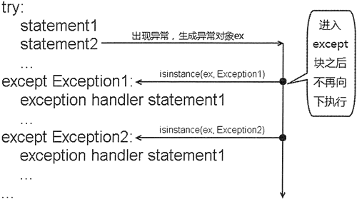

# Python finally：资源回收

有些时候，程序在 try 块里打开了一些物理资源（例如数据库连接、网络连接和磁盘文件等），这些物理资源都必须被显式回收。

Python 的垃圾回收机制不会回收任何物理资源，只能回收内存中对象所占用的内存。

图 1 Python 异常捕获流程示意图
那么在哪里回收这些物理资源呢？在 try 块里回收，还是在 except 块中进行回收？假设程序在 try 块里进行资源回收，根据图 1 所示的异常捕获流程，如果 try 块的某条语句引发了异常，该语句后的其他语句通常不会获得执行的机会，这将导致位于该语句之后的资源回收语句得不到执行。如果在 except 块里进行资源回收，因为 except 块完全有可能得不到执行，这将导致不能及时回收这些物理资源。

为了保证一定能回收在 try 块中打开的物理资源，异常处理机制提供了 finally 块。不管 try 块中的代码是否出现异常，也不管哪一个 except 块被执行，甚至在 try 块或 except 块中执行了 return 语句，finally 块总会被执行。

Python 完整的异常处理语法结构如下：

try:
    #业务实现代码
except SubException as e:
    #异常处理块 1
    ...
except SubException2 as e:
    #异常处理块 2
    ...
else:
    #正常处理块
finally :
    #资源回收块
    ...

在异常处理语法结构中，只有 try 块是必需的，也就是说：

*   如果没有 try 块，则不能有后面的 except 块和 finally 块；
*   except 块和 finally 块都是可选的，但 except 块和 finally 块至少出现其中之一，也可以同时出现；
*   可以有多个 except 块，但捕获父类异常的 except 块应该位于捕获子类异常的 except 块的后面；
*   不能只有 try 块，既没有 except 块，也没有 finally 块；
*   多个 except 块必须位于 try 块之后，finally 块必须位于所有的 except 块之后。

看如下程序：

```
import os
def test():
    fis = None
    try:
        fis = open("a.txt")
    except OSError as e:
        print(e.strerror)
        # return 语句强制方法返回
        return        # ①
        os._exit(1)     # ②
    finally:
        # 关闭磁盘文件，回收资源
        if fis is not None:
            try:
                # 关闭资源
                fis.close()
            except OSError as ioe:
                print(ioe.strerror)
        print("执行 finally 块里的资源回收!")
test()
```

上面程序在 try 块后增加了 finally 块，用于回收在 try 块中打开的物理资源。注意在程序的 except 块中 ① 处有一条 return 语句，该语句强制方法返回。在通常情况下，一旦在方法里执行到 return 语句，程序将立即结束该方法：现在不会了，虽然 return 语句也强制方法结束，但一定会先执行 finally 块的代码。 

运行上面程序，将看到如下运行结果：

No such file or directory
执行 finally 里的资源回收!

上面的运行结果表明在方法返回之前执行了 finally 块的代码。将 ① 处的 return 语句注释掉，取消 ② 处代码的注释，即在异常处理的 except 块中使用 os._exit(1) 语句来退出 Python 解释器。运行上面代码，将看到如下运行结果：

No such file or directory

上面的运行结果表明 finally 块没有被执行。如果在异常处理代码中使用 os.exit(1) 语句来退出 Python 解释器，则 finally 块将失去执行的机会。

除非在 try 块、except 块中调用了退出 Python 解释器的方法，否则不管在 try 块、except 块中执行怎样的代码，出现怎样的情况，异常处理的 finally 块总会被执行。调用 sys.exit() 方法退出程序不能阻止 finally 块的执行，这是因为 sys.exit() 方法本身就是通过引发 SystemExit 异常来退出程序的。

在通常情况下，不要在 finally 块中使用如 return 或 raise 等导致方法中止的语句（raise 语句将在后面介绍），一旦在 finally 块中使用了 return 或 raise 语句，将会导致 try 块、except 块中的 return、raise 语句失效。看如下程序：

```
def test():
    try:
        # 因为 finally 块中包含了 return 语句
        # 所以下面的 return 语句失去作用
        return True
    finally:
        return False
a = test()
print(a)
```

上面程序在 finally 块中定义了一条 return False 语句，这将导致 try 块中的 return true 失去作用。运行上面程序，将打印出 False 的结果。

如果 Python 程序在执行 try 块、except 块时遇到了 return 或 raise 语句，这两条语句都会导致该方法立即结束，那么系统执行这两条语句并不会结束该方法，而是去寻找该异常处理流程中的 finally 块，如果没有找到 finally 块，程序立即执行 return 或 raise 语句，方法中止；如果找到 finally 块，系统立即开始执行 finally 块，只有当 finally 块执行完成后，系统才会再次跳回来执行 try 块、except 块里的 return 或 raise 语句；如果在 finally 块里也使用了 return 或 raise 等导致方法中止的语句，finally 块己经中止了方法，系统将不会跳回去执行 try 块、except 块里的任何代码。

尽量避免在 finally 块里使用 return 或 raise 等导致方法中止的语句，否则可能出现一些很奇怪的情况。