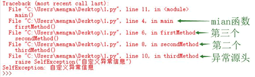

# Python traceback 模块：获取异常信息

异常对象提供了一个 with_traceback 用于处理异常的传播轨迹，查看异常的传播轨迹可追踪异常触发的源头，也可看到异常一路触发的轨迹。

下面示例显示了如何显示异常传播轨迹：

```
class SelfException(Exception): pass

def main():
    firstMethod()
def firstMethod():
    secondMethod()
def secondMethod():
    thirdMethod()
def thirdMethod():
    raise SelfException("自定义异常信息")
main()
```

上面程序中 main() 函数调用 firstMethod()，firstMethod() 调用 secondMethod()，secondMethod() 调用 thirdMethod()，thirdMethod() 直接引发一个 SelfException 异常。运行上面程序，将会看到如图 1 所示的结果：

图 1 异常传播轨迹
从图 1 中可以看出，异常从 thirdMethod() 函数开始触发，传到 secondMethod() 函数，再传到 firstMethod() 函数，最后传到 main() 函数，在 main() 函数止，这个过程就是 Python 的异常传播轨迹。

在实际应用程序的开发中，大多数复杂操作都会被分解成一系列函数或方法调用。这是因为，为了具有更好的可重用性，会将每个可重用的代码单元定义成函数或方法，将复杂任务逐渐分解为更易管理的小型子任务。由于一个大的业务功能需要由多个函数或方法来共同实现，在最终编程模型中，很多对象将通过一系列函数或方法调用来实现通信，执行任务。

所以，当应用程序运行时，经常会发生一系列函数或方法调用，从而形成“函数调用战”。异常的传播则相反，只要异常没有被完全捕获（包括异常没有被捕获，或者异常被处理后重新引发了新异常），异常就从发生异常的函数或方法逐渐向外传播，首先传给该函数或方法的调用者，该函数或方法的调用者再传给其调用者，直至最后传到 Python 解释器，此时 Python 解释器会中止该程序，并打印异常的传播轨迹信息。

很多初学者一看到图 1 所示的异常提示信息，就会惊慌失措，他们以为程序出现了很多严重的错误，其实只有一个错误，系统提示那么多行信息，只不过是显示异常依次触发的轨迹。

其实图 1 所示的异常传播轨迹信息非常清晰，它记录了应用程序中执行停止的各个点。最后一行信息详细显示了异常的类型和异常的详细消息。从这一行向上，逐个记录了异常发生源头、异常依次传播所经过的轨迹，并标明异常发生在哪个文件、哪一行、哪个函数处。

Python 专门提供了 traceback 模块来处理异常传播轨迹，使用 traceback 可以方便地处理 Python 的异常传播轨迹。导入 traceback 模块之后，traceback 提供了如下两个常用方法：

*   traceback.print_exc()：将异常传播轨迹信息输出到控制台或指定文件中。
*   format_exc()：将异常传播轨迹信息转换成字符串。

可能有读者感到好奇，从上面方法看不出它们到底处理哪个异常的传播轨迹信息。实际上我们常用的 print_exc() 是 print_exc([limit[, file]]) 省略了 limit、file 两个参数的形式。而 print_exc([limit[, file]]) 的完整形式是 `print_exception(etype, value, tb[,limit[, file]])`，在完整形式中，前面三个参数用于分别指定异常的如下信息：

*   etype：指定异常类型；
*   value：指定异常值；
*   tb：指定异常的 traceback 信息；

当程序处于 except 块中时，该 except 块所捕获的异常信息可通过 sys 对象来获取，其中 sys.exc_type、sys.exc_value、sys.exc_traceback 就代表当前 except 块内的异常类型、异常值和异常传播轨迹。

简单来说， print_exc([limit[, file]]) 相当于如下形式：

print_exception(sys.exc_etype, sys.exc_value, sys.exc_tb[, limit[, file]])

也就是说，使用 print_exc([limit[, file]]) 会自动处理当前 except 块所捕获的异常。该方法还涉及两个参数：

1.  limit：用于限制显示异常传播的层数，比如函数 A 调用函数 B，函数 B 发生了异常，如果指定 limit=1，则只显示函数 A 里面发生的异常。如果不设置 limit 参数，则默认全部显示。
2.  file：指定将异常传播轨迹信息输出到指定文件中。如果不指定该参数，则默认输出到控制台。

借助于 traceback 模块的帮助，我们可以使用 except 块捕获异常，并在其中打印异常传播信息，包括把它输出到文件中。例如如下程序：

```
# 导入 trackback 模块
import traceback
class SelfException(Exception): pass

def main():
    firstMethod()
def firstMethod():
    secondMethod()
def secondMethod():
    thirdMethod()
def thirdMethod():
    raise SelfException("自定义异常信息")
try:
    main()
except:
    # 捕捉异常，并将异常传播信息输出控制台
    traceback.print_exc()
    # 捕捉异常，并将异常传播信息输出指定文件中
    traceback.print_exc(file=open('log.txt', 'a'))
```

上面程序第一行先导入了 traceback 模块，接下来程序使用 except 捕获程序的异常，并使用 traceback 的 print_exc() 方法输出异常传播信息，分别将它输出到控制台和指定文件中。

运行上面程序，同样可以看到在控制台输出异常传播信息，而且在程序目录下生成了一个 log.txt 文件，该文件中同样记录了异常传播信息。