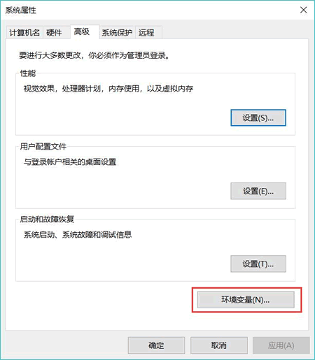

# Python 加载模块详解（2 种方式）

在编写一个 Python 模块之后，如果直接用 import 或 from...import 来导入该模块，Python 通常并不能加载该模块。道理很简单，Python 怎么知道到哪里去找这个模块呢？

编程其实并不难，就是用合适的语法告诉计算机，让它帮助完成某个工作。因此计算机能完成的事情，其实都是程序员预先告诉它的。

为了让 Python 能找到我们编写（或第三方提供） 的模块，可以用以下两种方式来告诉它：

1.  使用环境变量。
2.  将模块放在默认的模块加载路径下。

下面详细介绍这两种方式。

## 使用环境变量

Python 将会根据 PYTHONPATH 环境变量的值来确定到哪里去加载模块。PYTHONPATH 环境变量的值是多个路径的集合，这样 Python 就会依次搜索 PYTHONPATH 环境变量所指定的多个路径，试图从中找到程序想要加载的模块。

下面介绍在不同平台上设置环境变量的方式。

#### 在 Windows 平台上设置环境变量

右击桌面上的“计算机”图标，出现右键菜单；单击“属性”菜单项，系统显示“控制面板\所有控制面板项\系统”窗口，单击该窗口左边栏中的“高级系统设置”链接，出现“系统属性”对话框，如图 1 所示。

图 1 系统属性对话框
单击该对话框中“高级” Tab 页中的“环境变量”按钮，将看到如图 2 所示的“环境变量”对话框，通过该对话框可以添加或修改环境变量。

图 2 环境变量对话框
在如图 2 所示的对话框中，上面的“用户变量”部分用于设置当前用户的环境变量，下面的“系统变量”部分用于设置整个系统的环境变量。

一般建议设置“用户变量”即可，因为用户变量只对当前用户有效，而系统变量对所有用户有效。为了减少自己所做的修改对其他人的影响，故设置用户变量。对于当前用户而言，设置用户变量和系统变量的效果大致相同，不过系统变量的路径排在用户变量的路径之前。

单击用户变量中的“新建”按钮， 系统显示如图 3 所示的对话框。

图 3 新建 PYTHONPATH 环境变量
在“变量名”文本框内输入 PYTHONPATH，表明将要建立名为 PYTHONPATH 的环境变量；在“变量值”文本框内输入 `.;d:\python_ module`，这就是该环境变量的值，该值其实包含了两条路径（分号为分隔符）：

*   第一条路径为一个点（.），这个点代表当前路径，表明当运行 Python 程序时，Python 总能从当前路径加载模块；
*   第二条路径为 `d:\python_ module`，表明当运行 Python 程序时，Python 总能从 `d:\python_ module` 加载模块。

在成功设置了上面的环境变量之后，接下来只要把前面定义的模块（Python 程序）放在与当前所运行 Python 程序相同的路径中（或放在 `d:\python_ module` 路径下），该模块就能被成功加载了。

#### 在 Linux 上设置环境变量

启动 Linux 的终端窗口（命令行界面），进入当前用户的 home 路径下，然后在 home 路径下输入如下命令：

ls - a

该命令将列出当前路径下所有的文件，包括隐藏文件。Linux 平台的环境变量是通过 .bash_profile 文件来设置的，使用无格式编辑器打开该文件，在该文件中添加 PYTHONPATH 环境变量。也就是为该文件增加如下一行：

#设置 PYTHON PATH 环境变量
PYTHONPATH=.:/home/yeeku/python_module

Linux 与 Windows 平台不一样，多个路径之间以冒号（:）作为分隔符，因此上面一行同样设置了两条路径，点（.）代表当前路径，还有一条路径是 `/home/yeeku/python_module`（yeeku 是在 Linux 系统的登录名）。

在完成了 PYTHONPATH 变量值的设置后，在 .bash_profile 文件的最后添加导出 PYTHONPATH 变量的语句。

#导出 PYTHONPATH 环境变量
export PYTHONPATH

重新登录 Linux 平台，或者执行如下命令：

source .bash_profile

这两种方式都是为了运行该文件，使在文件中设置的 PYTHONPATH 变量值生效。

在成功设置了上面的环境变量之后，接下来只要把前面定义的模块（Python 程序）放在与当前所运行 Python 程序相同的路径中（或放在 `/home/yeeku/python_module` 路径下），该模块就能被成功加载了。

#### 在 Mac OS X 上设置环境变量

在 Mac OS X 上设置环境变量与 Linux 大致相同（因为 Mac OS X 本身也是类 UNIX 系统）。启动 Mac OS X 的终端窗口（命令行界面），进入当前用户的 home 路径下，然后在 home 路径下输入如下命令：

ls -a

该命令将列出当前路径下所有的文件，包括隐藏文件。Mac OS X 平台的环境变量也可通过，bash_profile 文件来设置，使用无格式编辑器打开该文件，在该文件中添加 PYTHONPATH 环境变量。也就是为该文件增加如下一行：

#设置 PYTHON PATH 环境变盘
PYTHONPATH=.:/Users/yeeku/python_module

Mac OS X 的多个路径之间同样以冒号（:）作为分隔符，因此上面一行同样设置了两条路径：点（.）代表当前路径，还有一条路径是 `/Users/yeeku/python_module`（yeeku 是作者在 Mac OS X 系统的登录名）。

在完成了 PYTHONPATH 变量值的设置后，在 .bash_profile 文件的最后添加导出 PYTHONPATH 变量的语句。

#导出 PYTHON PATH 环境变量
export PYTHONPATH

重新登录 Mac OS X 系统，或者执行如下命令：

source .bash_profile

这两种方式都是为了运行该文件，使在文件中设置的 PYTHON PATH 变量值生效。

在成功设置了上面的环境变量之后，接下来只要把前面定义的模块（Python 程序）放在与当前所运行 Python 程序相同的路径中（或放在 `Users/yeeku/python_module` 路径下），该模块就能被成功加载了。

在设置好环境变量之后，下面编写一个程序来导入、使用前面定义的 module1 模块：

```
# 两次导入 module1，并指定其别名为 md
import module1 as md
import module1 as md
print(md.my_book)
md.say_hi('Charlie')
user = md.User('孙悟空')
print(user)
user.walk()
```

该程序位于 `codes\09\9.2\` 目录下，因此需要将前面的 module1.py 文件也拷贝到该目录下。

上面代码中两次导入了 module1 模块，运行该程序，可以看到如下输出结果：

这是 module 1
Python 入门教程
Charlie,您好，欢迎学习 Python
User[name=孙悟空]
孙悟空正在慢慢地走路

上面程序在导入了 module1 模块之后，完全可以正常地使用 module1 中的程序单元。依次测试了 module1 中的变量、函数和类，它们都是完全正常的。

这里为什么要两次导入 module1 模块呢？其实完全没必要，此处两次导入只是为了说明一点：Python 很智能。虽然上面程序两次导入了 module1 模块，但最后运行程序，我们看到输出语句只输出一条“这是 module 1”，这说明第二次导入的 module1 模块并没有起作用，这就是 Python 的“智能”之处。

当程序重复导入同一个模块时，Python 只会导入一次。道理很简单，因为这些变量、函数、类等程序单元都只需要定义一次即可，何必导入多次呢？

相反，如果 Python 允许导入多次， 反而可能会导致严重的后果。比如程序定义了 foo 和 bar 两个模块，假如 foo 模块导入了 bar 模块，而 bar 模块又导入了 foo 模块，这似乎形成了无限循环导入，但由于 Python 只会导入一次，所以这个无限循环导入的问题完全可以避免。

## 默认的模块加载路径

如果要安装某些通用性模块，比如复数功能支持的模块、矩阵计算支持的模块、图形界面支持的模块等，这些都属于对 Python 本身进行扩展的模块，这种模块应该直接安装在 Python 内部，以便被所有程序共享，此时就可借助于 Python 默认的模块加载路径。

Python 默认的模块加载路径由 sys.path 变量代表，因此可通过在交互式解释器中执行如下命令来查看 Python 默认的模块加载路径：

['C:\\Users\\mengma\\Desktop',
'D:\\python3.6\\Lib\\idlelib',
'D:\\python3.6\\python36.zip',
'D:\\python3.6\\DLLs',
'D:\\python3.6\\lib',
'D:\\python3.6',
'C:\\Users\\mengma\\AppData\\Roaming\\Python\\Python36\\site-packages',
'D:\\python3.6\\lib\\site-packages']

上面代码使用 pprint 模块下的 pprint() 函数代替普通的 print() 函数，这是因为如果要打印的内容很多，使用 pprint 可以显示更友好的打印结果。

上面的运行结果就是 Python 3.x 默认的模块加载路径，这是因为作者将 Python 安装在了 d:\Python 路径下。如果将 Python 安装在其他路径下，上面的运行结果应该略有差异。

上面的运行结果列出的路径都是 Python 默认的模块加载路径，但通常来说，我们应该将 Python 的扩展模块添加在 `lib\site-packages` 路径下，它专门用于存放 Python 的扩展模块和包。

如果读者前面安装过矩阵计算支持的模块，则可以在 `lib\site-packages` 下找到一个 numpy 文件夹，这说明前面安装的 numpy 模块也是被放在 `lib\site-packages` 路径下的。

下面编写一个 Python 模块文件，并将该文件复制在 `lib\site-packages` 路径下：

```
'''
简单的模块，该模块包含以下内容
my_list：保存列表的变量
print_triangle: 使用星号打印三角形的函数
'''
my_list = ['Python', 'Kotlin', 'Swift']
def print_triangle(n):
    '''使用星号打印一个三角形'''
    if n <= 0:
        raise ValueError('n 必须大于 0')
    for i in range(n):
        print(' ' * (n - i - 1), end='')
        print('*' * (2 * i + 1), end='')
        print('')

# ====以下是测试代码====
def test_print_triangle():
    print_triangle(3)
    print_triangle(4)
    print_triangle(7)
if __name__ == '__main__': test_print_triangle()
```

上面模块文件中定义了一个 print_triangle() 函数，把该模块文件拷贝到 `lib\site-packages` 路径下，就相当于为 Python 扩展了一个 print_ shape 模块，这样任何 Python 程序都可使用该模块。

下面可直接在 Python 交互式解释器中测试该模块。在 Python 交互式解释器中输入如下命令：

>>> import print_shape
>>> print(print_shape,__doc__)
简单的模块，该模块包含以下内容
my_list：保存列表的变量
print_triangle：使用星号打印三角形的函数
>>> print_shape.print triangle.__doc__
'使用星号打印一个三角形'

上面第一行代码用于导入 print_ shape 模块；第二行代码用于查看 print_shape 模块的文档，交互式解释器输出了该模块开始定义的文档内容；第三行代码用于查看 print_shape 模块下 print_triangle 函数的文挡，交互式解释器会输出该函数定义后的文档说明。

接下来测试该模块中的 my_list 变量和 print_triangle() 函数。在交互式解释器中输入如下命令：

>>> print_shape.my_list[1]
'Kotlin'
>>> print_shape.print_triangle(4)
   *
  ***
*****
*******

从上面的运行结果可以看到，程序通过模块前缀访问 my_list 变量，输出了该变量的第二个元素；程序也通过模块前缀调用了 print_triangle 函数，打印出由星号组成的三角形，这表明该模块完全正常。

## 导入模块的本质

为了帮助大家更好地理解导入模块，下面定义一个新的模块，该模块比较简单，所以不再为之编写测试代码。该模块代码如下（编写在 fk_module.py 文件中）：

```
'一个简单的测试模块: fkmodule'
print("this is fk_module")
name = 'fkit'

def hello():
    print("Hello, Python")

接下来，在相同的路径下定义如下程序来使用该模块：
import fk_module

print("================")
# 打印 fk_module 的类型
print(type(fk_module))
print(fk_module)
```

由于前面在 PYTHONPATH 环境变量中已经添加了点（.），因此 Python 程序总可以加载相同路径下的模块。所以，上面程序可以导入相同路径下的 fk_module 模块。运行上面程序，可以看到如下输出结果：

this is fk_module
================
<class 'module'>
<module 'fk_module' from 'G:\\publish\\codes\\09\\9.2\\fk_module.py'>
fkit
<function hello at 0x0000000001EABAE8>

从上面的输出结果来看，当程序导入 fk_module 时，该模块中的输出语句会在 import 时自动执行。该程序中还包含一个与模块同名的变量，该变量的类型是 module。

使用“import fk_module”导入模块的本质就是，将 fk_module.py 中的全部代码加载到内存并执行，然后将整个模块内容赋值给与模块同名的变量，该变量的类型是 module，而在该模块中定义的所有程序单元都相当于该 module 对象的成员。

下面再试试使用 `from...import` 语句来执行导入，例如使用如下程序来测试该模块：

```
from fk_module import name, hello

print("================")
print(name)
print(hello)
# 打印 fk_module
print(fk_module)
```

运行上面程序，可以看到如下输出结果：

this is fk_module
================
fkit
<function hello at 0x0000000001E7BAE8>
Traceback (most recent call last):
  File "fk_module_test2.py", line 22, in <module>
print(fk_module)
NameError: name 'fk_module' is not defined

从上面的输出结果可以看出，即使使用 `from...import` 只导入模块中部分成员，该模块中的输出语句也会在 import 时自动执行，这说明 Python 依然会加载并执行模块中的代码。

使用“from fk_module import name, hello”导入模块中成员的本质就是将 fk_module.py 中的全部代码加载到内存并执行，然后只导入指定变量、函数等成员单元，并不会将整个模块导入，因此上面程序在输出 fk_module 时将看到错误提示：`name 'fk module' is not defined`。

在导入模块后，可以在模块文件所在目录下看到一个名为“__pycache__”的文件夹，打开该文件夹，可以看到 Python 为每个模块都生成一个 *.cpython-36.pyc 文件，比如 Python 为 fk_module 模块生成一个 fk_ module.cpython-36.pyc 文件，该文件其实是 Python 为模块编译生成的字节码，用于提升该模块的运行效率。