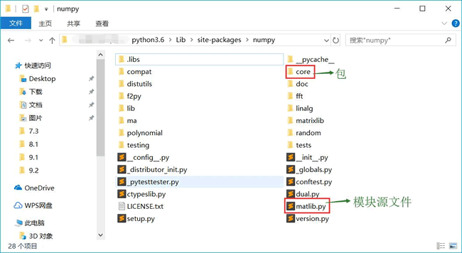

# Python 包及其定义和引用详解

对于一个需要实际应用的模块而言，往往会具有很多程序单元，包括变量、函数和类等，如果将整个模块的所有内容都定义在同一个 Python 源文件中，这个文件将会变得非常庞大，显然并不利于模块化开发。

## 什么是包

为了更好地管理多个模块源文件，Python 提供了包的概念。那么问题来了，什么是包呢？

从物理上看，包就是一个文件夹，在该文件夹下包含了一个 __init__.py 文件，该文件夹可用于包含多个模块源文件；从逻辑上看，包的本质依然是模块。

根据上面介绍可以得到一个推论，包的作用是包含多个模块，但包的本质依然是模块，因此包也可用于包含包。典型地，当我们为 Python 安装了 numpy 模块之后，可以在 Python 安装目录的 Lib\site-packages 目录下找到一个 numpy 文件夹，它就是前面安装的 numpy 模块（其实是一个包）。该文件夹的内容如图 1 所示：

图 1 numpy 模块（包）的文件结构
从图 1 可以看出，在 numpy 包（也是模块）下既包含了 matlib.py 等模块源文件，也包含了 core 等子包（也是模块）。这正对应了我们刚刚介绍的：包的本质依然是模块，因此包又可以包含包。

## 定义包

掌握了包是什么之后，接下来学习如何定义包。定义包更简单，主要有两步：

1.  创建一个文件夹，该文件夹的名字就是该包的包名。
2.  在该文件夹内添加一个 __init__.py 文件即可。

下面定义一个非常简单的包。先新建一个 first_package 文件夹，然后在该文件夹中添加一个 __init__.py 文件，该文件内容如下：

```
'''
这是学习包的第一个示例
'''
print('this is first_package')
```

上面的 Python 源文件非常简单，该文件开始部分的字符串是该包的说明文档，接下来是一条简单的输出语句。

下面通过如下程序来使用该包：

```
# 导入 first_package 包（模块）
import first_package

print('==========')
print(first_package.__doc__)
print(type(first_package))
print(first_package)
```

再次强调，包的本质就是模块，因此导入包和导入模块的语法完全相同。因此，上面程序中第 2 行代码导入了 first_package 包。程序最后三行代码输出了包的说明文档、包的类型和包本身。

运行该程序，可以看到如下输出结果：

this is first package
==========
这是学习包的第一个示例
<class 'module'>
<module 'first_package' from 'G:\\publish\\codes\\09\\9.3\\first_package\\__init__.py'>

从上面的输出结果可以看出，在导入 first_package 包时，程序执行了该包所对应的文件夹下的 __init__.py；从倒数第二行输出可以看到，包的本质就是模块；从最后一行输出可以看到，使用 import
first_package 导入包的本质就是加载井执行该包下的 __init__.py 文件，然后将整个文件内容赋值给与包同名的变量，该变量的类型是 module。

与模块类似的是，包被导入之后，会在包目录下生成一个 __pycache__ 文件夹，并在该文件夹内为包生成一个 __init__.cpython-36.pyc 文件。

由于导入包就相当于导入该包下的 __init__.py 文件，因此我们完全可以在 __init__.py 文件中定义变量、函数、类等程序单元，但实际上往往并不会这么做。想一想原因是什么？包的主要作用是包含多个模块，因此 __init__.py 文件的主要作用就是导入该包内的其他模块。

下面再定义一个更加复杂的包，在该包下将会包含多个模块，并使用 __init__.py 文件来加载这些模块。

新建一个 fk_package 包，并在该包下包含三个模块文件：

*   print_shape.py
*   billing.py
*   arithmetic_chart.py

fk_package 的文件结构如下：

fk_package
┠──arithmetic_chart.py
┠──billing.py
┠──print_shape.py
┗━━__init__.py

其中，arithmetic_chart.py 模块文件的内容如下：

```
def print_multiple_chart(n):
    '打印乘法口角表的函数'
    for i in range(n):
        for j in range(i + 1):
            print('%d * %d = %2d' % ((j + 1) , (i + 1) , (j + 1)* (i + 1)), end='  ')
        print('')
```

上面模块文件中定义了一个打印乘法口诀表的函数。

billing.py 模块文件的内容如下：

```
class Item:
    '定义代表商品的 Item 类'
    def __init__(self, price):
        self.price = price
    def __repr__(self):
        return 'Item[price=%g]' % self.price
```

print_shape.py 模块文件的内容如下：

```
def print_blank_triangle(n):
    '使用星号打印一个空心的三角形'
    if n <= 0:
        raise ValueError('n 必须大于 0')
    for i in range(n):
        print(' ' * (n - i - 1), end='')
        print('*', end='')
        if i != n - 1:
            print(' ' * (2 * i - 1), end='')
        else:
            print('*' * (2 * i - 1), end='')
        if i != 0:
            print('*')
        else:
            print('')
```

tk_package 包下的 __init__.py 文件暂时为空，不用编写任何内容。

上面三个模块文件都位于 fk_package 包下，总共提供了两个函数和一个类。这意味着 fk_package 包（也是模块）总共包含 arithmetic_chart、 billing 和 print_shape 三个模块。在这种情况下，这三个模块就相当于 fk_package 包的成员。

## 导入包内成员

如果需要使用 arithmetic_chart、 billing 和 print_shape 这三个模块，则可以在程序中执行如下导入代码：

```
# 导入 fk_package 包，实际上就是导入包下 __init__.py 文件
import fk_package
# 导入 fk_package 包下的 print_shape 模块，
# 实际上就是导入 fk_package 目录下的 print_shape.py
import fk_package.print_shape
# 实际上就是导入 fk_package 包（模块）导入 print_shape 模块
from fk_package import billing
# 导入 fk_package 包下的 arithmetic_chart 模块，
# 实际上就是导入 fk_package 目录下的 arithmetic_chart.py
import fk_package.arithmetic_chart

fk_package.print_shape.print_blank_triangle(5)
im = billing.Item(4.5)
print(im)
fk_package.arithmetic_chart.print_multiple_chart(5)
```

上面程序中第 2 行代码是“import fk_package”，由于导入包的本质只是加载并执行包里的 __init__.py 文件，因此执行这条导入语句之后，程序只能使用 fk_package 目录下的 __init__.py 文件中定义的程序单元。对于本例而言，由于 fk_package\__init__.py 文件内容为空，因此这条导入语句没有任何作用。

第 5 行导入语句的本质就是加载并执行 fk_package 包下的 print_shape.py 文件，并将其赋值给 fk_package.print_shape 变量。因此执行这条导入语句之后，程序可访问 fk_package\print_shape.py 文件所定义的程序单元，但需要添加 fk_package.print_shape 前缀。

第 8 行导入语句的本质是导入 fk_package 包（也是模块）下的 billing 成员（其实是模块）。因此执行这条导入语句之后，程序可使用 fk_package\billing.py 文件定义的程序单元，而且只需要添加 billing 前缀。

第 11 行代码与第 5 行代码的导入效果相同。

该程序后面分别测试了 fk_package 包下的 print_shape、billing、arithmetic_chart 这三个模块的功能。运行上面程序，可以看到三个模块的功能完全可以正常显示。

上面程序虽然可以正常运行，但此时存在两个问题：

1.  为了调用包内模块中的程序单元，需要使用很长的前缀，这实在是太麻烦了。
2.  包内 __init__.py 文件的功能完全被忽略了。

想一想就知道，包内的 __init__.py 文件并不是用来定义程序单元的，而是用于导入该包内模块的成员，这样即可把模块中的成员导入变成包内成员，以后使用起来会更加方便。

将 fk_package 包下的 __init__.py 文件编辑成如下形式：

```
# 从当前包导入 print_shape 模块
from . import print_shape
# 从.print_shape 导入所有程序单元到 fk_package 中
from .print_shape import *
# 从当前包导入 billing 模块
from . import billing
# 从.billing 导入所有程序单元到 fk_package 中
from .billing import *
# 从当前包导入 arithmetic_chart 模块
from . import arithmetic_chart
# 从.arithmetic_chart 导入所有程序单元到 fk_package 中
from .arithmetic_chart import *
```

该程序的代码基本上差不多，都是通过如下两行代码来处理导入的：

```
# 从当前包导入 print_shape 模块
from . import print_shape
# 从.print_shape 导入所有程序单元到 fk_package 中
from .print_shape import *
```

上面第一行 from...import 用于导入当前包（模块）中的 print_shape（模块），这样即可在 tk_package 中使用 print_shape 模块。但这种导入方式是将 print_shape 模块导入了 fk_package 包中，因此当其他程序使用 print_shape 内的成员时，依然需要通过 fk_package.print_shape 前缀进行调用。

第二行导入语句用于将 print_shape 模块内的所有程序单元导入 fk_package 模块中，这样以后只要使用 fk_package.前缀就可以使用三个模块内的程序单元。例如如下程序：

```
# 导入 fk_package 包，实际上就是导入包下 __init__.py 文件
import fk_package

# 直接使用 fk_package 前缀即可调用它所包含的模块内的程序单元。
fk_package.print_blank_triangle(5)
im = fk_package.Item(4.5)
print(im)
fk_package.print_multiple_chart(5)
```

上面第 2 行代码是导入 tk_package 包，导入该包的本质就是导入该包下的 __init__.py 文件。而 __init__.py 文件又执行了导入，它们会把三个模块内的程序单元导入 tk_package 包中，因此程序的下面代码可使用 tk_package.前缀来访问三个模块内的程序单元。

运行上面程序，同样可以看到正常的运行结果。