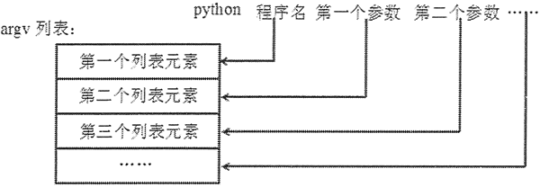

# Python sys 模块用法详解

sys 模块代表了 Python 解释器，主要用于获取和 Python 解释器相关的信息。

在 Python 的交互式解释器中先导入 sys 模块，然后输入 `[e for e in dir(sys) if not e.startswith('_')]` 命令（sys 模块没有 __all__ 变量），可以看到如下输出结果：

>>> [e for e in dir(sys) if not e.startswith('_')]
['api_version', 'argv', 'base_exec_prefix', 'base_prefix', 'builtin_module_names', 'byteorder', 'call_tracing', 'callstats', 'copyright', 'displayhook', 'dllhandle', 'dont_write_bytecode', 'exc_info', 'excepthook', 'exec_prefix', 'executable', 'exit', 'flags', 'float_info', 'float_repr_style', 'get_asyncgen_hooks', 'get_coroutine_wrapper', 'getallocatedblocks', 'getcheckinterval', 'getdefaultencoding', 'getfilesystemencodeerrors', 'getfilesystemencoding', 'getprofile', 'getrecursionlimit', 'getrefcount', 'getsizeof', 'getswitchinterval', 'gettrace', 'getwindowsversion', 'hash_info', 'hexversion', 'implementation', 'int_info', 'intern', 'is_finalizing', 'last_traceback', 'last_type', 'last_value', 'maxsize', 'maxunicode', 'meta_path', 'modules', 'path', 'path_hooks', 'path_importer_cache', 'platform', 'prefix', 'set_asyncgen_hooks', 'set_coroutine_wrapper', 'setcheckinterval', 'setprofile', 'setrecursionlimit', 'setswitchinterval', 'settrace', 'stderr', 'stdin', 'stdout', 'thread_info', 'version', 'version_info', 'warnoptions', 'winver']

上面列出的程序单元就是 sys 模块所包含的全部程序单元（包括变量、函数等），读者不要被它们吓着了，以为这些全都需要记下来。实际上完全没有必要，通常都是用到哪些模块就去查阅其对应的说明文档和参考手册。

sys 模块的参考页面为 [`docs.python.org/3/library/sys.html`](https://docs.python.org/3/library/sys.html)。

需要说明的是，大部分时候用不到 sys 模块里很冷僻的功能，因此本节只介绍 sys 模块中常用的属性和函数：

*   sys.argv：获取运行 Python 程序的命令行参数。其中 sys.argv[0] 通常就是指该 Python 程序，sys.argv[1] 代表为 Python 程序提供的第一个参数，sys.argv[2] 代表为 Python 程序提供的第二个参数……依此类推。
*   sys.byteorder：显示本地字节序的指示符。如果本地字节序是大端模式，则该属性返回 big；否则返回 little。
*   sys.copyright：该属性返回与 Python 解释器有关的版权信息。
*   sys.executable：该属性返回 Python 解释器在磁盘上的存储路径。
*   sys.exit()：通过引发 SystemExit 异常来退出程序。将其放在 try 块中不能阻止 finally 块的执行。
*   sys.flags：该只读属性返回运行 Python 命令时指定的旗标。
*   sys.getfilesystemencoding()：返回在当前系统中保存文件所用的字符集。
*   sys.getrefcount(object)：返回指定对象的引用计数。前面介绍过，当 object 对象的引用计数为 0 时，系统会回收该对象。
*   sys.getrecursionlimit()：返回 Python 解释器当前支持的递归深度。该属性可通过 setrecursionlimit() 方法重新设置。
*   sys.getswitchinterval()：返回在当前 Python 解释器中线程切换的时间间隔。该属性可通过 setswitchinterval() 函数改变。
*   sys.implementation：返回当前 Python 解释器的实现。
*   sys.maxsize：返回 Python 整数支持的最大值。在 32 位平台上，该属性值为 2**31-1；在 64 位平台上，该属性值为 2**63-1。
*   sys.modules：返回模块名和载入模块对应关系的字典。
*   sys.path：该属性指定 Python 查找模块的路径列表。程序可通过修改该属性来动态增加 Python 加载模块的路径。
*   sys.platform：返回 Python 解释器所在平台的标识符。
*   sys.stdin：返回系统的标准输入流——一个类文件对象。
*   sys.stdout：返回系统的标准输出流——一个类文件对象。
*   sys.stderr：返回系统的错误输出流——一个类文件对象。
*   sys.version：返回当前 Python 解释器的版本信息。
*   sys.winver：返回当前 Python 解释器的主版本号。

下面程序示范了使用 sys 模块的部分功能：

```
import sys
# 显示本地字节序的指示符。
print(sys.byteorder)
# 显示 Python 解释器有关的版权信息
print(sys.copyright)
# 显示 Python 解释器在磁盘上的存储路径。
print(sys.executable)
# 显示当前系统上保存文件所用的字符集。
print(sys.getfilesystemencoding())
# 显示 Python 整数支持的最大值
print(sys.maxsize)
# 显示 Python 解释器所在平台
print(sys.platform)
# 显示当前 Python 解释器的版本信息。
print(sys.version)
# 返回当前 Python 解释器的主版本号。
print(sys.winver)
```

上面程序分别调用了 sys 模块的部分属性和函数。运行该程序，可以看到如下输出结果：

little
Copyright (c) 2001-2017 Python Software Foundation.
All Rights Reserved.
Copyright (c) 2000 BeOpen.com.
All Rights Reserved.

Copyright (c) 1995-2001 Corporation for National Research Initiatives.
All Rights Reserved.

Copyright (c) 1991-1995 Stichting Mathematisch Centrum, Amsterdam.
All Rights Reserved.
D:\python3.6\pythonw.exe
utf-8
9223372036854775807
win32
3.6.2 (v3.6.2:5fd33b5, Jul  8 2017, 04:57:36) [MSC v.1900 64 bit (AMD64)]
3.6

从上面的输出结果可以看出，Windows 7 系统（作者使用的）的字节序是小端模式，将 Python 解释器保存在 `D:\python3.6\pythonw.exe` 处，当前 Python 版本是 3.6.2。

## 获取运行参数

通过 sys 模块的 argv 属性可获取运行 Python 程序的命令行参数。argv 属性值是一个列表，其列表元素和运行参数的关系如图 1 所示。

图 1 运行 Python 程序时命令行参数与 argv 列表的关系
因此，如果需要获取运行 Python 程序时传入的参数，可以通过 argv[1]、argv[2]……来获取。例如下面程序（编写在 argv_test.py 文件中）：

```
from sys import argv
# 输出 argv 列表的长度
print(len(argv))
# 遍历 argv 列表的每个元素
for arg in argv:
   print(arg)
```

上面程序是最简单的“Hello World”级的程序，只是这个程序增加了输出 argv 列表的长度、遍历 argv 列表元素的代码。使用`“python argv_test.py”` 命令运行上面程序，可以看到如下输出结果：

1
argv_test.py

此时看到 argv 列表的长度为 1，argv 的第一个元素就是被运行的 Python 程序。

如果改为使用如下命令来运行该程序：

python argv_test.py Python Swift

可以看到如下输出结果：

3
argv_test.py
Python
Swift

上面两次运行的结果和前面介绍的内容完全一致。

如果某个参数本身包含了空格，则应该将该参数用双引号（""）括起来；否则，Python 会把这个空格当成参数分隔符，而不是参数本身。例如，采用如下命令来运行上面程序：

python argv test.py "Python Swift"

可以看到 argv 列表的长度是 2，第一个列表元素是被运行的 Python 程序，第二个列表元素的值是“Python Swift”。

## 动态修改模块加载路径

前面介绍了使用 PYTHONPATH 环境变量来添加 Python 模块的加载路径，但这种方式必须预先设置好。如果需要在程序运行时动态改变 Python 模块的加载路径，则可通过 sys.path 属性来实现。

sys.path 也是很有用的一个属性，它可用于在程序运行时为 Python 动态修改模块加载路径。例如，如下程序在运行时动态指定加载 g:\fk_ext 目录下的模块：

```
import sys
# 动态添加 g:\fk_ext 路径作为模块加载路径
sys.path.append('g:\\fk_ext')
# 加载 g:\fk_ext 路径下的 hello 模块
import hello
```

为了成功运行该程序，需要在 G:\ 盘中创建 fk_ext 目录，并在该目录下添加 hello.py 模块文件。