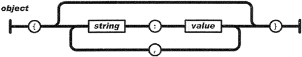
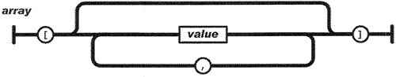
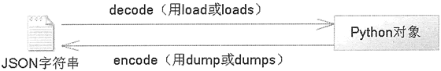

# Python json 模块完全攻略（超级详细）

JSON 是一种轻量级、跨平台、跨语言的数据交换格式，JSON 格式被广泛应用于各种语言的数据交换中，Python 也提供了对 JSON 的支持。

## JSON 的基本知识

JSON 的全称是 JavaScript Object Notation，即 JavaScript 对象符号，它是一种轻量级的数据交换格式。JSON 的数据格式既适合人来读写，也适合计算机本身解析和生成。最早的时候，JSON 是 JavaScript 语言的数据交换格式，后来慢慢发展成一种语言无关的数据交换格式，这一点非常类似于 XML。

JSON 主要在类似于 C 的编程语言中广泛使用，这些语言包括 C、C++、C#、Java、JavaScript、Perl、Python 等。JSON 提供了多种语言之间完成数据交换的能力，因此，JSON 也是一种非常理想的数据交换格式。

JSON 主要有如下两种数据结构：

*   由 key-value 对组成的数据结构。这种数据结构在不同的语言中有不同的实现。例如，在 JavaScript 中是一个对象；在 Python 中是一种 dict 对象；在 C 语言中是一个 struct；在其他语言中，则可能是 record、dictionary、hash table 等。
*   有序集合。这种数据结构在 Python 中对应于列表；在其他语言中，可能对应于 list、vector、数组和序列等。

上面两种数据结构在不同的语言中都有对应的实现，因此这种简便的数据表示方式完全可以实现跨语言。所以，JSON 可以作为程序设计语言中通用的数据交换格式。

在 JavaScript 中主要有两种 JSON 语法，其中一种用于创建对象，另一种用于创建数组。

#### 使用 JSON 语法创建对象

使用 JSON 语法创建对象是一种更简单的方式。使用 JSON 语法可避免书写函数，也可避免使用 new 关键字，而是可以直接获取一个 JavaScript 对象。对于早期的 JavaScript 版本，如果要使用 JavaScript 创建一个对象，通常可能会这样写：

```
//定义一个函数，可以作为该类的构造器
function Person(name, gender)
{
    this.name = name;
    this.gender = gender;
}
//创建一个 Person 实例
var p = new Person('yeeku', 'male');
//输出 Person 实例的 name 属性
alert (p.name);
```

从 JavaScript 1.2 开始，创建对象有了一种更快捷的语法，如下所示：

```
var p = {"name":'yeeku',"gender":'male'};
alert(p);
```

这种语法就是一种 JSON 语法。显然，使用 JSON 语法创建对象更加简捷、方便。如图 1 所示是使用 JSON 创建对象的语法示意图：

图 1 使用 JSON 创建对象的语法示意图
从图 1 可以看出，在创建对象 object 时，总以“{”开始，以“}”结束，对象的每个属性名和属性值之间以英文冒号（:）隔开，多个属性定义之间以英文逗号（,）隔开。语法格式如下：

object =
{
    propertyName1 : propertyValue1,
    propertyName2 : propertyValue2,
    ...
}

必须注意的是，并不是在每个属性定义的后面都有英文逗号，必须当后面还有属性定义时才需要有逗号。因此，下面的对象定义是错误的：

person =
{
    name : 'yeeku',
    gender : 'male',
}

因为在 gender 属性定义的后面多出了一个英文逗号。如果在最后一个属性定义的后面直接以“}”结束了，则不应该再有英文逗号。

当然，在使用 JSON 语法创建 JavaScript 对象时，属性值不仅可以是普通字符串，也可以是任何基本数据类型，还可以是函数、数组，甚至是另外一个使用 JSON 语法创建的对象。例如：

```
person =
{
    name : 'yeeku',
    gender : 'male',
    //使用 JSON 语法为其指定一个属性
    son : {
    name : 'tiger',
    grade : 1
    },
    //使用 JSON 语法为 person 直接分配一个方法
    info : function()
    {
    console.log("姓名：" + this.name + "性别：" + this.sex);
    }
}
```

#### 使用 JSON 语法创建数组

使用 JSON 语法创建数组也是非常常见的情形，在早期的 JavaScript 语法中，我们通过如下方式来创建数组：

```
//创建数组对象
var a = new Array();
//为数组元素赋值
a[0] = 'yeeku';
//为数组元素赋值
a[1] = 'nono';
```

或者，通过如下方式创建数组：

```
//在创建数组对象时直接赋值
var a = new Array ('yeeku', 'nono');
```

但如果使用 JSON 语法，则可以通过如下方式创建数组：

```
//使用 JSON 语法创建数组
var a = ['yeeku', 'nono'];
```

如图 2 所示是使用 JSON 创建数组的语法示意图：

图 2 使用 JSON 创建数组的语法示意图
正如从图 2 中所看到的，使用 JSON 语法创建数组总是以英文方括号（[）开始，然后依次放入数组元素，元素与元素之间以英文逗号隔开，最后一个数组元素后面不需要英文逗号，但以英文反方括号（]）结束。使用 JSON 创建数组的语法格式如下：

arr= [value1, value2, ...]

与使用 JSON 语法创建对象相似的是，在数组的最后一个元素的后面不能有英文逗号。

鉴于 JSON 语法的简单易用，而且作为数据传输载体时，数据传输量更小，因此在跨平台的数据交换中，往往采用 JSON 作为数据交换格式。假设需要交换一个对象 person，其 name 属性为 yeeku，gender 属性为 male，age 属性为 29，使用 JSON 语法可以简单写成如下形式：

```
person =
{
    name : 'yeeku',
    gender : 'male',
    age : 29
}
```

而 Python 则提供了将符合格式的 JSON 字符串恢复成对象的函数，也提供了将对象转换成 JSON 字符串的方法。JSON 的官方站点是[`www.json.org`](http://www.json.org)，读者可以登录该站点了解关于 JSON 的更多信息。

## Python 的 JSON 支持

json 模块提供了对 JSON 的支持，它既包含了将 JSON 字符串恢复成 Python 对象的函数，也提供了将 Python 对象转换成 JSON 字符串的函数。

当程序把 JSON 对象或 JSON 字符串转换成 Python 对象时，从 JSON 类型到 Python 类型的转换关系如表 3 所示：

表 3 JSON 类型转换 Python 类型的对应关系

| JSON 类型 | Python 类型 |
| 对象（object） | 字典（dict） |
| 数组（array） | 列表（list） |
| 字符串（string） | 字符串（str） |
| 整数（number(int)）  | 整数（int） |
| 实数（number(real)） | 浮点数（float） |
| true | True |
| false | False |
| null  | None |

当程序把 Python 对象转换成 JSON 格式字符串时，从 Python 类型到 JSON 类型的转换关系如表 4 所示：

表 4 Python 类型转换 JSON 类型的对应关系

| Python 类型 | JSON 类型 |
| 字典（dict） | 对象（object） |
| 列表（list）和元组（tuple） | 数组（array） |
| 字符串（str） | 字符串（string） |
| 整型、浮点数，以及整型、浮点型派生的枚举（float,int-& float-derived Enums） | 数值型（number） |
| True | true |
| False | false |
| None | null |

在 Python 的交互式解释器中先导入 json 模块，然后输入 json.all 命令，即可看到该模块所包含的全部属性和函数：

>>> json.__all__
['dump', 'dumps', 'load', 'loads', 'JSONDecoder', 'JSONDecodeError', 'JSONEncoder']

json 模块中常用的函数和类的功能如下：

*   json.dump(obj, fp, *, skipkeys=False, ensure_ascii=True, check_circular=True, allow_nan=True, cls=None, indent=None, separators=None, default=None, sort_keys=False, **kw)：将 obj 对象转换成 JSON 字符串输出到 fp 流中，fp 是一个支持 write() 方法的类文件对象。
*   json.dumps(obj, *, skipkeys=False, ensure_ascii=True, check_circular=True, allow_nan= True, cls=None, indent=None, separators=None, default=None, sort_keys=False, **kw)：将 obj 对象转换为 JSON 字符串，并返回该 JSON 字符串。
*   json.load(fp, *, cls=None, object_hook=None, parse_float=None, parse_int=None, parse_constant=None, object_pairs_hook=None, **kw)：从 fp 流读取 JSON 字符串，将其恢复成 JSON 对象，其中 fp 是一个支持 write() 方法的类文件对象。
*   json.loads(s, *, encoding=None, cls=None, object_hook=None, parse_float=None, parse_int=None, parse_constant=None, object_pairs_hook=None, **kw)：将 JSON 字符串 s 恢复成 JSON 对象。

通过上面 4 个功能函数就可以实现 JSON 的两个主要应用场景，由于 JSON 只是一种轻量级的数据交换格式，因此 JSON 的主要应用场景如图 5 所示：

图 5 Python 的 JSON 支持
下面程序示范了 dumps() 和 dump() 函数的 encode 操作（将 Python 对象转换成 JSON 字符串）：

```
import json
# 将 Python 对象转 JSON 字符串（元组会当成数组）
s = json.dumps(['yeeku', {'favorite': ('coding', None, 'game', 25)}])
print(s) # ["yeeku", {"favorite": ["coding", null, "game", 25]}]
# 简单的 Python 字符串转 JSON
s2 = json.dumps("\"foo\bar")
print(s2) #"\"foo\bar"
# 简单的 Python 字符串转 JSON
s3 = json.dumps('\\')
print(s3) #"\\"
# Python 的 dict 对象转 JSON，并对 key 排序
s4 = json.dumps({"c": 0, "b": 0, "a": 0}, sort_keys=True)
print(s4) #{"a": 0, "b": 0, "c": 0}
# 将 Python 列表转 JSON，
# 并指定 JSON 分隔符：逗号和冒号之后没有空格（默认有空格）
s5 = json.dumps([1, 2, 3, {'x': 5, 'y': 7}], separators=(',', ':'))
# 输出的 JSON 字符串中逗号和冒号之后没有空格
print(s5) # '[1,2,3,{"4":5,"6":7}]'
# 指定 indent 为 4，意味着转换的 JSON 字符串有缩进
s6 = json.dumps({'Python': 5, 'Kotlin': 7}, sort_keys=True, indent=4)
print(s6)
# 使用 JSONEncoder 的 encode 方法将 Python 转 JSON
s7 = json.JSONEncoder().encode({"names": ("孙悟空", "齐天大圣")})
print(s7) # {"names": ["\u5b59\u609f\u7a7a", "\u9f50\u5929\u5927\u5723"]}
f = open('a.json', 'w')
# 使用 dump()函数将转换得到 JSON 字符串输出到文件
json.dump(['Kotlin', {'Python': 'excellent'}], f)
```

上面程序主要是调用 dumps() 函数执行 encode 操作，程序在调用 dumps() 函数时指定了不同的选项。上面程序最后一行代码调用 dump() 函数将通过 encode 操作得到的 JSON 字符串输出到文件中。实际上，dumps() 和 dump() 函数的功能、所支持的选项基本相同，只是 dumps() 函数直接返回转换得到的 JSON 字符串，而 dump() 函数则将转换得到的 JSON 字符串输出到文件中。

运行上面程序，可以看到如下输出结果：

["yeeku", {"favorite": ["coding", null, "game", 25]}]
"\"foo\bar"
"\\"
{"a": 0, "b": 0, "c": 0}
[1,2,3,{"x":5,"y":7}]
{
    "Kotlin": 7,
    "Python": 5
}
{"names": ["\u5b59\u609f\u7a7a", "\u9f50\u5929\u5927\u5723"]}

程序运行结束后，会在程序所在目录生成一个 a.json 文件，该文件内容就是转换得到的 JSON 字符串。

正如从上面程序中所看到的，程序调用 json.JSONEncoder 对象的 encode() 方法也可以将 Python 对象转换为 JSON 字符串。而 dumps() 和 dump() 函数是更高级的调用方式，一般调用 dumps() 和 dump() 函数对 Python 对象执行转换即可。

下面程序示范了 loads() 和 load() 函数的 decode 操作（将 JSON 字符串转换成 Python 对象）：

```
import json
# 将 JSON 字符串恢复成 Python 列表
result1 = json.loads('["yeeku", {"favorite": ["coding", null, "game", 25]}]')
print(result1) # ['yeeku', {'favorite': ['coding', None, 'game', 25]}]
# 将 JSON 字符串恢复成 Python 字符串
result2 = json.loads('"\\"foo\\"bar"')
print(result2) # "foo"bar
# 定义一个自定义的转化函数
def as_complex(dct):
    if '__complex__' in dct:
        return complex(dct['real'], dct['imag'])
    return dct
# 使用自定义的恢复函数
# 自定义回复函数将 real 数据转成复数的实部，将 imag 转成复数的虚部
result3 = json.loads('{"__complex__": true, "real": 1, "imag": 2}',\
    object_hook=as_complex)
print(result3) # (1+2j)
f = open('a.json')
# 从文件流恢复 JSON 列表
result4 = json.load(f)
print(result4) # ['Kotlin', {'Python': 'excellent'}]
```

上面程序开始调用 loads() 函数从 JSON 字符串恢复 Python 列表、Python 字符串等。接下来程序示范了一个比较特殊的例子，程序定义了一个自定义的恢复函数，该函数负责将一个原本应该恢复成 dict 对象的 JSON 字符串恢复成复数，并负责将字典中 real 对应的值转换成复数的实部，将字典中 imag 对应的值转换成复数的虚部。

通过使用自定义的恢复函数，可以完成 JSON 类型到 Python 特殊类型（如复数、矩阵）的转换。上面程序最后使用 load() 函数示范了从文件流来恢复 JSON 列表。

运行上面程序，可以看到如下输出结果：

['yeeku', {'favorite': ['coding', None, 'game', 25]}]
"foo"bar
(1+2j)
['Kotlin', {'Python': 'excellent'}]

此外，我们还需要考虑一个问题，Python 支持更多的 JSON 所不支持的类型，比如复数、矩阵等，如果直接使用 dumps() 或 dump() 函数进行转换，程序肯定会出问题。此时就需要开发者对 JSONEncoder 类进行扩展，通过这种扩展来完成从 Python 特殊类型到 JSON 类型的转换。

例如，如下程序示范了通过扩展 JSONEncoder 来实现从 Python 复数到 JSON 字符串的转换：

```
import json
# 定义 JSONEncoder 的子类
class ComplexEncoder(json.JSONEncoder):
    def default(self, obj):
        # 如果要转换的对象是复数类型，程序负责处理
        if isinstance(obj, complex):
            return {"__complex__": 'true', 'real': obj.real, 'imag': obj.imag}
        # 对于其他类型，还使用 JSONEncoder 的默认处理
        return json.JSONEncoder.default(self, obj)
s1 = json.dumps(2 + 1j, cls=ComplexEncoder)
print(s1) # '{"__complex__": "true", "real": 2.0, "imag": 1.0}'
s2 = ComplexEncoder().encode(2 + 1j)
print(s2) # '{"__complex__": "true", "real": 2.0, "imag": 1.0}'
```

上面程序扩展了 JSONEncoder 类的子类，并重写了它的 default() 方法，在方法中判断如果要转换的目标类型是复数（complex），程序就会进行自定义转换，即将复数转换成 JSON 对象，且该对象包含 "_complex_":'true' 属性。

一旦扩展了 JSONEncoder 的子类之后，程序有两种方式来使用自定义的子类：

1.  在 dumps() 或 dump() 函数中通过 cls 属性指定使用 JSONEncoder 的自定义子类。
2.  直接使用 JSONEncoder 的自定义子类的 encode() 方法来执行转换。

运行该程序，可以看到如下输出结果：

{"__complex__": "true", "real": 2.0, "imag": 1.0}
{"__complex__": "true", "real": 2.0, "imag": 1.0}