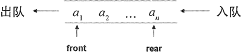

# Python queue（双端队列）模块及用法（无师自通）

在“数据结构”课程中最常讲授的数据结构有栈、队列、双端队列。

栈是一种特殊的线性表，它只允许在一端进行插入、删除操作，这一端被称为栈顶（top），另一端则被称为栈底（bottom）。

从栈顶插入一个元素被称为进栈，将一个元素插入栈顶被称为“压入栈”，对应的英文说法为 push；相应地，从栈顶删除一个元素被称为出栈，将一个元素从栈顶删除被称为“弹出栈”，对应的英文说法为 pop。

对于栈而言，最先入栈的元素位于栈底，只有等到上面所有元素都出栈之后，栈底的元素才能出栈。因此栈是一种后进先出（LIFO）的线性表。如图 1 所示为栈的操作示意图。

图 1 栈的操作示意图
队列也是一种特殊的线性表，它只允许在表的前端（front）进行删除操作，在表的后端（rear）进行插入操作。进行插入操作的端被称为队尾，进行删除操作的端被称为队头。

对于一个队列来说，每个元素总是从队列的 rear 端进入队列的，然后等待该元素之前的所有元素都出队之后，当前元素才能出队。因此，队列是一种先进先出（FIFO）的线性表。队列示意图如图 2 所示。

图 2 队列示意图
双端队列（即此处介绍的 deque）代表一种特殊的队列，它可以在两端同时进行插入、删除操作，如图 3 所示。

图 3 双端队列示意图
对于一个双端队列来说，它可以从两端分别进行插入、删除操作，如果程序将所有的插入、删除操作都固定在一端进行，那么这个双端队列就变成了栈；如果固定在一端只添加元素，在另一端只删除元素，那么它就变成了队列。因此，deque 既可被当成队列使用，也可被当成栈使用。

deque 位于 collections 包下，在交互式解释器中先导入 collections 包，然后输入 `[e for e in dir(collections.deque) if not e.startswith('_')]` 命令来查看 deque 的全部方法，可以看到如下输出结果：

>>> from collections import deque
>>> [e for e in dir(deque) if not e.startswith('_')]
['append', 'appendleft', 'clear', 'copy', 'count', 'extend', 'extendleft', 'index', 'insert', 'maxlen', 'pop', 'popleft', 'remove', 'reverse', 'rotate']

从上面的方法可以看出，deque 的方法基本都有两个版本，这就体现了它作为双端队列的特征。deque 的左边（left）就相当于它的队列头（front），右边（right）就相当于它的队列尾（rear）：

*   append 和 appendleft：在 deque 的右边或左边添加元素，也就是默认在队列尾添加元素。
*   pop 和 popleft：在 deque 的右边或左边弹出元素，也就是默认在队列尾弹出元素。
*   extend 和 extendleft：在 deque 的右边或左边添加多个元素，也就是默认在队列尾添加多个元素。

deque 中的 clear() 方法用于清空队列：insert() 方法则是线性表的方法，用于在指定位置插入元素。

假如程序要把 deque 当成栈使用，则意味着只在一端添加、删除元素，因此调用 append 和 pop 方法即可。例如如下程序：

```
from collections import deque
stack = deque(('Kotlin', 'Python'))
# 元素入栈
stack.append('Erlang')
stack.append('Swift')
print('stack 中的元素：' , stack)
# 元素出栈，后添加的元素先出栈
print(stack.pop())
print(stack.pop())
print(stack)
```

运行上面程序，可以看到如下运行结果：

stack 中的元素： deque(['Kotlin', 'Python', 'Erlang', 'Swift'])
Swift
Erlang
deque(['Kotlin', 'Python'])

从上面的运行结果可以看出，程序最后入栈的元素“Swift”最先出栈，这体现了栈的 LIFO 的特征。

假如程序要把 deque 当成队列使用，则意味着一端只用来添加元素，另一端只用来删除元素，因此调用 append、popleft 方法即可。例如如下程序：

```
from collections import deque
q = deque(('Kotlin', 'Python'))
# 元素加入队列
q.append('Erlang')
q.append('Swift')
print('q 中的元素：' , q)
# 元素出队列，先添加的元素先出队列
print(q.popleft())
print(q.popleft())
print(q)
```

运行上面程序，可以看到如下运行结果：

q 中的元素： deque(['Kotlin', 'Python', 'Erlang', 'Swift'])
Kotlin
Python
deque(['Erlang', 'Swift'])

从上面的运行结果可以看出，程序先添加的元素“Katlin”最先出队列，这体现了队列的 FIFO 的特征。

此外，deque 还有一个 rotate() 方法，该方法的作用是将队列的队尾元素移动到队头，使之首尾相连。例如如下程序：

```
from collections import deque
q = deque(range(5))
print('q 中的元素：' , q)
# 执行旋转，使之首尾相连
q.rotate()
print('q 中的元素：' , q)
# 再次执行旋转，使之首尾相连
q.rotate()
print('q 中的元素：' , q)
```

运行上面程序，可以看到如下输出结果：

q 中的元素： deque([0, 1, 2, 3, 4])
q 中的元素： deque([4, 0, 1, 2, 3])
q 中的元素： deque([3, 4, 0, 1, 2])

从上面的输出结果来看，每次执行 rotate() 方法，deque 的队尾元素都会被移到队头，这样就形成了首尾相连的效果。