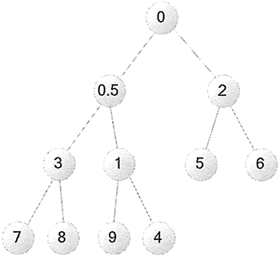

# Python heapq（堆操作）用法详解

Python 提供了关于堆的操作，下面先简单介绍有关堆的概念。

假设有 n 个数据元素的序列 k[0]，k[1]，...，k[n-1]，当且仅当满足 `k[i]≤k[2i+1] 且 k[i]≤k[2i+2]（其中 i=0,2,...,(n-1)/2）`时，可以将这组数据称为小顶堆（小根堆）；或者满足 `k[i]≥k[2i+1] 且 k[i]≥k[2i+2]（其中 i=0,2,...,(n-1)/2）`时，可以将这组数据称为大顶堆（大根堆）。

对于满足小顶堆的数据序列 k[0]，k[1]，...，k[n-1]，如果将它们顺序排成一棵完全二叉树，则此树的特点是：树中所有节点的值都小于其左、右子节点的值，此树的根节点的值必然最小。反之，对于满足大顶堆的数据序列 k[0]，k[1]，...，k[n-1]，如果将它们顺序排成一棵完全二叉树，则此树的特点是：树中所有节点的值都大于其左、右子节点的值，此树的根节点的值必然最大。

通过上面介绍不难发现，小顶堆的任意子树也是小顶堆，大顶堆的任意子树还是大顶堆。

Python 提供的是基于小顶堆的操作，因此 Python 可以对 list 中的元素进行小顶堆排列，这样程序每次获取堆中元素时，总会取得堆中最小的元素。

例如，判断数据序列 `9, 30, 49, 46, 58, 79` 是否为堆，可以将其转换为一棵完全二叉树，如图 1 所示。

图 1 完全二叉树
在图 1 中，每个节点上的灰色数字代表该节点数据在底层数组中的索引。图 1 所示的完全二叉树完全满足小顶堆的特征，每个父节点的值总小于或等于它的左、右子节点的值。

Python 并没有提供“堆”这种数据类型，它是直接把列表当成堆处理的。Python 提供的 heapq 包中有一些函数，当程序用这些函数来操作列表时，该列表就会表现出“堆”的行为。

在交互式解释器中先导入 heapq 包，然后输入 `heapq.__all__` 命令来查看 heapq 包下的全部函数，可以看到如下输出结果：

>>> heapq.__all__
['heappush', 'heappop', 'heapify', 'heapreplace', 'merge', 'nlargest', 'nsmallest', 'heappushpop']

上面这些函数就是执行堆操作的工具函数，这些函数的功能大致如下：

*   heappush(heap, item)：将 item 元素加入堆。
*   heappop(heap)：将堆中最小元素弹出。
*   heapify(heap)：将堆属性应用到列表上。
*   heapreplace(heap, x)：将堆中最小元素弹出，并将元素 x 入堆。
*   merge(*iterables, key=None, reverse=False)：将多个有序的堆合并成一个大的有序堆，然后再输出。
*   heappushpop(heap, item)：将 item 入堆，然后弹出并返回堆中最小的元素。
*   nlargest(n, iterable, key=None)：返回堆中最大的 n 个元素。
*   nsmallest(n, iterable, key=None)：返回堆中最小的 n 个元素。

下面程序示范了这些函数的用法：

```
from heapq import *
my_data = list(range(10))
my_data.append(0.5)
# 此时 my_data 依然是一个 list 列表
print('my_data 的元素：', my_data)
# 对 my_data 应用堆属性
heapify(my_data)
print('应用堆之后 my_data 的元素：', my_data)
heappush(my_data, 7.2)
print('添加 7.2 之后 my_data 的元素：', my_data)
```

上面程序开始创建了一个 list 列表，接下来程序调用 heapify() 函数对列表执行堆操作，执行之后看到 my_data 的元素顺序如下：

应用堆之后 my_data 的元素：[0 , 0.5, 2, 3, 1, 5, 6, 7, 8, 9, 4]

这些元素看上去是杂乱无序的，但其实并不是，它完全满足小顶堆的特征。我们将它转换为完全二叉树，可以看到如图 2 所示的效果。

图 2 小顶堆对应的完全二叉树
当程序再次调用 heappush(my_data, 7.2) 向堆中加入一个元素之后，输出该堆中元素，可以看到如下输出结果：

添加 7.2 之后 my_data 的元素：[0, 0.5, 2, 3, 1, 5, 6, 7, 8, 9, 4,7.2]

此时将它转换为完全二叉树，可以看到如图 3 所示的效果。

图 3 添加 7.2 之后的小顶堆对应的完全二叉树
接下来程序尝试从堆中弹出两个元素：

```
# 弹出堆中最小的元素
print(heappop(my_data)) # 0
print(heappop(my_data)) # 0.5
print('弹出两个元素之后 my_data 的元素：', my_data)
```

上面三行代码的输出如下：

0
0.5
弹出两个元素之后 my_data 的元素： [1, 3, 2, 7, 4, 5, 6, 7.2, 8, 9]

从最后输出的 my_data 的元素来看，此时 my_data 的元素依然满足小顶堆的特征。

下面代码示范了 replace() 函数的用法：

```
# 弹出最小元素，压入指定元素
print(heapreplace(my_data, 8.1))
print('执行 replace 之后 my_data 的元素：', my_data)
```

执行上面两行代码，可以看到如下输出结果：

1
执行 replace 之后 my_data 的元素： [2, 3, 5, 7, 4, 8.1, 6, 7.2, 8, 9]

也可以测试通过 nlargest()、nsmallest() 来获取最大、最小的 n 个元素，代码如下：

```
print('my_data 中最大的 3 个元素：', nlargest(3, my_data))
print('my_data 中最小的 4 个元素：', nsmallest(4, my_data))
```

运行上面程序，可以看到如下输出结果：

my_data 中最大的 3 个元素： [9, 8.1, 8]
my_data 中最小的 4 个元素： [2, 3, 4, 5]

通过上面程序不难看出，Python 的 heapq 包中提供的函数，其实就是提供对排序算法中“堆排序”的支持。Python 通过在底层构建小顶堆，从而对容器中的元素进行排序，以便程序能快速地获取最小、最大的元素，因此使用起来非常方便。

提示：当程序要获取列表中最大的 n 个元素，或者最小的 n 个元素时，使用堆能缓存列表的排序结果，因此具有较好的性能。