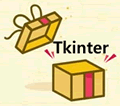

# 第十一章 Tkinter

Python GUI 开发也叫 Python 图形界面开发，通俗地讲，就是开发出带界面的客户端程序，像 QQ、迅雷一样。

Python GUI 库有很多，大部分都是第三方提供的，并且有各自的特点，这给开发者造成了“选择障碍”，所以，本专题干脆以 Python 内置的 Tkinter 库来讲解图形界面开发。

这套 Python Tkinter 教程通俗易懂，简洁明了，同时包含了大量实例，你的学习将会非常轻松逾越。