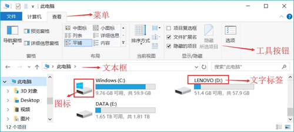
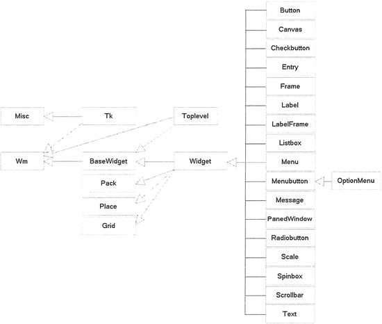
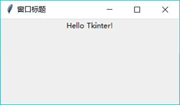
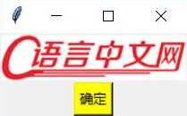

# Python Tkinter GUI 编程组件及用法

如果从程序员的角度来看一个窗口，这个窗口不是一个整体（有点庖丁解牛的感觉），而是由多个部分组合而成的，如图 1 所示：

图 1 窗口的“分解”
从图 1 中可以看出，任何窗口都可被分解成一个空的容器，容器里盛装了大量的基本组件，通过设置这些基本组件的大小、位置等属性，就可以将该空的容器和基本组件组成一个整体的窗口。

实际上，图形界面编程非常简单，它非常类似于小朋友玩的拼图游戏，容器类似于拼图的“母板”，而普通组件（如 Button、Listbox 之类的）则类似于拼图的图块。创建图形用户界面的过程就是完成拼图的过程。

使用 Tkinter 进行 GUI 编程与其他语言的 GUI 编程基本相似，都是使用不同的“积木块”来堆出各种各样的界面。因此，学习 GUI 编程的总体步骤大致可分为三步：

1.  了解 GUI 库大致包含哪些组件，就相当于熟悉每个积木块到底是些什么东西。
2.  掌握容器及容器对组件进行布局的方法，就相当于掌握拼图的“母板”，以及母板怎么固定积木块的方法。
3.  逐个掌握各组件的用法，则相当于深入掌握每个积木块的功能和用法。

下面先完成第 1 步，大致介绍 Tkinter 库包含的各 GUI 组件。由于这些组件之间存在错综复杂的继承关系，因此先通过类图来了解各 GUI 组件，以及它们之间的关系。

Tkinter 的 GUI 组件之间的继承关系如图 2 所示。

图 2 Tkinter 的 GUI 组件之间的继承关系
从图 2 可以看到，Tkinter 的 GUI 组件有两个根父类，它们都直接继承了 object 类：

*   Misc：它是所有组件的根父类。
*   Wm：它主要提供了一些与窗口管理器通信的功能函数。

对于 Misc 和 Wm 两个基类而言，GUI 编程并不需要直接使用它们，但由于它们是所有 GUI 组件的父类，因此 GUI 组件都可以直接使用它们的方法。

Misc 和 Wm 派生了一个子类 Tk，它代表应用程序的主窗口。因此所有 Tkinter GUI 编程通常都需要直接或间接使用该窗口类。

BaseWidget 是所有组件的基类，它还派生了一个子类 Widget。Widget 代表一个通用的 GUI 组件，Tkinter 所有的 GUI 组件都是 Widget 的子类。

再来看 Widget 的父类。Widget 一共有四个父类，除 BaseWidget 之外，还有 Pack、Place 和 Grid，这三个父类都是布局管理器，它们负责管理所包含的组件的大小和位置。

剩下的就是图 2 右边所显示的 Widget 的子类了，它们都是 Tkinter GUI 编程的各种 UI 组件，也就是前面所说的各种“积木块”。表 3 简单介绍了各 GUI 组件的功能。

表 3 各 GUI 组件的功能

| Tkinter 类 | 名称 | 简介 |
| Toplevel  | 顶层 | 容器类，可用于为其他组件提供单独的容器；Toplevel 有点类似于窗口 |
| Button | 按钮 | 代表按钮组件 |
| Canvas | 画布 | 提供绘图功能，包括绘制直线、矩形、椭圆、多边形、位图等 |
| Checkbutton | 复选框 | 可供用户勾选的复选框 |
| Entry | 单行输入框 | 用户可输入内容 |
| Frame | 容器 | 用于装载其它 GUI 组件 |
| Label | 标签 | 用于显示不可编辑的文本或图标 |
| LabelFrame | 容器 | 也是容器组件，类似于 Frame，但它支持添加标题 |
| Listbox | 列表框 | 列出多个选项，供用户选择 |
| Menu | 菜单 | 菜单组件 |
| Menubutton | 菜单按钮 | 用来包含菜单的按钮（包括下拉式、层叠式等） |
| OptionMenu | 菜单按钮 | Menubutton 的子类，也代表菜单按钮，可通过按钮打开一个菜单 |
| Message | 消息框 | 类似于标签，但可以显示多行文本；后来当 Label 也能显示多行文本之后，该组件基本处于废弃状态 |
| PanedWindow  | 分区窗口 | 该容器会被划分成多个区域，每添加一个组件占一个区域，用户可通过拖动分隔线来改变各区域的大小 |
| Radiobutton | 单选钮 | 可供用户点边的单选钮 |
| Scale | 滑动条 | 拖动滑块可设定起始值和结束值，可显示当前位置的精确值 |
| Spinbox | 微调选择器 | 用户可通过该组件的向上、向下箭头选择不同的值 |
| Scrollbar | 滚动条 | 用于为组件（文本域、画布、列表框、文本框）提供滚动功能 |
| Text | 多行文本框 | 显示多行文本 |

此处只是简单地介绍了这些 GUI 组件，读者有一个大致印象即可，先不用太熟悉它们。下面通过一个简单的例子来创建一个窗口：

```
# Python 2.x 使用这行
#from Tkinter import *
# Python 3.x 使用这行
from tkinter import * 
# 创建 Tk 对象，Tk 代表窗口
root = Tk()
# 设置窗口标题
root.title('窗口标题')
# 创建 Label 对象，第一个参数指定该 Label 放入 root
w = Label(root, text="Hello Tkinter!")
# 调用 pack 进行布局
w.pack()
# 启动主窗口的消息循环
root.mainloop()
```

上面程序主要创建了两个对象 Tk 和 Label。其中 Tk 代表顶级窗口，Label 代表一个简单的文本标签，因此需要指定将该 Label 放在哪个容器内。上面程序在创建 Label 时第一个参数指定了 root，表明该 Label 要放入 root 窗口内。

运行上面程序，可以看到如图 3 所示的运行效果：

图 3 简单窗口
此外，还有一种方式是不直接使用 Tk，只要创建 Frame 的子类，它的子类就会自动创建 Tk 对象作为窗口。例如如下程序：

```
# Python 2.x 使用这行
#from Tkinter import *
# Python 3.x 使用这行
from tkinter import *

# 定义继承 Frame 的 Application 类
class Application(Frame):
    def __init__(self, master=None):
        Frame.__init__(self, master)
        self.pack()
        # 调用 initWidgets()方法初始化界面
        self.initWidgets()
    def initWidgets(self):
        # 创建 Label 对象，第一个参数指定该 Label 放入 root
        w = Label(self)
        # 创建一个位图
        bm = PhotoImage(file = 'serial.png')
        # 必须用一个不会被释放的变量引用该图片，否则该图片会被回收
        w.x = bm
        # 设置显示的图片是 bm
        w['image'] = bm
        w.pack()
        # 创建 Button 对象，第一个参数指定该 Button 放入 root
        okButton = Button(self, text="确定")
        okButton['background'] = 'yellow'
        okButton.configure(background='yellow')
        okButton.pack()
# 创建 Application 对象
app = Application()
# Frame 有个默认的 master 属性，该属性值是 Tk 对象（窗口）
print(type(app.master))
# 通过 master 属性来设置窗口标题
app.master.title('窗口标题')
# 启动主窗口的消息循环
app.mainloop()
```

上面程序创建了 Frame 的子类 Application，并在该类的构造方法中调用了 initWidges() 方法（这个方法可以是任意方法名），程序在 initWidgets() 方法中创建了两个组件，即 Label 和 Button。

上面程序只是创建了 Application 的实例（Frame 容器的子类），并未创建 Tk 对象（窗口），那么这个程序有窗口吗？答案是肯定的。如果程序在创建任意 Widget 组件（甚至 Button）时没有指定 master 属性（即创建 Widget 组件时第一个参数传入 None），那么程序会自动为该 Widget 组件创建一个 Tk 窗口，因此 Python 会自动为 Application 实例创建 Tk 对象来作为它的 master。

该程序与上一个程序的差别在于，程序在创建 Label 和 Button 之后，对 Label 进行了配置，设置了 Label 显示的背景图片；也对 Button 进行了配置，设置了 Button 的背景色。

可能有读者对上面程序中的如下代码感到好奇：

w.x = bm

这行代码负责为 w 的 x 属性赋值。这行代码有什么作用呢？因为程序在 initWidgets() 方法中创建了 PhotoImage 对象，这是一个图片对象。当该方法结束时，如果该对象没有被其他变量引用，这个图片可能会被系统回收，此处由于 w（Label 对象）需要使用该图片，因此程序就让 w 的 x 属性引用该 PhotoImage 对象，阻止系统回收 PhotoImage 的图片。

运行上面程序，可以看到如图 4 所示的效果：

图 4 配置 Label 和 Button
仔细体会上面程序中 initWidgets() 方法的代码，虽然看上去代码量不小，但实际上只有 3 行代码：

*   创建 GUI 组件。相当于创建“积木块”。
*   添加 GUI 组件，此处使用 pack() 方法添加。相当于把“积木块”添加进去。
*   配置 GUI 组件。

其中创建 GUI 组件的代码很简单，与创建其他 Python 对象并没有任何区别，但通常至少要指定一个参数，用于设置该 GUI 组件属于哪个容器（Tk 组件例外，因为该组件代表顶级窗口）。

配置 GUI 组件有两个时机：

1.  在创建 GUI 组件时以关键宇参数的方式配置。例如 Button(self, text="确定")，其中 text = "确定" 就指定了该按钮上的文本是“确定”。
2.  在创建完成之后，以字典语法进行配置。例如 okButton['background']='yellow'，这种语法使得 okButton 看上去就像一个字典，它用于配置 okButton 的 background 属性，从而改变该按钮的背景色。

上面两种方式完全可以切换。比如可以在创建按钮之后配置该按钮上的文本，例如如下代码：

okButton ['text']= '确定'

这行代码其实是调用 configure() 方法的简化写法。也就是说，这样代码等同于如下代码：

okButton.configure(text = '确定')

也可以在创建按钮时就配置它的文本和背景色，例如如下代码：

```
#创建 Button 对象，在创建时就配置它的文本和背景色
okButton = Button (self, text = "确定", background = 'yellow')
```

这里又产生了一个问题，除可配置 background、image 等选项之外，GUI 组件还可配置哪些选项呢？可以通过该组件的构造方法的帮助文档来查看。例如，查看 Button 的构造方法的帮助文档，可以看到如下输出结果：

>>> help(tkinter.Button.__init__)
Help on function __init__ in module tkinter:

__init__(self, master=None, cnf={}, **kw)
    Construct a button widget with the parent MASTER.

    STANDARD OPTIONS

        activebackground, activeforeground, anchor,
        background, bitmap, borderwidth, cursor,
        disabledforeground, font, foreground
        highlightbackground, highlightcolor,
        highlightthickness, image, justify,
        padx, pady, relief, repeatdelay,
        repeatinterval, takefocus, text,
        textvariable, underline, wraplength

    WIDGET-SPECIFIC OPTIONS

        command, compound, default, height,
        overrelief, state, width

上面的帮助文档指出，Button 支持两组选项：标准选项（STANDARD OPTIONS）和组件特定选项（WIDGET-SPECIFIC OPTIONS）。至于这些选项的含义，基本上通过它们的名字就可猜出来。

此处简单介绍一下这些 GUI 组件的常见边项的含义。表 5 显示了大部分 GUI 组件都支持的选项。

表 5 GUI 组件支持的通用选项

| 选项名（别名） | 含义 | 单位 | 典型值 |
| activebackground | 指定组件处于激活状态时的背景色 | color | 'gray25'或'#ff4400' |
| activeforeground | 指定组件处于激活状态时的前景色 | color | 'gray25'或'#ff4400' |
| anchor  | 指定组件内的信息（比如文本或图片）在组件中如何显示。必须为下面的值之一：N、NE、E、SE、S、SW、W、NW 或 CENTER。比如 NW（NorthWest）指定将信息显示在组件的左上角 |   | CENTER |
| background(bg) | 指定组件正常显示时的背景色 | color | 'gray25'或'#ff4400' |
| bitmap | 指定在组件上显示该选项指定的位图，该选项值可以是 Tk_GetBitmap 接收的任何形式的位图。位图的显示方式受 anchor、justify 选项的影响。如果同时指定了 bitmap 和 text，那么 bitmap 覆盖文本；如果同时指定了 bitmap 和 image，那么 image 覆盖 bitmap |   |   |
| borderwidth | 指定组件正常显示时的 3D 边框的宽度，该值可以是 Tk_GetPixels 接收的任何格式 | pixel | 2 |
| cursor | 指定光标在组件上的样式。该值可以是 Tk_GetCursors 接受的任何格式 | cursor | gumby |
| command | 指定按组件关联的命令方法，该方法通常在鼠标离开组件时被触发调用 |   |   |
| disabledforeground  | 指定组件处于禁用状态时的前景色 | color | 'gray25'或'#ff4400' |
| font  | 指定组件上显示的文本字体 | font  | 'Helvetica'或('Verdana', 8) |
| foreground(fg)  | 指定组件正常显示时的前景色 | color | 'gray'或'#ff4400' |
| highlightbackground | 指定组件在高亮状态下的背景色 | color | 'gray'或'#ff4400' |
| highlightcolor | 指定组件在高亮状态下的前景色 | color | 'gray'或'#ff4400' |
| highlightthickness | 指定组件在高亮状态下的周围方形区域的宽度，该值可以是 Tk_GetPixels 接收的任何格式 | pixel  | 2 |
| height | 指定组件的高度，以 font 选项指定的字体的字符高度为单位，至少为 1 | integer | 14 |
| image | 指定组件中显示的图像，如果设置了 image 选项，它将会覆盖 text、bitmap 选项 | image |   |
| justify | 指定组件内部内容的对齐方式，该选项支持 LEFT（左对齐）、CENTER（居中对齐）或 RIGHT（右对齐）这三个值 | constant | RIGHT |
| padx | 指定组件内部在水平方向上两边的空白，该值可以是 Tk_GctPixels 接收的任何格式 | pixel | 12 |
| pady | 指定组件内部在垂直方向上两地的空白，该值可以是 Tk_GctPixels 接收的任何格式 | pixel | 12 |
| relief  | 指定组件的 3D 效果，该选项支持的值包括 RAISED、SUNKEN、FLAT、RIDGE、SOLID、GROOVE。该值指出组件内部相对于外部的外观样式，比如 RAISED 表示组件内部相对于外部凸起 | constant | GROOVE RAISED |
| selectbackground | 指定组件在选中状态下的背景色 | color | 'gray'或'#ff4400' |
| selectborderwidth | 指定组件在选中状态下的 3D 边框的宽度，该值可以是 Tk_GetPixels 接收的任何格式 | pixel | 2 |
| selectforeground | 指定组在选中状态下的前景色 | color | 'gray'或'#ff4400' |
| state | 指定组件的当前状态。该选项支持 NORMAL（正常）、DISABLE（禁用）这两个值 | constant | NORMAL |
| takefocus | 指定组件在键盘遍历（Tab 或 Shift+Tab）时是否接收焦点，将该选项设为 1 表示接收焦点；设为 0 表示不接收焦点 | boolean |  1 或 YES |
| text | 指定组件上显示的文本，文本显示格式由组件本身、anchor 及 justify 选项决定 | str | '确定' |
| textvariable | 指定一个变量名，GUI 组件负责显示该变量值转换得到的字符串，文本显示格式由组件本身、anchor 及 justify 选项决定 | variable | bnText |
| underline | 指定为组件文本的第几个字符添加下画线，该选项就相当于为组件绑定了快捷键  | integer | 2 |
| width | 指定组件的宽度，以 font 选项指定的字体的字符高度为单位，至少为 1 | integer | 14 |
| wraplength | 对于能支持字符换行的组件，该选项指定每行显示的最大字符数，超过该数量的字符将会转到下行显示 | integer | 20 |
| xscrollcommand | 通常用于将组件的水平滚动改变（包括内容滚动或宽度发生改变）与水平滚动条的 set 方法关联，从而让组件的水平滚动改变传递到水平滚动条 | function | scroll.set |
| yscrollcommand | 通常用于将组件的垂直滚动改变（包括内容滚动或高度发生改变）与垂直滚动条的 set 方法关联，从而让组件的垂直滚动改变传递到垂直滚动条 | function | scroll.set |