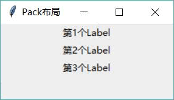
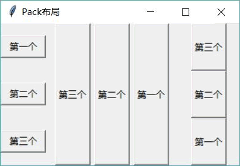

# Python Tkinter Pack 布局管理器（超级详细，看了无师自通）

GUI 编程就相当于小孩子搭积木，每个积木块应该放在哪里，每个积木块显示为多大，也就是对大小和位置都需要进行管理，而布局管理器正是负责管理各组件的大小和位置的。此外，当用户调整了窗口的大小之后，布局管理器还会自动调整窗口中各组件的大小和位置。

如果使用 Pack 布局，那么当程序向容器中添加组件时，这些组件会依次向后排列，排列方向既可是水平的，也可是垂直的。

下面程序简单示范了 Pack 布局的用法，该程序向窗口中添加了三个 Label 组件：

```
# Python 2.x 使用这行
#from Tkinter import *
# Python 3.x 使用这行
from tkinter import * 

# 创建窗口并设置窗口标题
root = Tk()
# 设置窗口标题
root.title('Pack 布局')
for i in range(3):
    lab = Label(root, text="第%d 个 Label" % (i + 1), bg='#eeeeee')
    # 调用 pack 进行布局
    lab.pack()
# 启动主窗口的消息循环
root.mainloop()
```

上面程序创建了一个窗口，然后使用循环创建了三个 Label，并对这三个 Label 使用了 pack() 方法进行默认的 Pack 布局。运行该程序，可以看到如图 1 所示的界面：

图 1 使用 Pack 布局
图 1 使用的是默认的 Pack 布局，实际上程序在调用 pack() 方法时可传入多个选项。例如，通过 `help(tkinter.Label.pack)` 命令来查看 pack() 方法支持的选项，可以看到如下输出结果：

>>> help(tkinter.Label.pack)
Help on function pack_configure in module tkinter:

pack_configure(self, cnf={}, **kw)
    Pack a widget in the parent widget. Use as options:
    after=widget - pack it after you have packed widget
    anchor=NSEW (or subset) - position widget according to
                              given direction
    before=widget - pack it before you will pack widget
    expand=bool - expand widget if parent size grows
    fill=NONE or X or Y or BOTH - fill widget if widget grows
    in=master - use master to contain this widget
    in_=master - see 'in' option description
    ipadx=amount - add internal padding in x direction
    ipady=amount - add internal padding in y direction
    padx=amount - add padding in x direction
    pady=amount - add padding in y direction
    side=TOP or BOTTOM or LEFT or RIGHT -  where to add this widget.

从上面的显示信息可以看出，pack() 方法通常可支持如下选项：

*   anchor：当可用空间大于组件所需求的大小时，该选项决定组件被放置在容器的何处。该选项支持 N（北，代表上）、E（东，代表右）、S（南，代表下）、W（西，代表左）、NW（西北，代表左上）、NE（东北，代表右上）、SW（西南，代表左下）、SE（东南，代表右下）、CENTER（中，默认值）这些值。
*   expand：该 bool 值指定当父容器增大时才是否拉伸组件。
*   fill：设置组件是否沿水平或垂直方向填充。该选项支持 NONE、X、Y、BOTH 四个值，其中 NONE 表示不填充，BOTH 表示沿着两个方向填充。
*   ipadx：指定组件在 x 方向（水平）上的内部留白（padding）。
*   ipady：指定组件在 y 方向（水平）上的内部留白（padding）。
*   padx：指定组件在 x 方向（水平）上与其他组件的间距。
*   pady：指定组件在 y 方向（水平）上与其他组件的间距。
*   side：设置组件的添加位置，可以设置为 TOP、BOTTOM、LEFT 或 RIGHT 这四个值的其中之一。

当程序界面比较复杂时，就需要使用多个容器（Frame）分开布局，然后再将 Frame 添加到窗口中。例如如下程序：

```
# Python 2.x 使用这行
#from Tkinter import *
# Python 3.x 使用这行
from tkinter import * 
class App:
    def __init__(self, master):
        self.master = master
        self.initWidgets()
    def initWidgets(self):
        # 创建第一个容器
        fm1 = Frame(self.master)
        # 该容器放在左边排列
        fm1.pack(side=LEFT, fill=BOTH, expand=YES)
        # 向 fm1 中添加 3 个按钮
        # 设置按钮从顶部开始排列，且按钮只能在垂直（X）方向填充
        Button(fm1, text='第一个').pack(side=TOP, fill=X, expand=YES)
        Button(fm1, text='第二个').pack(side=TOP, fill=X, expand=YES)
        Button(fm1, text='第三个').pack(side=TOP,  fill=X, expand=YES)
        # 创建第二个容器
        fm2 = Frame(self.master)
        # 该容器放在左边排列，就会挨着 fm1
        fm2.pack(side=LEFT, padx=10, expand=YES)
        fm2.pack(side=LEFT, padx=10, fill=BOTH, expand=YES)
        # 向 fm2 中添加 3 个按钮
        # 设置按钮从右边开始排列
        Button(fm2, text='第一个').pack(side=RIGHT, fill=Y, expand=YES)
        Button(fm2, text='第二个').pack(side=RIGHT, fill=Y, expand=YES)
        Button(fm2, text='第三个').pack(side=RIGHT, fill=Y, expand=YES)       
        # 创建第三个容器
        fm3 = Frame(self.master)
        # 该容器放在右边排列，就会挨着 fm1
        fm3.pack(side=RIGHT, padx=10, fill=BOTH, expand=YES)
        # 向 fm3 中添加 3 个按钮
        # 设置按钮从底部开始排列，且按钮只能在垂直（Y）方向填充
        Button(fm3, text='第一个').pack(side=BOTTOM, fill=Y, expand=YES)
        Button(fm3, text='第二个').pack(side=BOTTOM, fill=Y, expand=YES)
        Button(fm3, text='第三个').pack(side=BOTTOM, fill=Y, expand=YES)
root = Tk()
root.title("Pack 布局")
display = App(root)
root.mainloop()
```

上面程序创建了三个 Frame 容器，其中第一个 Frame 容器内包含三个从顶部（TOP）开始排列的按钮，这意味着这三个按钮会从上到下依次排列，且这三个按钮能在水平（X）方向上填充；第二个 Frame 容器内包含三个从右边（RIGHT）开始排列的按钮，这意味着这三个按钮会从右向左依次排列；第三个 Frame 容器内包含三个从底部（BOTTOM）开始排列的按钮，这意味着这三个按钮会从下到上依次排列，且这三个按钮能在垂直（Y）方向上填充。

运行上面程序，将看到如图 2 所示的界面。

图 2 复杂的 Pack 布局
从图 2 中可以看到，为运行效果添加了三个框，分别代表 fm1、fm2、fm3（实际上容器是看不到的），此时可以看到 fm1 内的三个按钮从上到下排列，并且可以在水平方向上填充；fm3 内的三个按钮从下到上排列，并且可以在垂直方向上填充。

可能有读者会有疑问，fm2 内的三个按钮也都设置了 fill=Y，expand=YES，这说明它们也能在垂直方向上填充，为啥舍看不到呢？仔细看 `fm2.pack(side=LEFT, padx=10, expand= YES)`这行代码，它说明 fm2 本身不在任何方向上填充，因此 fm2 内的三个按钮都不能填充。

如果希望看到 fm2 内的三个按钮也能在垂直方向上填充，则可将 fm2 的 pack() 方法改为如下代码：

fm2.pack(side=LEFT, padx=10, fill=BOTH, expand=YES)

通过上面介绍不难发现，Pack 布局其实还是非常灵活的，它完全可以实现很复杂的用户界面。这里有一个界面分解的常识需要说明，无论看上去多么复杂、古怪的界面，其实大多可分解为水平排列和垂直排列，而 Pack 布局既可实现水平排列，也可实现垂直排列，然后再通过多个容器进行组合，这样就可以开发出更复杂的界面了。

对于打算使用 Pack 布局的开发者来说，首先要做的事情是将程序界面进行分解，分解成水平排列的容器和垂直排列的容器（有时候甚至要容器嵌套容器），然后使用多个 Pack 布局的容器将它们组合在一起。