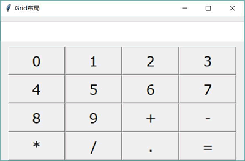

# Python Tkinter Grid 布局管理器用法（附带实例分析）

很多时候 Tkinter 界面编程都会优先考虑使用 Pack 布局，但实际上 Tkinter 后来引入的 Grid 布局不仅简单易用，而且管理组件也非常方便。

Grid 把组件空间分解成一个网格进行维护，即按照行、列的方式排列组件，组件位置由其所在的行号和列号决定，行号相同而列号不同的几个组件会被依次上下排列，列号相同而行号不同的几个组件会被依次左右排列。

可见，在很多场景下 Grid 是最好用的布局方式。相比之下，Pack 布局在控制细节方面反而显得有些力不从心。

使用 Grid 布局的过程就是为各个组件指定行号和列号的过程，不需要为每个网格都指定大小，Grid 布局会自动为它们设置合适的大小。

程序调用组件的 grid() 方法就进行 Grid 布局，在调用 grid() 方法时可传入多个选项，该方法支持的 ipadx、ipady、padx、pady 与 pack() 方法的这些选项相同。而 grid() 方法额外增加了如下选项：

*   column：指定将组件放入哪列。第一列的索引为 0。
*   columnspan：指定组件横跨多少列。
*   row：指定组件放入哪行。第一行的索引为 0
*   rowspan：指定组件横跨多少行。
*   sticky：有点类似于 pack() 方法的 anchor 选项，同样支持 N（北，代表上）、E（东，代表右）、S（南，代表下）、W（西，代表左）、NW（西北，代表左上）、NE（东北，代表右上）、SW（西南，代表左下）、SE（东南，代表右下）、CENTER（中，默认值）这些值。

下面程序使用 Grid 布局来实现一个计算器界面：

```
# Python 2.x 使用这行
#from Tkinter import *
# Python 3.x 使用这行
from tkinter import *

class App:
    def __init__(self, master):
        self.master = master
        self.initWidgets()
    def initWidgets(self):
        # 创建一个输入组件
        e = Entry(relief=SUNKEN, font=('Courier New', 24), width=25)
        # 对该输入组件使用 Pack 布局，放在容器顶部
        e.pack(side=TOP, pady=10)
        p = Frame(self.master)
        p.pack(side=TOP)
        # 定义字符串的元组
        names = ("0" , "1" , "2" , "3"
            , "4" , "5" , "6" , "7" , "8" , "9"
            , "+" , "-" , "*" , "/" , ".", "=")
        # 遍历字符串元组
        for i in range(len(names)):
            # 创建 Button，将 Button 放入 p 组件中
            b = Button(p, text=names[i], font=('Verdana', 20), width=6)
            b.grid(row=i // 4, column=i % 4)
root = Tk()
root.title("Grid 布局")
App(root)
root.mainloop()
```

上面程序实际上使用了两个布局管理器进行嵌套，先使用 Pack 布局管理两个组件，分贝是 Entry（输入组件）和 Frame（容器），这两个组件就会按照从上到下的方式排列。

接下来程序使用 Grid 布局管理 Frame 容器中的 16 个按钮，分别将 16 个按钮放入不同的行、不同的列。运行上面程序，可以看到如图 1 所示的界面。

图 1 使用 Grid 布局实现计算器界面