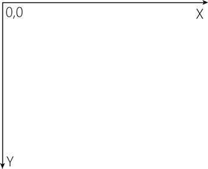
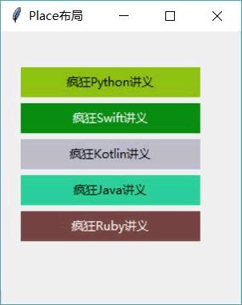

# Python Tkinter Place 布局管理器及用法

Place 布局就是其他 GUI 编程中的“绝对布局”，这种布局方式要求程序显式指定每个组件的绝对位置或相对于其他组件的位置。

如果要使用 Place 布局，调用相应组件的 place() 方法即可。在使用该方法时同样支持一些详细的选项，关于这些选项的介绍如下：

*   x：指定组件的 X 坐标。x 为 0 代表位于最左边。
*   y：指定组件的 Y 坐标。y 为 0 代表位于最右边。
*   relx：指定组件的 X 坐标，以父容器总宽度为单位 1，该值应该在 0.0~1.0 之间，其中 0.0 代表位于窗口最左边，1.0 代表位于窗口最右边，0.5 代表位于窗口中间。
*   rely：指定组件的 Y 坐标，以父容器总高度为单位 1，该值应该在 0.0~1.0  之间，其中 0.0 代表位于窗口最上边，1.0 代表位于窗口最下边，0.5 代表位于窗口中间。
*   width：指定组件的宽度，以 pixel 为单位。
*   height：指定组件的高度，以 pixel 为单位。
*   relwidth：指定组件的宽度，以父容器总宽度为单位 1，该值应该在 0.0~1.0 之间，其中 1.0 代表整个窗口宽度，0.5 代表窗口的一半宽度。
*   relheight：指定组件的高度，以父容器总高度为单位 1，该值应该在 0.0~1.0 之间，其中 1.0 代表整个窗口高度，0.5 代表窗口的一半高度。
*   bordermode：该属性支持“inside”或“outside” 属性值，用于指定当设置组件的宽度、高度时是否计算该组件的边框宽度。

当使用 Place 布局管理容器中的组件时，需要设置组件的 x、y 或 relx、rely 选项，Tkinter 容器内的坐标系统的原点 (0,0) 在左上角，其中 X 轴向右延伸，Y 轴向下延伸，如图 1 所示：

图 1 Tkinter 容器坐标系
如果通过 x、y 指定坐标，单位就是 pixel（像素）；如果通过 relx、rely 指定坐标，则以整个父容器的宽度、高度为 1。不管通过哪种方式指定坐标，通过图 1 不难发现，通过 x 指定的坐标值越大，该组件就越靠右；通过 y 指定的坐标值越大，该组件就越靠下。

下面介绍一个使用 Place 进行布局的例子，该示例将会动态计算各 Label 的大小和位置，并通过 place() 方法设置各 Label 的大小和位置。

```
# Python 2.x 使用这行
#from Tkinter import *
# Python 3.x 使用这行
from tkinter import *
import random
class App:
    def __init__(self, master):
        self.master = master
        self.initWidgets()
    def initWidgets(self):
        # 定义字符串元组
        books = ('疯狂 Python 讲义', '疯狂 Swift 讲义', '疯狂 Kotlin 讲义',\
            '疯狂 Java 讲义', '疯狂 Ruby 讲义')
        for i in range(len(books)):
            # 生成 3 个随机数
            ct = [random.randrange(256) for x in range(3)]
            grayness = int(round(0.299*ct[0] + 0.587*ct[1] + 0.114*ct[2]))
            # 将元组中 3 个随机数格式化成 16 进制数,转成颜色格式
            bg_color = "#%02x%02x%02x" % tuple(ct)
            # 创建 Label，设置背景色和前景色
            lb = Label(root,
                text=books[i],
                fg = 'White' if grayness < 120 else 'Black',
                bg = bg_color)
            # 使用 place()设置该 Label 的大小和位置
            lb.place(x = 20, y = 36 + i*36, width=180, height=30)
root = Tk()
root.title("Place 布局")
# 设置窗口的大小和位置
# width x height + x_offset + y_offset
root.geometry("250x250+30+30")  
App(root)
root.mainloop()
```

上面程序中第 26 行代码就是调用 place() 方法执行 Place 布局的关键代码。在调用 place() 方法时主要设置了 x（X 坐标）、y（Y 坐标）、width（宽度）、height（高度）这四个选项，通过这四个边项即可控制各 Label 的位置和大小。

为了增加一些趣味性，上面程序使用随机数计算了 Label 组件的背景色，并根据背景色的灰度值来计算 Label 组件的前景色：如果 grayness 小于 125，则说明背景色较深，前景色使用白色；否则说明背景色较浅，前景色使用黑色。运行上面程序，可以看到如图 2 所示的界面。

图 2 使用 Place 布局