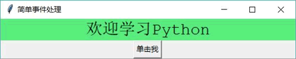
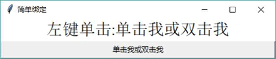
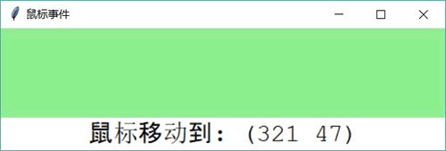
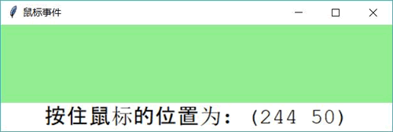

# Python Tkinter command 和 bind 事件处理（绑定）用法详解

前面介绍了如何放置各种组件，从而得到了丰富多彩的图形界面，但这些界面还不能响应用户的任何操作。比如单击窗口上的按钮，该按钮并不会提供任何响应。这就是因为程序没有为这些组件绑定任何事件处理的缘故。

## command 绑定事件处理方法

简单的事件处理可通过 command 选项来绑定，该选项绑定为一个函数或方法，当用户单击指定按钮时，通过该 command 选项绑定的函数或方法就会被触发。

下面程序示范了为按钮的 command 绑定事件处理方法：

```
# Python 2.x 使用这行
#from Tkinter import *
# Python 3.x 使用这行
from tkinter import *
import random

class App:
    def __init__(self, master):
        self.master = master
        self.initWidgets()
    def initWidgets(self):
        self.label = Label(self.master, width=30)
        self.label['font'] = ('Courier', 20)
        self.label['bg'] = 'white'
        self.label.pack()
        bn = Button(self.master, text='单击我', command=self.change)
        bn.pack()
    # 定义事件处理方法
    def change(self):
        self.label['text'] = '欢迎学习 Python'
        # 生成 3 个随机数
        ct = [random.randrange(256) for x in range(3)]
        grayness = int(round(0.299*ct[0] + 0.587*ct[1] + 0.114*ct[2]))
        # 将元组中 3 个随机数格式化成 16 进制数,转成颜色格式
        bg_color = "#%02x%02x%02x" % tuple(ct)
        self.label['bg'] = bg_color
        self.label['fg'] = 'black' if grayness > 125 else 'white'
root = Tk()
root.title("简单事件处理")
App(root)
root.mainloop()
```

上面程序中第 16 行代码为 Button 的 command 选项指定为 self.change，这意味着当该按钮被单击时，将会触发当前对象的 change() 方法。该 change() 方法会改变界面上 Label 的文本和背景色。

运行该程序，单击界面上的“单击我”按钮，将看到如图 1 所示的界面。

图 1 使用 command 绑定事件处理

## bind 绑定事件处理方法

上面这种简单的事件绑定方式虽然简单，但它存在较大的局限性：

*   程序无法为具体事件（比如鼠标移动、按键事件）绑定事件处理方法。
*   程序无法获取事件相关信息。

为了弥补这种不足，Python 提供了更灵活的事件绑定方式，所有 Widget 组件都提供了一个 bind() 方法，该方法可以为“任意” 事件绑定事件处理方法。

下面先看一个为按钮的单击、双击事件绑定事件处理方法的示例：

```
# 将 tkinter 写成 Tkinter 可兼容 Python 2.x
from tkinter import *
class App:
    def __init__(self, master):
        self.master = master
        self.initWidgets()
    def initWidgets(self):
        self.show = Label(self.master, width=30, bg='white', font=('times', 20))
        self.show.pack()
        bn = Button(self.master, text='单击我或双击我')
        bn.pack(fill=BOTH, expand=YES)
        # 为左键单击事件绑定处理方法
        bn.bind('<Button-1>', self.one)
        # 为左键双击事件绑定处理方法
        bn.bind('<Double-1>', self.double)
    def one(self, event):
        self.show['text'] = "左键单击:%s" % event.widget['text']
    def double(self, event):
        print("左键双击击, 退出程序:", event.widget['text'])
        import sys; sys.exit()
root = Tk()
root.title('简单绑定')
App(root)
root.mainloop()
```

上面程序中第 13、15 行代码为 Button 按钮的单击、双击事件绑定了事件处理方法，其中第 13 行代码为 '<Btutton-1>' 事件绑定了 self.one 作为事件处理方法；第 15 行代码为 '<Double-1>' 事件绑定了 self.double 作为事件处理方法。

此时 self.one 和 self.double 方法都可定义一个 event 参数，该参数代表了传给该事件处理方法的事件对象，因此上面程序示范了通过事件来获取事件源的方式（通过 event.widget 获取即可）。对于鼠标事件来说，鼠标相对当前组件的位置可通过 event 对象中的 x 和 y 属性来获取。

运行上面程序，单击界面上的按钮，将看到如图 2 所示的运行结果：

图 2 为单击、双击事件绑定事件处理方法
从上面的例子可以看到， Tkinter 直接使用字符串来代表事件类型，比如使用 <Button-1> 代表鼠标左键单击事件，使用 <Double-1> 代表鼠标左键双击事件。那问题来了，其他事件应该怎么写呢？

代表 Tkinter 事件的字符串大致遵循如下格式：

<modifier-type-detail>

其中 type 是事件字符串的关键部分，用于描述事件的种类，比如鼠标事件、键盘事件等；modifer 则代表事件的修饰部分，比如单击、双击等；detail 用于指定事件的详情，比如指定鼠标左键、右键、滚轮等。

Tkinter 支持的各种鼠标、键盘事件如表 3 所示。

表 3 Tkinter 支持的各种鼠标、键盘事件

| 事件 | 简介 |
| <Button-detail> | 鼠标按键的单击事件，detail 指定哪一个鼠标键被单击。比如单击鼠标左键为 <Button-1>，单击鼠标中键为 <Button-2>，单击鼠标右键为 <Button-3>，单击向上滚动的滚轮为 <Button-4>，单击向下滚动的滚轮为 <Button-5> |
| <modifier Motion> | 鼠标在组件上的移动事件，modifier 指定要求按住哪个鼠标键。比如按住鼠标左键移动为 <B1-Motion>，锁住鼠杯中键移动为 <B2-Motion>，按住鼠标右键移动为 <B3-Motion> |
| <ButtonRelease-detail> | 鼠标按键的释放事件，detail 指定哪一个鼠标键被释放。比如鼠标左键被释放为 <ButtonRelease-1>，鼠标中键被释放为 <ButtonRelease-2>，鼠标右键被释放为 <ButtonRelease-3> |
| <Double-Button-detail>或<Double-detail> | 用户双击某个鼠标键的事件，detail 指定哪一个鼠标键被双击。比如双击鼠标左键为 <Double-1>，双击鼠标中键为 <Double-2>，双击鼠标右键为 <Double-3>，双击向上滚动的滚轮为 <Double-4>，双击向下滚动的滚轮为 <Double-5> |
| <Enter>  | 鼠标进入组件的事件。注意，<Enter> 事件不是按下回车键事件，按下回车键的事件是 <Return> |
| <Leave> | 鼠标移出组件事件 |
| <Focusln>  | 组件及其包含的子组件获得焦点 |
| <FocusOut> | 组件及其包含的子组件失去焦点 |
| <Return> | 按下回车键的事件。实际上可以为所有按键绑定事件处理方法。特殊键位名称包括 Cancel、BackSpace、Tab、Return（回车）、Shift_L（左 Shift，如果只写 Shift 则代表任意 Shift）、Control_L（左 Ctrl，如果只写 Control 则代表任意 Ctrl）、Alt_L（左 Alt，如果只写 Alt 则代表任意 Alt）、Pause、Caps_Lock、Escape、Prior（Page Up）、Next（Page Down）、End、Home、Left、Up、Right、Down、Print、Insert、Delete、F1、F2、F3、F4、F5、F6、F7、F8、F9、F10、F11、F12、Num_Lock 和 Scroll_Lock  |
| <Key> | 键盘上任意键的单击事件，程序可通过 event 获取用户单击了哪个键 |
| a | 键盘上指定键被单击的事件。比如‘a’代表 a 键被单击，‘b’代表 b 键被单击（不要尖括号）…… |
| <Shift-Up> | 在 Shift 键被按下时按 Up 键。类似的还有 <Shift-Left>、<Shift-Down>、<Alt-Up>、<Control-Up> 等 |
| <Configure>  | 组件大小、位置改变的事件。组件改变之后的大小、位置可通过 event 的 width、height、x、y 获取 |

下面通过一个示例来示范为鼠标移动事件绑定事件处理方法：

```
# 将 tkinter 写成 Tkinter 可兼容 Python 2.x
from tkinter import *
class App:
    def __init__(self, master):
        self.master = master
        self.initWidgets()
    def initWidgets(self):
        lb = Label(self.master, width=40, height=3)
        lb.config(bg='lightgreen', font=('Times', 20))
        # 为鼠标移动事件绑定事件处理方法
        lb.bind('<Motion>', self.motion)
        # 为按住左键时的鼠标移动事件绑定事件处理方法
        lb.bind('<B1-Motion>', self.press_motion)
        lb.pack()
        self.show = Label(self.master, width=38, height=1)
        self.show.config(bg='white', font=('Courier New', 20))
        self.show.pack()
    def motion(self, event):
        self.show['text'] = "鼠标移动到: (%s %s)" % (event.x, event.y)
        return
    def press_motion(self, event):
        self.show['text'] = "按住鼠标的位置为: (%s %s)" % (event.x, event.y)
        return
root = Tk()
root.title('鼠标事件')
App(root)
root.mainloop()
```

上面程序中第 11 行代码为 <Motion>（鼠标移动）事件绑定了事件处理方法，因此鼠标在 lb 组件上移动时将会不断触发 motion() 方法；第 13 行代码为 <B1-Motion>（按住左键时鼠标移动）事件绑定了事件处理方法，因此按住鼠标左键在 lb 组件上移动时将会不断触发 press_motion() 方法。

运行该程序，如果让鼠标直接在第一个 Label 组件（lb）上移动，将看到如图 4 所示的运行结果。

图 4 鼠标移动事件
如果按住鼠标左键并让鼠标在第一个 Label 组件（lb）上移动，将看到如图 5 所示的运行结果。

图 5 按住左键时的鼠标移动事件
读者可能对前面章节中那个徒有其表的计算器感到很失望，下面程序将会为该计算器的按钮绑定事件处理方法，从而使它变成真正可运行的计算器：

```
# 将 tkinter 改为 Tkinter 兼容 Python 2.x
from tkinter import *

class App:
    def __init__(self, master):
        self.master = master
        self.initWidgets()
        self.expr = None
    def initWidgets(self):
        # 创建一个输入组件
        self.show = Label(relief=SUNKEN, font=('Courier New', 24),\
            width=25, bg='white', anchor=E)
        # 对该输入组件使用 Pack 布局，放在容器顶部
        self.show.pack(side=TOP, pady=10)
        p = Frame(self.master)
        p.pack(side=TOP)
        # 定义字符串的元组
        names = ("0" , "1" , "2" , "3"
            , "4" , "5" , "6" , "7" , "8" , "9"
            , "+" , "-" , "*" , "/" , ".", "=")
        # 遍历字符串元组
        for i in range(len(names)):
            # 创建 Button，将 Button 放入 p 组件中
            b = Button(p, text=names[i], font=('Verdana', 20), width=6)
            b.grid(row=i // 4, column=i % 4)
            # 为鼠标左键的单击事件绑定事件处理方法
            b.bind('<Button-1>', self.click)
            # 为鼠标左键的双击事件绑定事件处理方法
            if b['text'] == '=': b.bind('<Double-1>', self.clean)
    def click(self, event):
        # 如果用户单击的是数字键或点号
        if(event.widget['text'] in ('0', '1', '2', '3',\
            '4', '5', '6', '7', '8', '9', '.')):
            self.show['text'] = self.show['text'] + event.widget['text']
        # 如果用户单击了运算符
        elif(event.widget['text'] in ('+', '-', '*', '/')):
            # 如果当前表达式为 None，直接用 show 组件的内容和运算符进行连接
            if self.expr is None:
                self.expr = self.show['text'] + event.widget['text']
            # 如果当前表达式不为 None，用表达式、show 组件的内容和运算符进行连接
            else:
                self.expr = self.expr + self.show['text'] + event.widget['text']
            self.show['text'] = ''
        elif(event.widget['text'] == '=' and self.expr is not None):
            self.expr = self.expr + self.show['text']
            print(self.expr)
            # 使用 eval 函数计算表达式的值
            self.show['text'] = str(eval(self.expr))
            self.expr = None
    # 双击=按钮时，程序清空计算结果、将表达式设为 None
    def clean(self, event):
        self.expr = None
        self.show['text'] = ''
root = Tk()
root.title("计算器")
App(root)
root.mainloop()
```

上面程序中第 27 行代码为界面上所有按钮的单击事件绑定了处理方法，以便处理程序的计算功能；第 29 行代码则为“=”按钮的双击事件绑定了处理方法，当用户双击该按钮时，程序会清空计算结果，重新开始计算。