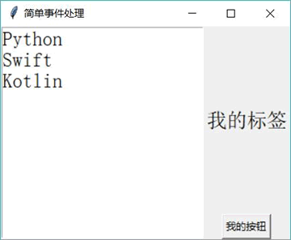

# Python Tkinter ttk 组件及用法（附带实例）

前面程序都是直接使用 tkinter 模块下的 GUI 组件的，这些组件看上去特别“复古”，也就是丑，仿佛是从 20 年前的程序上抠出来的组件。

为了弥补这点不足，Tkinter 后来引入了一个 ttk 组件作为补充（主要就是简单包装、美化一下），并使用功能更强大的 Combobox 取代了原来的 Listbox，且新增了 LabeledScale（带标签的 Scale）、Notebook（多文档窗口）、Progressbar（进度条）、Treeview（树）等组件。

ttk 作为一个模块被放在 tkinter 包下，使用 ttk 组件与使用普通的 Tkinter 组件并没有多大的区别，只要导入 ttk 模块即可。下面程序示范了如何使用 ttk 组件：

```
from tkinter import *
# 导入 ttk
from tkinter import ttk

class App:
    def __init__(self, master):
        self.master = master
        self.initWidgets()
    def initWidgets(self):
        # ttk 使用 Combobox 取代了 Listbox
#        cb = ttk.Combobox(self.master, font=24)
        # 为 Combobox 设置列表项
#        cb['values'] = ('Python', 'Swift', 'Kotlin')
        cb = Listbox(self.master, font=24)
        # 为 Listbox 设置列表项
        for s in ('Python', 'Swift', 'Kotlin'):
            cb.insert(END, s)
        cb.pack(side=LEFT, fill=X, expand=YES)
#        f = ttk.Frame(self.master)
        f = Frame(self.master)
        f.pack(side=RIGHT, fill=BOTH, expand=YES)
#       lab = ttk.Label(self.master, text='我的标签', font=24)
        lab = Label(self.master, text='我的标签', font=24)
        lab.pack(side=TOP, fill=BOTH, expand=YES)
#        bn = ttk.Button(self.master, text='我的按钮')
        bn = Button(self.master, text='我的按钮')
        bn.pack()
root = Tk()
root.title("简单事件处理")
App(root)
root.mainloop()
```

上面程序中被注释的代码是使用 ttk 组件的代码，未被注释的代码是直接使用 Tkinter 组件的代码。直接运行上面程序，可以看到如图 1 所示的界面。

图 1 Tkinter 组件的运行界面
如果将上面程序中被注释的代码取消注释，并注释使用 Tkinter 组件的代码，改为使用 ttk 组件，再次运行上面程序，则可以看到如图 2 所示的界面。

图 2 ttk 组件的运行界面
对比两个界面上 Tkinter 的 Button 和 ttk 的 Button，不难发现 ttk 下的 Button 更接近 Windows 7 本地平台的风格，显得更漂亮，这就是 ttk 组件的优势。