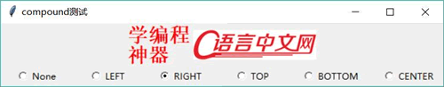

# Python Tkinter compound 选项使用方法（实例分析）

程序可以为按钮或 Label 等组件同时指定 text 和 image 两个选项，其中 text 用于指定该组件上的文本；image 用于显示该组件上的图片，当同时指定这两个选项时，通常 image 会覆盖 text。

但在某些时候，程序希望该组件能同时显示文木和图片，此时就需要通过 compound 选项进行控制。

compound 选项支持如下属性值：

*   None：图片覆盖文字。
*   LEFT 常量（值为‘left’字符串）：图片在左，文本在右。
*   RIGHT 常量（值为‘right’字符串）：图片在右，文本在左。
*   TOP 常量（值为‘top’字符串）： 图片在上，文本在下。
*   BOTTOM 常量（值为‘bottom’字符串）：图片在底，文本在上。
*   CENTER 常量（值为‘center’字符串）：文本在图片上方。

下面程序使用多个单选钮来控制 Label 的 compound 选项：

```
from tkinter import *
# 导入 ttk
from tkinter import ttk

class App:
    def __init__(self, master):
        self.master = master
        self.initWidgets()
    def initWidgets(self):
        # 创建一个位图
        bm = PhotoImage(file = 'serial.png')
        # 创建一个 Label，同时指定 text 和 image
        self.label = ttk.Label(self.master, text='学编程\n 神器',\
            image=bm, font=('StSong', 20, 'bold'), foreground='red' )
        self.label.bm = bm
        # 设置 Label 默认的 compound 为 None
        self.label['compound'] = None
        self.label.pack()
        # 创建 Frame 容器，用于装多个 Radiobutton
        f = ttk.Frame(self.master)
        f.pack(fill=BOTH, expand=YES)
        compounds = ('None', "LEFT", "RIGHT", "TOP", "BOTTOM", "CENTER")
        # 定义一个 StringVar 变量，用作绑定 Radiobutton 的变量
        self.var = StringVar()
        self.var.set('None')
        # 使用循环创建多个 Radionbutton 组件
        for val in compounds:
            rb = Radiobutton(f,
                text = val,
                padx = 20,
                variable = self.var,
                command = self.change_compound,
                value = val).pack(side=LEFT, anchor=CENTER)
    # 实现 change_compound 方法，用于动态改变 Label 的 compound 选项
    def change_compound(self):
        self.label['compound'] = self.var.get().lower()
root = Tk()
root.title("compound 测试")
App(root)
root.mainloop()
```

上面程序中第 16 行代码设置 Label 默认的 compound 选项为 None，这意味着该 Label 默认图片覆盖文字； 第 35 行代码会根据单选钮的值（单选钮与 self.var 绑定）来确定 Label 的 compound 选项。

运行该程序，将会看到 Label 中只显示图片，并不显示文字，这就是 compound 选项为 None 的效果。随着用户单击下面的单选钮，将可以看到 Label 上图片和文字的位置的改变，如图 1 所示。

图 1 将 compound 设为 RIGHT 让图片居右