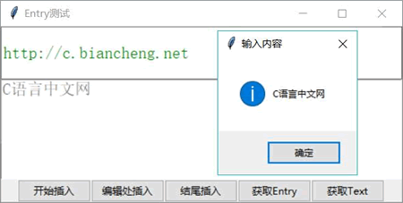
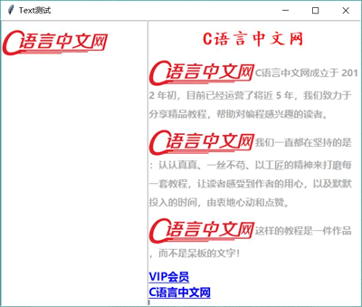

# Python Tkinter Entry 和 Text 控件用法(包含两者区别)

Entry 和 Text 组件都是可接收用户输入的输入框组件，区别是 Entry 是单行输入框组件，Text 是多行输入框组件，而且 Text 可以为不同的部分添加不同的格式，甚至响应事件。

不管是 Entry 还是 Text 组件，程序都提供了 get() 方法来获取文本框中的内容；但如果程序要改变文本框中的内容，则需要调用二者的 insert() 方法来实现。

如果要删除 Entry 或 Text 组件中的部分内容，则可通过 `delete(self,first,last=None)` 方法实现，该方法指定删除从 first 到 last 之间的内容。

关于 Entry 和 Text 支持的索引需要说明一下，由于 Entry 是单行文本框组件，因此它的索引很简单，比如要指定第 4 个字符到第 8 个字符，索引指定为 (3,8) 即可。但 Text 是多行文本框组件，因此它的索引需要同时指定行号和列号，比如 1.0 代表第 1 行、第 1 列（行号从 1 开始， 列号从 0 开始），如果要指定第 2 行第 3 个字符到第 3 行第 7 个字符，索引应指定为 (2.2,3.6)。

此外，正如从前面程序所看到的，Entry 支持双向绑定，程序可以将 Entry 与变量绑定在一起，这样程序就可以通过该变量来改变、获取 Entry 组件中的内容。

下面程序示范了 Entry 和 Text 组件的用法：

```
from tkinter import *
# 导入 ttk
from tkinter import ttk
from tkinter import messagebox
class App:
    def __init__(self, master):
        self.master = master
        self.initWidgets()
    def initWidgets(self):
        # 创建 Entry 组件
        self.entry = ttk.Entry(self.master,
            width=44,
            font=('StSong', 14),
            foreground='green')
        self.entry.pack(fill=BOTH, expand=YES)
        # 创建 Entry 组件
        self.text = Text(self.master,
            width=44,
            height=4,
            font=('StSong', 14),
            foreground='gray')
        self.text.pack(fill=BOTH, expand=YES)
        # 创建 Frame 作为容器
        f = Frame(self.master)
        f.pack()
        # 创建五个按钮，将其放入 Frame 中
        ttk.Button(f, text='开始插入', command=self.insert_start).pack(side=LEFT)
        ttk.Button(f, text='编辑处插入', command=self.insert_edit).pack(side=LEFT)
        ttk.Button(f, text='结尾插入', command=self.insert_end).pack(side=LEFT)
        ttk.Button(f, text='获取 Entry', command=self.get_entry).pack(side=LEFT)
        ttk.Button(f, text='获取 Text', command=self.get_text).pack(side=LEFT)
    def insert_start(self):
        # 在 Entry 和 Text 开始处插入内容
        self.entry.insert(0, 'Kotlin')
        self.text.insert(1.0, 'Kotlin')
    def insert_edit(self):
        # 在 Entry 和 Text 的编辑处插入内容
        self.entry.insert(INSERT, 'Python')
        self.text.insert(INSERT, 'Python')
    def insert_end(self):
        # 在 Entry 和 Text 的结尾处插入内容
        self.entry.insert(END, 'Swift')
        self.text.insert(END, 'Swift')
    def get_entry(self):
        messagebox.showinfo(title='输入内容', message=self.entry.get())
    def get_text(self):
        messagebox.showinfo(title='输入内容', message=self.text.get(1.0, END))
root = Tk()
root.title("Entry 测试")
App(root)
root.mainloop()
```

上面程序开始创建了一个 Entry 组件和一个 Text 组件，程序中第 34、35 行代码用于在 Entry 和 Text 组件的开始部分插入指定文本内容，如果要在 Entry、Text 的指定位置插入文本内容，通过 insert() 方法的第一个参数指定位置即可。如果要在编辑处插入内容，则将第一个参数设为 INSERT 常量（值为 'insert'）； 如果要在结尾处插入内容，则将第一个参数设为 END 常量（值为 'end'）。

同时，程序第 45、47 行代码调用了 Entry 和 Text 组件的 get() 方法来获取其中的文本内容。运行上面程序，尝试向 Entry、Text 中插入一些内容，然后单击界面上的“获取 Text”按钮，则可以看到如图 1 所示的界面。

图 1 获取文本框中的内容
Text 实际上是一个功能强大的“富文本”编辑组件，这意味着使用 Text 不仅可以插入文本内容，也可以插入图片，可通过 image_create(self, index, cnf={}, **kw) 方法来插入。

Text 也可以设置被插入文本内容的格式，此时就需要为 `insert(self, index, chars, *args)` 方法的最后一个参数传入多个 tag 进行控制，这样就可以使用 Text 组件实现图文并茂的效果。

此外，当 Text 内容较多时就需要对该组件使用滚动条，以便该 Text 能实现被动显示。为了让滚动条控制 Text 组件内容的滚动，实际上就是将它们进行双向关联。这里需要两步操作：

1.  将 Scrollbar 的 command 设为目标组件的 xview 或 yview，其中 xview 用于水平滚动条控制目标组件水平滚动；yview 用于垂直读动条控制目标组件垂直滚动。
2.  将目标组件的 xscrollcommand 或 yscrollcommand 属性设为 Scrollbar 的 set 方法。

如下程序示范了使用 Text 来实现一个图文并茂的界面：

```
from tkinter import *
# 导入 ttk
from tkinter import ttk
class App:
    def __init__(self, master):
        self.master = master
        self.initWidgets()
    def initWidgets(self):
        # 创建第一个 Text 组件
        text1 = Text(self.master, height=27, width=32)
        # 创建图片
        book = PhotoImage(file='serial.png')
        text1.bm = book
        text1.insert(END,'\n')
        # 在结尾处插入图片
        text1.image_create(END, image=book)
        text1.pack(side=LEFT, fill=BOTH, expand=YES)
        # 创建第二个 Text 组件
        text2 = Text(self.master, height=33, width=50)
        text2.pack(side=LEFT,  fill=BOTH, expand=YES)
        self.text = text2
        # 创建 Scrollbar 组件，设置该组件与 text2 的纵向滚动关联
        scroll = Scrollbar(self.master, command=text2.yview)
        scroll.pack(side=RIGHT, fill=Y)
        # 设置 text2 的纵向滚动影响 scroll 滚动条
        text2.configure(yscrollcommand=scroll.set)
        # 配置名为 title 的样式
        text2.tag_configure('title', font=('楷体', 20, 'bold'),
            foreground='red', justify=CENTER, spacing3=20)
        text2.tag_configure('detail', foreground='darkgray',
            font=('微软雅黑', 11, 'bold'),
            spacing2=10, # 设置行间距
            spacing3=15) # 设置段间距
        text2.insert(END,'\n')
        # 插入文本内容，设置使用 title 样式
        text2.insert(END,'C 语言中文网\n', 'title')
        # 创建图片
        star = PhotoImage(file='serial.png')
        text2.bm = star
        details = ('C 语言中文网成立于 2012 年初，目前已经运营了将近 5 年，' +\
            '我们致力于分享精品教程，帮助对编程感兴趣的读者。\n' ,
        '我们一直都在坚持的是：认认真真、一丝不苟、以工匠的精神来打磨每一套教程，让读者感受到作者的用心，以及默默投入的时间，由衷地心动和点赞。\n',
        '这样的教程是一件作品，而不是呆板的文字！\n')
        # 采用循环插入多条介绍信息
        for de in details:
            text2.image_create(END, image=star)
            text2.insert(END, de, 'detail')
        url =['http://vip.biancheng.net/','http://c.biancheng.net/']
        name =['VIP 会员', 'C 语言中文网']
        m=0
        for each in name:
            # 为每个链接创建单独的配置
            text2.tag_configure(m, foreground='blue', underline=True,
                font=('微软雅黑', 13, 'bold'))
            text2.tag_bind(m, '<Enter>', self.show_arrow_cursor)
            text2.tag_bind(m, '<Leave>', self.show_common_cursor)
            # 使用 handlerAdaptor 包装,将当前链接参数传入事件处理函数
            text2.tag_bind(m, '<Button-1>', self.handlerAdaptor(self.click, x = url[m]))
            text2.insert(END, each + '\n', m)
            m += 1
    def show_arrow_cursor(self, event):
        # 光标移上去时变成箭头
        self.text.config(cursor='arrow')
    def show_common_cursor(self, event):
        # 光标移出去时恢复原样
        self.text.config(cursor='xterm')
    def click(self, event, x):
        import webbrowser
        # 使用默认浏览器打开链接
        webbrowser.open(x)
    def handlerAdaptor(self, fun,**kwds):
        return lambda event, fun=fun, kwds=kwds: fun(event,**kwds)
root = Tk()
root.title("Text 测试")
App(root)
root.mainloop()
```

上面程序中使用 Text 的 tag_configure（也写作 tag_config）方法创建了 title 和 detail 两个 tag，每个 tag 可用于控制一段文本的格式、事件等。

接下来程序使用 title tag 插入了一个标题内容，因此该标题内容的格式将受到 title tag 的控制；然后程序使用循环插入了三条受 detail tag 控制的描述信息，每次在插入描述信息之前都先插入一张图片。

不仅如此，上面程序在循环内创建了 tag，并调用 Text 组件的 tag_bind() 方法为 tag 绑定事件处理方法。与前面的描述信息不同的是，此处程序需要让每个链接打开不同的页面，因此程序为每条链接内容分别创建了不同的 tag，从而实现为每个链接打开对应的页面。

运行上面程序，将看到如图 2 所示的图文并茂的界面：

图 2 使用 Text 实现图文并茂的界面