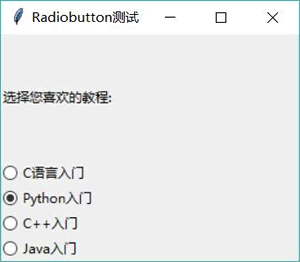
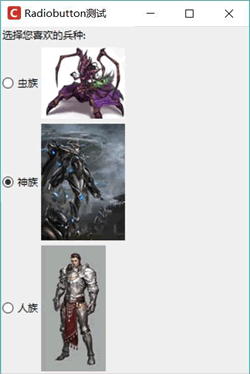
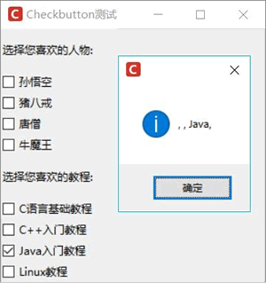

# Python Tkinter Radiobutton 和 Checkbutton 控件用法

Radiobutton 组件代表单选钮，该组件可以绑定一个方法或函数，当单选钮被选择时，该方法或函数将会被触发。

为了将多个 Radiobutton 编为一组，程序需要将多个 Radiobutton 绑定到同一个变量，当这组 Radiobutton 的其中一个单选钮被选中时，该变量会随之改变；反过来，当该变量发生改变时，这组 Radiobutton 也会自动选中该变量值所对应的单选钮。

下面程序示范了 Radiobutton 组件的用法：

```
from tkinter import *
# 导入 ttk
from tkinter import ttk
class App:
    def __init__(self, master):
        self.master = master
        self.initWidgets()
    def initWidgets(self):
        # 创建一个 Label 组件
        ttk.Label(self.master, text='选择您喜欢的教程:')\
            .pack(fill=BOTH, expand=YES)
        self.intVar = IntVar()
        # 定义元组
        books = ('C 语言入门', 'Python 入门',
            'C++入门',  'Java 入门')
        i = 1
        # 采用循环创建多个 Radiobutton
        for book in books:
            ttk.Radiobutton(self.master,
                text = book,
                variable = self.intVar, # 将 Radiobutton 绑定到 self.intVar 变量
                command = self.change, # 将选中事件绑定到 self.change 方法
                value=i).pack(anchor=W)
            i += 1
        # 设置 Radiobutton 绑定的变量的值为 2，
        # 则选中 value 为 2 的 Radiobutton
        self.intVar.set(2)
    def change(self):
        from tkinter import messagebox
        # 通过 Radiobutton 绑定变量获取选中的单选框
        messagebox.showinfo(title=None, message=self.intVar.get() )
root = Tk()
root.title("Radiobutton 测试")
App(root)
root.mainloop()
```

上面程序使用循环创建了多个 Radiobutton 组件，程序指定将这些 Radiobutton 绑定到 self.intVar 变量，这意味着这些 Radiobutton 位于同一组内；与此同时，程序为这组 Radiobutton 的选中事件绑定了 self.change 方法，因此每次当用户选择不同的单选钮时，总会触发该对象的 change() 方法。

运行上面程序，可以看到程序默认选中第二个单选钮，这是因为第二个单选钮的 value 为 2，而程序将这组单选钮绑定的 self.intVar 的值设置为 2；如果用户改变选中其他单选钮，程序将会弹出提示框显示用户的选择项，如图 1 所示：

图 1 选中不同的单选钮
单边钮除了可以显示文本，也可以显示图片，只要为其指定 image 选项即可。如果希望图片和文字同时显示也是可以的，只要通过 compound 边项进行控制即可（如果不指定 compound 选项，该选项默认为 None，这意味着只显示图片）。如下程序示范了带图片的单选钮：

```
from tkinter import *
# 导入 ttk
from tkinter import ttk
class App:
    def __init__(self, master):
        self.master = master
        self.initWidgets()
    def initWidgets(self):
        # 创建一个 Label 组件
        ttk.Label(self.master, text='选择您喜欢的兵种:')\
            .pack(fill=BOTH, expand=YES)
        self.intVar = IntVar()
        # 定义元组
        races = ('z.png', 'p.png','t.png')
        raceNames = ('虫族', '神族','人族')
        i = 1
        # 采用循环创建多个 Radiobutton
        for rc in races:
            bm = PhotoImage(file = 'images/' + rc)
            r = ttk.Radiobutton(self.master,
                image = bm,
                text = raceNames[i - 1],
                compound = RIGHT, # 图片在文字右边
                variable = self.intVar, # 将 Radiobutton 绑定到 self.intVar 变量
                command = self.change, # 将选中事件绑定到 self.change 方法
                value=i)
            r.bm = bm
            r.pack(anchor=W)
            i += 1
        # 设置默认选中 value 为 2 的单选按钮
        self.intVar.set(2)
    def change(self): pass
root = Tk()
root.title("Radiobutton 测试")
# 改变窗口图标
root.iconbitmap('images/fklogo.ico')
App(root)
root.mainloop()
```

上面程序为 RadioButton 同时指定了 image 和 text 选项，并指定 compound 选项为 RIGHT，这意味着该单选钮的图片显示在文字的右边。运行上面程序，可以看到如图 2 所示的运行界面。

图 2 带图标的单选钮
上面程序还重新设置了窗口图标，因此在运行界面上可以看到窗口图标是自定义的图标。

Checkbutton 与 Radiobutton 很相似，只是 Checkbutton 允许选择多项，而每组 Radiobutton 只能选择一项。其他功能基本相似，同样可以显示文字和图片，同样可以绑定变量，同样可以为选中事件绑定处理函数和处理方法。但由于 Checkbutton 可以同时选中多项，因此程序需要为每个 Checkbutton 都绑定一个变量。

Checkbutton 就像开关一样，它支持两个值：开关打开的值和开关关闭的值。因此，在创建 Checkbutton 时可同时设置 onvalue 和 offvalue 选项为打开和关闭分别指定值。如果不指定 onvalue 和 offvalue，则 onvalue 默认为 1，offvalue 默认为 0。

下面程序通过两组 Checkbutton 示范了 Checkbutton 的用法：

```
from tkinter import *
# 导入 ttk
from tkinter import ttk
from tkinter import messagebox
class App:
    def __init__(self, master):
        self.master = master
        self.initWidgets()
    def initWidgets(self):
        # 创建一个 Label 组件
        ttk.Label(self.master, text='选择您喜欢的人物:')\
            .pack(fill=BOTH, expand=YES)
        self.chars = []
        # 定义元组
        characters = ('孙悟空', '猪八戒','唐僧', '牛魔王')
        # 采用循环创建多个 Checkbutton
        for ch in characters:
            intVar = IntVar()
            self.chars.append(intVar)
            cb = ttk.Checkbutton(self.master,
                text = ch,
                variable = intVar, # 将 Checkbutton 绑定到 intVar 变量
                command = self.change) # 将选中事件绑定到 self.change 方法
            cb.pack(anchor=W)
        # 创建一个 Label 组件
        ttk.Label(self.master, text='选择您喜欢的教程:')\
            .pack(fill=BOTH, expand=YES)
        # --------------下面是第二组 Checkbutton---------------
        self.books = []
        # 定义两个元组
        books = ('C 语言基础教程', 'C++入门教程','Java 入门教程', 'Linux 教程')
        vals = ('C', 'C++','Java', 'Linux')
        i = 0
        # 采用循环创建多个 Checkbutton
        for book in books:
            strVar = StringVar()
            self.books.append(strVar)
            cb = ttk.Checkbutton(self.master,
                text = book,
                variable = strVar, # 将 Checkbutton 绑定到 strVar 变量
                onvalue = vals[i],
                offvalue = '无',
                command = self.books_change) # 将选中事件绑定到 books_change 方法
            cb.pack(anchor=W)
            i += 1
    def change(self):
        # 将 self.chars 列表转换成元素为 str 的列表
        new_li = [str(e.get()) for e in self.chars]
        # 将 new_li 列表连接成字符串
        st = ', '.join(new_li)
        messagebox.showinfo(title=None, message=st)
    def books_change(self):
        # 将 self.books 列表转换成元素为 str 的列表
        new_li = [e.get() for e in self.books]
        # 将 new_li 列表连接成字符串
        st = ', '.join(new_li)
        messagebox.showinfo(title=None, message=st)
root = Tk()
root.title("Checkbutton 测试")
# 改变窗口图标
root.iconbitmap('favicon.ico')
App(root)
root.mainloop()
```

上面程序中第一组 Checkbutton 没有指定 onvalue 和 offvalue，因此它们的 onvalue 和 offvalue 默认分别为 1、0，所以程序将这组 Checkbutton 绑定到 IntVar 类型的变量；第二组 Checkbutton 将 onvalue 和 offvalue 都指定为字符串，因此程序将这组 Checkbutton 绑定到 StringVar 类型的变量。

运行该程序，选中“Java 入门教程”选项，可以看到如图 3 所示的运行效果。

图 3 Checkbutton 组件