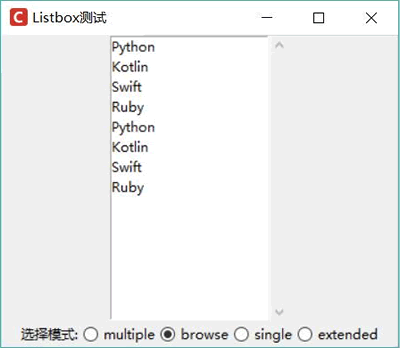
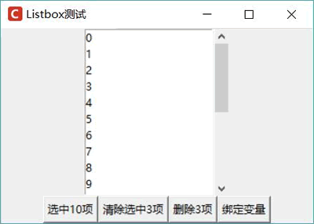
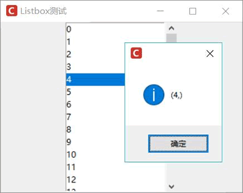
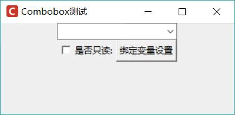

# Python Tkinter Listbox 和 Combobox 控件用法

Listbox 代表一个列表框，用户可通过列表框来选择一个列表项。ttk 模块下的 Combobox 则是 Listbox 的改进版，它既提供了单行文本框让用户直接输入（就像 Entry 一样），也提供了下拉列表框供用户选择（就像 Listbox 一样），因此它被称为复合框。

程序创建 Listbox 起码需要两步：

1.  创建 Listbox 对象，并为之执行各种选项。Listbox 除支持大部分通用选项之外，还支持 selectmode 选项，用于设置 Listbox 的选择模式。
2.  调用 Listbox 的 insert(self, index, *elements) 方法来添加选项。从最后一个参数可以看出，该方法既可每次添加一个选项，也可传入多个参数，每次添加多个选项。index 参数指定选项的插入位置，它支持 END（结尾处）、ANCHOR（当前位置）和 ACTIVE（选中处）等特殊索引。

Listbox 的 selectmode 支持的选择模式有如下几种：

*   'browse'：单选模式，支持按住鼠标键拖动来改变选择。
*   'multiple'：多边模式。
*   'single'：单边模式，必须通过鼠标键单击来改变选择。
*   'extended'：扩展的多边模式，必须通过 CtrL 或 Shift 键辅助实现多选。

下面程序示范了 Listbox 的基本用法：

```
from tkinter import *
# 导入 ttk
from tkinter import ttk
class App:
    def __init__(self, master):
        self.master = master
        self.initWidgets()
    def initWidgets(self):
        topF = Frame(self.master)
        topF.pack(fill=Y, expand=YES)
        # 创建 Listbox 组件
        self.lb = Listbox(topF)
        self.lb.pack(side=LEFT, fill=Y, expand=YES)
        for item in ['Python', 'Kotlin', 'Swift', 'Ruby']: 
            self.lb.insert(END, item)
        # 或直接使用多个元素来插入
        self.lb.insert(ANCHOR, 'Python', 'Kotlin', 'Swift', 'Ruby')
        # 创建 Scrollbar 组件，设置该组件与 self.lb 的纵向滚动关联
        scroll = Scrollbar(topF, command=self.lb.yview)
        scroll.pack(side=RIGHT, fill=Y)
        # 设置 self.lb 的纵向滚动影响 scroll 滚动条
        self.lb.configure(yscrollcommand=scroll.set)
        f = Frame(self.master)
        f.pack()
        Label(f, text = '选择模式:').pack(side=LEFT)
        modes = ('multiple', 'browse', 'single', 'extended')
        self.strVar = StringVar()
        for m in modes:
            rb = ttk.Radiobutton(f, text = m, value = m,
                variable = self.strVar, command = self.choose_mode)
            rb.pack(side=LEFT)
        self.strVar.set('browse')
    def choose_mode(self):
        print(self.strVar.get())
        self.lb['selectmode'] = self.strVar.get()
root = Tk()
root.title("Listbox 测试")
# 改变窗口图标
root.iconbitmap('images/fklogo.ico')
App(root)
root.mainloop()
```

上面程序中，第 15 行代码表示每次插入一个选项，因此程序使用循环来控制插入多个选项；第 17 行代码则表示直接插入多个选项；第 35 行代码根据用户选择来改变 Listbox 的 Selectmode 选项，这样读者可以体会 Listbox 不同选项的差异。

运行上面程序，可以看到如图 1 所示的效果：

图 1 Listbox 的运行效果
除了最常见的 insert() 方法，Listbox 还支持如下常见的操作列表项的方法：

*   selection_set(self, first, last=None)：选中从 first 到 last（包含）的所有列表项。如果不指定 last，则直接选中 first 列表项。
*   selection_clear(self, first, last=None)：取消选中从 first 到 last（包含）的所有列表项。如果不指定 last，则只取消选中 first 列表项。
*   delete(self, first, last=None)：删除从 first 到 last（包含）的所有列表项。如果不指定 last，则只删除 first 列表项。

Listbox 也支持使用 Iistvariable 选项与变量进行绑定，但这个变量并不是控制 Listbox 选中哪些项，而是控制 Listbox 包含哪些项。简单来说，如果 listvariable 选项与变量进行了双向绑定，则无须调用 insert()、delete() 方法来添加、删除列表项，只要通过绑定变量即可改变 Listbox 中的列表项。

下面程序示范了操作 Listbox 中选项的方法：

```
from tkinter import *
# 导入 ttk
from tkinter import ttk
class App:
    def __init__(self, master):
        self.master = master
        self.initWidgets()
    def initWidgets(self):
        topF = Frame(self.master)
        topF.pack(fill=Y, expand=YES)
        # 定义 StringVar 变量
        self.v = StringVar()
        # 创建 Listbox 组件，与 v 变量绑定
        self.lb = Listbox(topF, listvariable = self.v)
        self.lb.pack(side=LEFT, fill=Y, expand=YES)
        for item in range(20): 
            self.lb.insert(END, str(item))
        # 创建 Scrollbar 组件，设置该组件与 self.lb 的纵向滚动关联
        scroll = Scrollbar(topF, command=self.lb.yview)
        scroll.pack(side=RIGHT, fill=Y)
        # 设置 self.lb 的纵向滚动影响 scroll 滚动条
        self.lb.configure(yscrollcommand=scroll.set)
        f = Frame(self.master)
        f.pack()
        Button(f, text="选中 10 项", command=self.select).pack(side=LEFT)
        Button(f, text="清除选中 3 项", command=self.clear_select).pack(side=LEFT)
        Button(f, text="删除 3 项", command=self.delete).pack(side=LEFT)
        Button(f, text="绑定变量", command=self.var_select).pack(side=LEFT)
    def select(self):
        # 选中指定项
        self.lb.selection_set(0, 9) 
    def clear_select(self):
        # 取消选中指定项
        self.lb.selection_clear(1,3)
    def delete(self):
        # 删除指定项
        self.lb.delete(5, 8)
    def var_select(self):
        # 修改与 Listbox 绑定的变量
        self.v.set(('12', '15'))     
root = Tk()
root.title("Listbox 测试")
# 改变窗口图标
root.iconbitmap('images/fklogo.ico')
App(root)
root.mainloop()
```

上面程序中第 31 行代码控制选中列表项中第一个到第十个选项；第 34 行代码控制取消选中列表项中的 3 项； 第 37 行代码删除列表项中的 4 项；第 40 行代码通过绑定变量来改变 Listbox 中的列表项。运行上面程序，删除其中 4 项之后的运行效果如图 2 所示。

图 2 操作列表项
如果程序要获取 Listbox 当前边中的项，则可通过 curselection() 方法来实现，该方法会返回一个元组，该元组包含当前 Listbox 的所有选中项。

Listbox 并不支持使用 command 选项来绑定事件处理函数或方法，如果程序需要为 Listbox 绑定事件处理函数或方法，则可通过 bind() 方法来实现。下面程序示范了通过 bind() 方法为 Listbox 绑定事件处理方法：

```
from tkinter import *
# 导入 ttk
from tkinter import ttk
class App:
    def __init__(self, master):
        self.master = master
        self.initWidgets()
    def initWidgets(self):
        topF = Frame(self.master)
        topF.pack(fill=Y, expand=YES)
        # 创建 Listbox 组件
        self.lb = Listbox(topF)
        self.lb.pack(side=LEFT, fill=Y, expand=YES)
        for item in range(20): 
            self.lb.insert(END, str(item))
        # 创建 Scrollbar 组件，设置该组件与 self.lb 的纵向滚动关联
        scroll = Scrollbar(topF, command=self.lb.yview)
        scroll.pack(side=RIGHT, fill=Y)
        # 设置 self.lb 的纵向滚动影响 scroll 滚动条
        self.lb.configure(yscrollcommand=scroll.set)
        # 为双击事件绑定事件处理方法
        self.lb.bind("<Double-1>", self.click)
    def click(self, event):
        from tkinter import messagebox
        # 获取 Listbox 当前选中项
        messagebox.showinfo(title=None, message=str(self.lb.curselection()))
root = Tk()
root.title("Listbox 测试")
# 改变窗口图标
root.iconbitmap('images/fklogo.ico')
App(root)
root.mainloop()
```

上面程序中第 22 行代码为 Listbox 的左键双击事件（<Double-1> 绑定了事件处理方法，当用户双击 Listbox 时，程序将会触发该对象的 click 方法；在第 26 行代码则调用了 Listbox 的 curselection() 方法来获取当前选中项。

运行上面程序，双击某个列表顷，将可以看到如图 3 所示的运行效果。

图 3 为双击事件绑定事件处理方法
Combobox 的用法更加简单，程序可通过 values 选项直接为它设置多个选项。该组件的 state 选项支持‘readonly’状态，该状态代表 Combobox 的文本框不允许编辑，只能通过下拉列表框的列表项来改变。

Combobox 同样可通过 textvariable 选项将它与指定变量绑定，这样程序可通过该变量来获取或修改 Combobox 组件的值。

Combobox 还可通过 postcommand 选项指定事件处理函数或方法，当用户单击 Combobox 的下拉箭头时，程序就会触发 postcomrnand 选项指定的事件处理函数或方法。

下面程序示范了 Combobox 组件的用法：

```
from tkinter import *
# 导入 ttk
from tkinter import ttk
class App:
    def __init__(self, master):
        self.master = master
        self.initWidgets()
    def initWidgets(self):
        self.strVar = StringVar()
        # 创建 Combobox 组件
        self.cb = ttk.Combobox(self.master,
            textvariable=self.strVar, # 绑定到 self.strVar 变量
            postcommand=self.choose) # 当用户单击下拉箭头时触发 self.choose 方法
        self.cb.pack(side=TOP)
        # 为 Combobox 配置多个选项
        self.cb['values'] = ['Python', 'Ruby', 'Kotlin', 'Swift']
        f = Frame(self.master)
        f.pack()
        self.isreadonly = IntVar()
        # 创建 Checkbutton，绑定到 self.isreadonly 变量
        Checkbutton(f, text = '是否只读:',
            variable=self.isreadonly,
            command=self.change).pack(side=LEFT)
        # 创建 Button，单击该按钮激发 setvalue 方法
        Button(f, text = '绑定变量设置',
            command=self.setvalue).pack(side=LEFT)
    def choose(self):
        from tkinter import messagebox
        # 获取 Combbox 的当前值
        messagebox.showinfo(title=None, message=str(self.cb.get()))
    def change(self):
        self.cb['state'] = 'readonly' if self.isreadonly.get() else 'enable'
    def setvalue(self):
        self.strVar.set('我爱 Python')
root = Tk()
root.title("Combobox 测试")
# 改变窗口图标
root.iconbitmap('images/fklogo.ico')
App(root)
root.mainloop()
```

上面程序中第 12 行代码将 Combobox 组件绑定到 self.strVar 变量；第 13 行代码为 Combobox 的 command 绑定了事件处理方法；第 32 行代码根据列表框的值来确定 Combobox 是否允许编辑。

运行上面程序，可以看到如图 4 所示的运行界面：

图 4 Combobox 组件