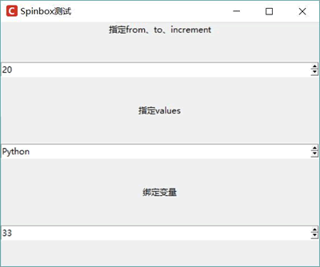

# Python Tkinter Spinbox 控件及用法（附带实例）

Spinbox 控件是一个带有两个小箭头的文本框，用户既可以通过两个小箭头上下调整该组件内的值，也可以直接在文本框内输入内容作为该组件的值。

Spinbox 本质上也相当于持有一个列表框，这一点类似于 Combobox，但 Spinbox 不会展开下拉列表供用户选择。Spinbox 只能通过向上、向下箭头来选择不同的选项。

在使用 Spinbox 组件时，既可通过 from（由于 from 是关键字，实际使用时写成 from_）、to、increment 选项来指定选项列表，也可通过 values 选项来指定多个列表项，该选项的值可以是 list 或 tuple。

Spinbox 同样可通过 textvariable 选项将它与指定变量绑定，这样程序即可通过该变量来获取或修改 Spinbox 组件的值。

Spinbox 还可通过 command 选项指定事件处理函数或方法，即当用户单击 Spinbox 的向上、向下箭头时，程序就会触发 command 选项指定的事件处理函数或方法。

下面程序示范了 Spinbox 组件的用法：

```
from tkinter import *
# 导入 ttk
from tkinter import ttk
class App:
    def __init__(self, master):
        self.master = master
        self.initWidgets()
    def initWidgets(self):
        ttk.Label(self.master, text='指定 from、to、increment').pack()
        # 通过指定 from_、to、increament 选项创建 Spinbox
        sb1 = Spinbox(self.master, from_ = 20,
            to = 100,
            increment = 5)
        sb1.pack(fill=X, expand=YES)
        ttk.Label(self.master, text='指定 values').pack()
        # 通过指定 values 选项创建 Spinbox
        self.sb2 = Spinbox(self.master,
            values=('Python', 'Swift', 'Kotlin', 'Ruby'),
            command = self.press) # 通过 command 绑定事件处理方法
        self.sb2.pack(fill=X, expand=YES)
        ttk.Label(self.master, text='绑定变量').pack()
        self.intVar = IntVar()
        # 通过指定 values 选项创建 Spinbox，并为之绑定变量
        sb3 = Spinbox(self.master,
            values=list(range(20, 100, 4)),
            textvariable = self.intVar, # 绑定变量
            command = self.press)
        sb3.pack(fill=X, expand=YES)
        self.intVar.set(33) # 通过变量改变 Spinbox 的值
    def press(self):
        print(self.sb2.get())
root = Tk()
root.title("Spinbox 测试")
# 改变窗口图标
root.iconbitmap('images/fklogo.ico')
App(root)
root.mainloop()
```

上面程序中第 11~13 行代码使用 from_、to、increment 选项创建了 Spinbox 组件；第 17~19 行代码使用 values 选项创建了 Spinbox 组件，并为该组件的 command 选项指定了事件处理方法，因此当单击 Spinbox 的向上、向下箭头调整值时，该选项指定的事件处理方法就会被触发；第 24-27 行代码在创建 Spinbox 时使用 textvariable 选项绑定了变量，这样程序完全可通过绑定变量来访问或修改该 Spinbox 组件的值。

运行上面程序，可以看到如图 1 所示的运行界面：

图 1 Spinbox 组件