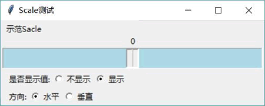
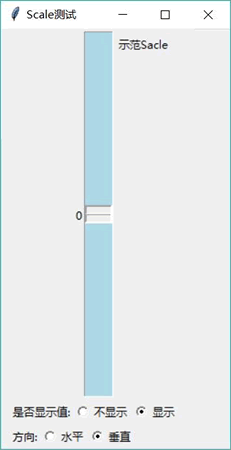

# Python Tkinter Scale 和 LabeledScale 用法

Scale 组件代表一个滑动条，可以为该滑动条设置最小值和最大值，也可以设置滑动条每次调节的步长。

Scale 组件支持如下选项：

*   from：设置该 Scale 的最小值。
*   to：设置该 Scale 的最大值。
*   resolution：设置该 Scale 滑动时的步长。
*   label：为 Scale 组件设置标签内容。
*   length：设置轨道的长度。
*   width：设置轨道的宽度。
*   troughcolor：设置轨道的背景色。
*   sliderlength：设置轨道的长度。
*   sliderrelief：设置滑块的立体样式。
*   showvalue：设置是否显示当前值。
*   orient：设置方向。该选项支持 VERTICAL 和 HORIZONTAL 两个值。
*   digits：设置有效数字至少要有几位。
*   variable：用于与变量进行绑定。
*   command：用于为该 Scale 组件绑定事件处理，函数或方法。

如果使用 ttk.Scale 组件，则更接近操作系统本地的效果，但允许定制的选项少。

下面以一个示例程序来介绍 Scale 组件的选项的功能和用法：

```
from tkinter import *
# 导入 ttk
from tkinter import ttk

class App:
    def __init__(self, master):
        self.master = master
        self.initWidgets()
    def initWidgets(self):
        self.scale = Scale(self.master,
            from_ = -100,  # 设置最大值
            to = 100,  # 设置最小值
            resolution = 5, # 设置步长
            label = '示范 Sacle', # 设置标签内容
            length = 400, # 设置轨道的长度
            width = 30, # 设置轨道的宽度
            troughcolor='lightblue', # 设置轨道的背景色
            sliderlength=20, # 设置滑块的长度
            sliderrelief=SUNKEN, # 设置滑块的立体样式
            showvalue=YES, # 设置显示当前值
            orient = HORIZONTAL  #设置水平方向
        )
        self.scale.pack()
        # 创建一个 Frame 作为容器
        f = Frame(self.master)
        f.pack(fill=X, expand=YES, padx=10)
        Label(f, text='是否显示值:').pack(side=LEFT)
        i = 0
        self.showVar = IntVar()
        self.showVar.set(1)
        # 创建两个 Radiobutton 控制 Scale 是否显示值
        for s in ('不显示', '显示'):
            Radiobutton(f, text=s, value=i,variable=self.showVar,
            command=self.switch_show).pack(side=LEFT)
            i += 1
        # 创建一个 Frame 作为容器
        f = Frame(self.master)
        f.pack(fill=X, expand=YES, padx=10)
        Label(f, text='方向:').pack(side=LEFT)
        i = 0
        self.orientVar = IntVar()
        self.orientVar.set(0)
        # 创建两个 Radiobutton 控制 Scale 的方向
        for s in ('水平', '垂直'):
            Radiobutton(f, text=s, value=i,variable=self.orientVar,
            command=self.switch_orient).pack(side=LEFT)
            i += 1
    def switch_show(self):
        self.scale['showvalue'] = self.showVar.get()
    def switch_orient(self):
        # 根据单选框的选择设置 orient 选项的值
        self.scale['orient'] = VERTICAL if self.orientVar.get() else HORIZONTAL
root = Tk()
root.title("Scale 测试")
App(root)
root.mainloop()
```

上面程序创建了 Scale 组件，并为该 Scale 组件指定了前面所介绍的选项。此外，程序还根据单选钮的选中状态来设置 Scale 组件的 showvalue 选项，该选项将会控制该 Scale 组件是否显示当前值。此程序会根据单选钮的选中状态设置 Scale 是水平的还是垂直的（根据 orient 选项进行设置）。

运行上面程序，如果将 Scale 组件默认显示为水平滑动条，则效果如图 1 所示。

图 1 水平滑动条
如果将上面的 Scale 设置为垂直渭动条，并选中“不显示”单选钮，将会看到如图 2 所示的效果。

图 2 垂直滑动条
Scale 组件同样支持 variable 进行变量绑定，也支持使用 command 选项绑定事件处理函数或方法，这样每当用户拖动滑动条上的滑块时，都会触发 command 绑定的事件处理方法，不过 Scale 的事件处理方法比较奇葩，它可以额外定义一个参数，用于获取 Scale 的当前值。例如如下程序：

```
from tkinter import *
# 导入 ttk
from tkinter import ttk

class App:
    def __init__(self, master):
        self.master = master
        self.initWidgets()
    def initWidgets(self):
        # 定义变量
        self.doubleVar = DoubleVar()
        self.scale = Scale(self.master,
            from_ = -100,  # 设置最大值
            to = 100,  # 设置最小值
            resolution = 5, # 设置步长
            label = '示范 Sacle', # 设置标签内容
            length = 400, # 设置轨道的长度
            width = 30, # 设置轨道的宽度
            orient = HORIZONTAL,  #设置水平方向
            digits = 10, # 设置十位有效数字
            command = self.change, # 绑定事件处理函数
            variable = self.doubleVar # 绑定变量
        )
        self.scale.pack()
        # 设置 Scale 的当前值
        self.scale.set(20)
    # 这个事件处理函数比较奇葩，它可以接收到 Scale 的值
    def change(self, value):
        print(value, self.scale.get(), self.doubleVar.get())
root = Tk()
root.title("Scale 测试")
App(root)
root.mainloop()
```

上面程序示范了通过三种方式来获取 Scale 组件的值：

1.  通过事件处理方法的参数来获取。
2.  通过 Scale 组件提供的 get() 方法来获取。
3.  通过 Scale 组件绑定的变量来获取。

通过上面三种方式获取的变量值都是一样的，但由于 Scale 组件指定了 digits 选项（该选项指定 Scale 的值的有效数字至少保留几位）为 10，因此程序通过事件处理方法获取的值将有 10 位有效数字，如 -35.0000000。

ttk.LabeledScale 是平台化的滑动条，因此它允许设置的选项很少，只能设置 from、to 和 compound 等有限的几个选项，而且它总是生成一个水平滑动条（不能变成垂直的），其中 compound 选项控制滑动条的数值标签是显示在滑动条的上方，还是滑动条的下方。

下面程序示范了 LabeledScale 组件的功能和用法：

```
from tkinter import *
# 导入 ttk
from tkinter import ttk

class App:
    def __init__(self, master):
        self.master = master
        self.initWidgets()
    def initWidgets(self):
        self.scale = ttk.LabeledScale(self.master,
            from_ = -100,  # 设置最大值
            to = 100,  # 设置最小值
#            compound = BOTTOM # 设置显示数值的 Label 在下方
        )
        self.scale.value = -20
        self.scale.pack(fill=X, expand=YES)
root = Tk()
root.title("LabeledScale 测试")
App(root)
root.mainloop()
```

上面程序创建了一个 LabeledScale 组件，该组件会生成一个水平滑动条，并且滑动条的数值标签默认会显示在滑动条的上方；如果取消程序中被注释代码的注释，也就是将 compound 选项设为 BOTTOM，则意味着滑动条的数值标签默认会显示在滑动条的下方。