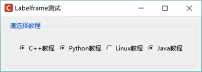
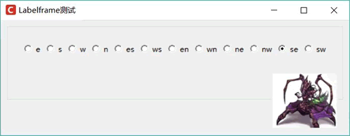

# Python Tkinter LabelFrame 用法详解（实例分析）

Labelframe 是 Frame 容器的改进版，它允许为容器添加一个标签，该标签既可以是普通的文字标签，也可以将任意 GUI 组件作为标签。

为了让 ttk.Labelframe 与 tkinter.LabelFrame 保持名字上的兼容，ttk 为 ttk.Labelframe 起了一个别名 ttk.LabelFrame（注意 f 的大小写），因此在程序中既可使用 ttk.Labelframe, 也可使用 ttk.LabelFrame，它们二者完全相同。

为了给 Labelframe 设置文字标签，只要为它指定 text 选项即可。如下程序示范了 Labelframe 组件的用法：

```
from tkinter import *
# 导入 ttk
from tkinter import ttk
class App:
    def __init__(self, master):
        self.master = master
        self.initWidgets()
    def initWidgets(self):
        # 创建 Labelframe 容器
        lf = ttk.Labelframe(self.master, text='请选择教程',
            padding=20)
        lf.pack(fill=BOTH, expand=YES, padx=10, pady=10)
        books = ['C++', 'Python', 'Linux', 'Java']
        i = 0
        self.intVar = IntVar()
        # 使用循环创建多个 Radiobutton，并放入 Labelframe 中
        for book in books:
            Radiobutton(lf, text=book + '教程',
            value=i,
            variable=self.intVar).pack(side=LEFT)
            i += 1    
root = Tk()
root.title("Labelframe 测试")
# 改变窗口图标
root.iconbitmap('1.ico')
App(root)
root.mainloop()
```

上面程序首先创建了一个简单的 Labelframe 组件，并为它指定了 text 选项，该选项的内容将会作为该容器的标签。接下来程序向 Labelframe 容器中添加了 4 个 Radiobutton。运行该程序，可以看到如图 1 所示的效果。

图 1 Labelframe 组件
Labelframe 允许通过如下选项对标签进行定制：

*   labelwidget：设置可以将任意 GUI 组件作为标签。
*   labelanchor：设置标签的位置。该选项支持 'e'、's'、'w'、'n'、'es'、'ws'、'en'、'wn'、'ne'、'nw'、'se'、'sw' 这 12 个边项值，用于控制标签的位置。

如下程序示范了对 Labelframe 的标签进行定制：

```
from tkinter import *
# 导入 ttk
from tkinter import ttk
class App:
    def __init__(self, master):
        self.master = master
        self.initWidgets()
    def initWidgets(self):
        # 创建 Labelframe 容器
        self.lf = ttk.Labelframe(self.master, padding=20)
        self.lf.pack(fill=BOTH, expand=YES, padx=10, pady=10)
        # 创建一个显示图片的 Label
        bm = PhotoImage(file='images/z.png')
        lb = Label(self.lf, image=bm)
        lb.bm = bm
        # 将 Labelframe 的标题设为显示图片的 Label
        self.lf['labelwidget'] = lb
        # 定义代表 Labelframe 的标题位置的 12 个常量
        self.books = ['e', 's', 'w', 'n', 'es', 'ws', 'en', 'wn',
            'ne', 'nw', 'se', 'sw']
        i = 0
        self.intVar = IntVar()
        # 使用循环创建多个 Radiobutton，并放入 Labelframe 中
        for book in self.books:
            Radiobutton(self.lf, text= book,
            value=i,
            command=self.change,
            variable=self.intVar).pack(side=LEFT)
            i += 1
        self.intVar.set(9)
    def change(self):
        # 通过 labelanchor 选项改变 Labelframe 的标题的位置
        self.lf['labelanchor'] = self.books[self.intVar.get()]
root = Tk()
root.title("Labelframe 测试")
# 改变窗口图标
root.iconbitmap('images/fklogo.ico')
App(root)
root.mainloop()
```

上面程序通过 labelwidget 选项定制了该 Labelframe 的标签，该选项值指定为一个显示图片的 Label，因此该 Labelframe 的标签就是一张图片。与此同时，程序会根据单选钮的选中状态设置 Labelframe 的标签的位置。

运行该程序，改变 Labelframe 的标签的位置到右下角（se）处，将看到如图 2 所示的界面。

图 2 定制 Labelframe 的标签