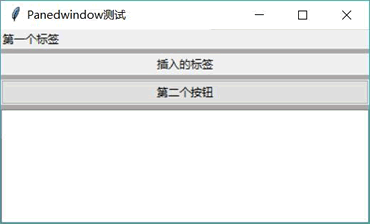
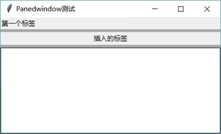
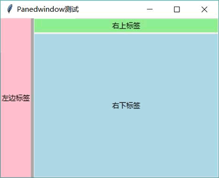

# Python Tkinter Panedwindow 控件用法详解

Panedwindow 是一个管理窗口布局的容器，它允许添加多个子组件（不需要使用 Pack、Grid 或 Place 布局）并为每个子组件划分一个区域，用户可用鼠标移动各区域的分隔线来改变各子组件的大小（如果没有显式指定大小，子细件总是自动占满整个区域）。

ttk.Panedwindow 继承了 tkinter.PanedWindow，为了让 ttk.Panedwindow 与 tkinter.PanedWindow 保持名字上的兼容，ttk 为 ttk.Panedwindow 起了一个别名 ttk.PanedWindow（注意 w 的大小写），因此在程序中既可使用 ttk.Panedwindow，也可使用 ttk.PanedWindow，它们二者完全相同。

Panedwindow 是一个非常有特色的容器，它自带布局管理功能，它允许通过 orient 选项指定水平或垂直方向，让容器中的各组件按水平或垂直方向排列。

在创建 Panedwindow 之后，程序可通过如下方法操作 Panedwindow 容器中的子组件：

*   add(self, child, **kw)：添加一个子组件。
*   insert(self, pos, child,**kw)：在 pos 位置插入一个子组件。
*   remove(self, child)：删除一个子组件，该子组件所在区域也被删除。

下面程序示范了为 Panedwindow 添加、插入、删除子组件：

```
from tkinter import *
# 导入 ttk
from tkinter import ttk

class App:
    def __init__(self, master):
        self.master = master
        self.initWidgets()
    def initWidgets(self):
        # 创建 Style
        style = ttk.Style()
        style.configure("fkit.TPanedwindow", background='darkgray', relief=RAISED)
        # 创建 Panedwindow 组件，通过 style 属性配置分隔线
        pwindow = ttk.Panedwindow(self.master,
            orient=VERTICAL, style="fkit.TPanedwindow") 
        pwindow.pack(fill=BOTH, expand=1)
        first = ttk.Label(pwindow, text="第一个标签")
        # 调用 add 方法添加组件，每个组件一个区域
        pwindow.add(first)
        okBn = ttk.Button(pwindow, text="第二个按钮",
            # 调用 remove()方法删除组件，该组件所在区域消失
            command=lambda : pwindow.remove(okBn))
        # 调用 add 方法添加组件，每个组件一个区域
        pwindow.add(okBn)
        entry = ttk.Entry(pwindow, width=30)
        # 调用 add 方法添加组件，每个组件一个区域
        pwindow.add(entry)
        # 调用 insert 方法插入组件
        pwindow.insert(1, Label(pwindow, text='插入的标签'))
root = Tk()
root.title("Panedwindow 测试")
App(root)
root.mainloop()
```

上面程序中，第 11、12 行代码创建了一个 ttk.Style 对象，该对象专门用于管理他组件的样式，这样 ttk 组件即可通过 style 选项复用 ttk.Style 管理的样式。此处使用 ttk.Style 为 ttk.Panedwindow 指定样式，这样才能看到 ttk.Panedwindow 容器内的分隔线（默认是看不到的）。

与此同时，程序第 19 行代码调用了 add() 方法为 Panedwindow 容器添加子组件；第 22 行代码调用了 remove() 方法删除 Panedwindow 容器中的子组件；第 29 行代码调用了 insert() 方法向 Panedwindow 容器中添加了子组件。

运行上面程序，将看到如图 1 所示的运行界面。

图 1 Panedwindow 组件
如果单击该界面上的“第二个按钮”，将会删除 Panedwindow 组件中的该按钮，该按钮所占的区域也会消失。此时将看到如图 2 所示的界面。

图 2 删除 Panedwindow 组件中的子组件
看到上面例子，可能有读者会想，Panedwindow 要么水平排列组件，要么垂直排列组件，这样功能不是太局限了吗？

请别忘记了，Panedwindow 组件同样也是可以嵌套的，以实现功能更丰富的界面。例如，如下程序在水平 Panedwindow 中嵌套了垂直 Panedwindow：

```
from tkinter import *
# 导入 ttk
from tkinter import ttk

class App:
    def __init__(self, master):
        self.master = master
        self.initWidgets()
    def initWidgets(self):
        # 创建 Style
        style = ttk.Style()
        style.configure("fkit.TPanedwindow",
            background='darkgray', relief=RAISED)
        # 创建 Panedwindow 组件，通过 style 属性配置分隔线
        pwindow = ttk.Panedwindow(self.master,
            orient=HORIZONTAL, style="fkit.TPanedwindow")
        pwindow.pack(fill=BOTH, expand=YES)
        left = ttk.Label(pwindow, text="左边标签", background='pink')
        pwindow.add(left)
        # 创建第二个 Panedwindow 组件，该组件的方向为垂直方向
        rightwindow = PanedWindow(pwindow, orient=VERTICAL)
        pwindow.add(rightwindow)
        top = Label(rightwindow, text="右上标签", background='lightgreen')
        rightwindow.add(top) 
        bottom = Label(rightwindow, text="右下标签", background='lightblue')
        rightwindow.add(bottom) 
root = Tk()
root.title("Panedwindow 测试")
App(root)
root.mainloop()
```

上面程序中，第 15 行代码创建了一个水平分布的 Panedwindow 容器，在该容器中先添加了一个 Label 组件；第 21 行代码创建了一个垂直分布的 Panedwindow 容器，该容器被添加到第一个 Panedwindow 容器中，这样就形成了嵌套，从而可以实现功能更丰富的界面。

运行上面程序，可以看到如图 3 所示的界面。

图 3 Panedwindow 嵌套