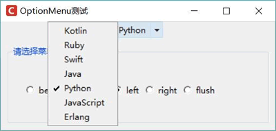

# Python Tkinter OptionMenu 控件用法

OptionMenu 组件用于构建一个带菜单的按钮，该菜单可以在按钮的四个方向上展开，展开方向可通过 direction 选项控制。

使用 OptionMenu 比较简单，直接调用它的如下构造函数即可：

__init__ (self, master, variable, value, *values, **kwargs)

其中，master 参数的作用与所有的 Tkinker 组件一样，指定将该组件放入哪个容器中。其他参数的含义如下：

*   variable：指定该按钮上的菜单与哪个变量绑定。
*   value：指定默认选择菜单中的哪一项。
*   values：Tkinter 将收集为此参数传入的多个值，为每个值创建一个菜单项。
*   kwargs：用于为 OptionMenu 配置选项。除前面介绍的常规选项之外，还可通过 direction 选项控制菜单的展开方向。

下面程序创建了一个 OptionMenu，并通过单选钮来控制 OptionMenu 中菜单的展开方向：

```
from tkinter import *
# 导入 ttk
from tkinter import ttk
class App:
    def __init__(self, master):
        self.master = master
        self.initWidgets()
    def initWidgets(self):
        self.sv = StringVar()
        # 创建一个 OptionMenu 控件
        self.om = ttk.OptionMenu(root,
            self.sv, # 绑定变量
            'Python', # 设置初始选中值
            'Kotlin', # 以下多个值用于设置菜单项
            'Ruby',
            'Swift',
            'Java',
            'Python',
            'JavaScript',
            'Erlang',
            command = self.print_option) # 绑定事件处理方法
        self.om.pack()
        # 创建 Labelframe 容器
        lf = ttk.Labelframe(self.master, padding=20, text='请选择菜单方向')
        lf.pack(fill=BOTH, expand=YES, padx=10, pady=10)
        # 定义代表 Labelframe 的标题位置的 12 个常量
        self.directions = ['below', 'above', 'left', 'right', 'flush']
        i = 0
        self.intVar = IntVar()
        # 使用循环创建多个 Radiobutton，并放入 Labelframe 中
        for direct in self.directions:
            Radiobutton(lf, text= direct,
            value=i,
            command=self.change,
            variable=self.intVar).pack(side=LEFT)
            i += 1
        self.intVar.set(9)
    def print_option(self, val):
        # 通过两种方式来获取 OptionMenu 选中的菜单项的值
        print(self.sv.get(), val)
    def change(self):
        # 通过 direction 选项改变 OptionMenu 上菜单的展开方向
        self.om['direction'] = self.directions[self.intVar.get()]
root = Tk()
root.title("OptionMenu 测试")
# 改变窗口图标
root.iconbitmap('images/fklogo.ico')
App(root)
root.mainloop()
```

上面程序中，第 21 行代码为 OptionMenu 的 command 选项绑定了 self.print_option 方法，这意味着当用户选择菜单中的不同菜单项时，都会触发 self.print_option 方法。该事件处理方法也比较奇葩，它可以额外指定一个参数来获取目标菜单项上的值，如上面程序中第 38 行代码所示。

程序中第 43 行代码通过动态改变 OptionMenu 的 direction 选项值，就可以动态改变按钮上菜单的展开方向。

运行上面程序，选中下方的“left”单选钮，就可以看到如图 1 所示的效果。

图 1 OptionMenu 组件