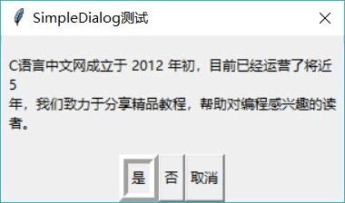
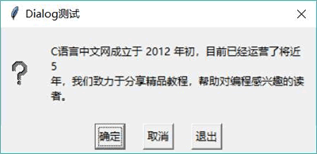

# Python Tkinter 对话框创建及使用（附带实例）

对话框也是图形界面编程中很常用的组件，通常用于向用户生成某种提示信息，或者请求用户输入某些简单的信息。

对话框看上去有点类似于顶级窗口，但对于对话框有如下两点需要注意：

*   对话框通常依赖其他窗口，因此程序在创建对话框时同样需要指定 master 属性（该对话框的属主窗口）。
*   对话框有非模式（non-modal）和模式（modal）两种，当某个模式对话框被打开之后，该模式对话框总是位于它依赖的窗口之上；在模式对话框被关闭之前，它依赖的窗口无法获得焦点。

Tkinter 在 simpledialog 和 dialog 模块下分别提供了 SimpleDialog 类和 Dialog 类，它们都可作为普通对话框使用，而且用法也差不多。

在使用 simpledialog.SimpleDialog 创建对话框时，可指定如下选项：

*   title：指定该对话框的标题。
*   text：指定该对话框的内容。
*   button：指定该对话框下方的几个按钮。
*   default：指定该对话框中默认第几个按钮得到焦点。
*   cancel：指定当用户通过对话框右上角的 X 按钮关闭对话框时，该对话框的返回值。

如果使用 dialog.Dialog 创建对话框，除可使用 master 指定对话框的属主窗口之外，还可通过 dict 来指定如下选项：

*   title：指定该对话框的标题。
*   text：指定该对话框的内容。
*   strings：指定该对话框下方的几个按钮。
*   default：指定该对话框中默认第几个按钮得到焦点。
*   bitmap：指定该对话框上的图标。

对比上面介绍不难发现，simpledialog.SimpleDialog 和 dialog.Dialog 所支持的选项大同小异，区别只是 dialog.Dialog 需要使用 dict 来传入多个选项。

如下程序分别示范了使用 SimpleDialog 和 Dialog 来创建对话框：

```
from tkinter import *
# 导入 ttk
from tkinter import ttk
# 导入 simpledialog
from tkinter import simpledialog
# 导入 dialog
from tkinter import dialog

class App:
    def __init__(self, master):
        self.master = master
        self.initWidgets()
    def initWidgets(self):
        self.msg = 'C 语言中文网成立于 2012 年初，目前已经运营了将近 5 年，我们致力于分享精品教程，帮助对编程感兴趣的读者。'
        # 创建 2 个按钮，并为之绑定事件处理函数
        ttk.Button(self.master, text='打开 SimpleDialog',
            command=self.open_simpledialog # 绑定 open_simpledialog 方法
            ).pack(side=LEFT, ipadx=5, ipady=5, padx= 10)
        ttk.Button(self.master, text='打开 Dialog',
            command=self.open_dialog # 绑定 open_dialog 方法
            ).pack(side=LEFT, ipadx=5, ipady=5, padx = 10)
    def open_simpledialog(self):
        # 使用 simpledialog.SimpleDialog 创建对话框
        d = simpledialog.SimpleDialog(self.master, # 设置该对话框所属的窗口
            title='SimpleDialog 测试', # 标题
            text=self.msg,  # 内容
            buttons=["是", "否", "取消"],
            cancel=3,
            default=0 # 设置默认是哪个按钮得到焦点
        )
        print(d.go())  #①
    def open_dialog(self):
        # 使用 dialog.Dialog 创建对话框
        d = dialog.Dialog(self.master # 设置该对话框所属的窗口
            , {'title': 'Dialog 测试',  # 标题
            'text':self.msg, # 内容
            'bitmap': 'question', # 图标
            'default': 0,  # 设置默认选中项
            # strings 选项用于设置按钮
            'strings': ('确定',
                '取消',
                '退出')})
        print(d.num)  #②

root = Tk()
root.title("对话框测试")
App(root)
root.mainloop()
```

上面程序中，第 24 行代码使用 simpledialog.SimpleDialog 创建了对话框，同时第 34 行代码使用 dialog.Dialog 创建了对话框。从代码中可以看到，创建两个对话框的代码相似，区别只是创建 dialog.Dialog 时需要使用 dict 传入选项。

运行上面程序，单击界面上的“打开 SimpleDialog”按钮，可以看到如图 1 所示的效果。

图 1 SimpleDialog 对话框
程序中 ① 号代码打印了该对话框 go() 方法的返回值，该返回值会获取用户单击了对话框的哪个按钮。如果用户通过对话框右上角的 X 按钮关闭对话框，则返回 cancel 选项指定的值。

如果单击界面上的“打开 Dialog”按钮，可以看到如图 2 所示的效果。

图 2 Dialog 对话框
程序中 ② 号代码打印了该对话框 num 属性的值，该返回值会获取用户单击了对话框的哪个按钮。

在图 2 所示对话框的左边还显示了一个问号图标，这是 Python 内置的 10 个位图之一，可以直接使用。共有如下几个常量可用于设置位图：

*   “error”
*   “gray75”
*   “gray50”
*   “gray25”
*   “gray12”
*   “howglass”
*   “info”
*   “questhead”
*   “question”
*   “warning”