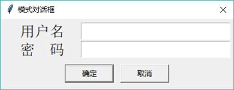

# Python Tkinter 自定义对话框（模式和非模式）

从前面章节的介绍可以看到，不管是使用 SimpleDialog 还是 Dialog，整个对话框的布局都是比较固定的，开发者只能为其指定 title、text 等选项，如果希望在对话框中添加其他组件，这就很难实现了。另外，SimpleDialog 和 Dialog 都是模式的。

如果开发者需要使用自定义的对话框，包括定制模式和非模式行为，则可通过继承 Toplevel 来实现。如果打算通过这种方式来实现自定义对话框，有两点要注意：

1.  继承 Toplevel 来实现自定义对话框同样需要为对话框指定 master。
2.  程序可调用 Toplevel 的 grab_set() 方法让该对话框变成模式对话框，否则就是非模式对话框。

下面程序示范了自定义模式和非模式对话框：

```
from tkinter import *
# 导入 ttk
from tkinter import ttk
from tkinter import messagebox

# 自定义对话框类，继承 Toplevel
class MyDialog(Toplevel):
    # 定义构造方法
    def __init__(self, parent, title = None, modal=True):
        Toplevel.__init__(self, parent)
        self.transient(parent)
        # 设置标题
        if title: self.title(title)
        self.parent = parent
        self.result = None
        # 创建对话框的主体内容
        frame = Frame(self)
        # 调用 init_widgets 方法来初始化对话框界面
        self.initial_focus = self.init_widgets(frame)
        frame.pack(padx=5, pady=5)
        # 调用 init_buttons 方法初始化对话框下方的按钮
        self.init_buttons()
        # 根据 modal 选项设置是否为模式对话框
        if modal: self.grab_set()
        if not self.initial_focus:
            self.initial_focus = self
        # 为"WM_DELETE_WINDOW"协议使用 self.cancel_click 事件处理方法
        self.protocol("WM_DELETE_WINDOW", self.cancel_click)
        # 根据父窗口来设置对话框的位置
        self.geometry("+%d+%d" % (parent.winfo_rootx()+50,
            parent.winfo_rooty()+50))
        print( self.initial_focus)
        # 让对话框获取焦点
        self.initial_focus.focus_set()
        self.wait_window(self)
    # 通过该方法来创建自定义对话框的内容
    def init_widgets(self, master):
        # 创建并添加 Label
        Label(master, text='用户名', font=12,width=10).grid(row=1, column=0)
        # 创建并添加 Entry,用于接受用户输入的用户名
        self.name_entry = Entry(master, font=16)
        self.name_entry.grid(row=1, column=1)
        # 创建并添加 Label
        Label(master, text='密  码', font=12,width=10).grid(row=2, column=0)
        # 创建并添加 Entry,用于接受用户输入的密码
        self.pass_entry = Entry(master, font=16)
        self.pass_entry.grid(row=2, column=1)
    # 通过该方法来创建对话框下方的按钮框
    def init_buttons(self):
        f = Frame(self)
        # 创建"确定"按钮,位置绑定 self.ok_click 处理方法
        w = Button(f, text="确定", width=10, command=self.ok_click, default=ACTIVE)
        w.pack(side=LEFT, padx=5, pady=5)
        # 创建"确定"按钮,位置绑定 self.cancel_click 处理方法
        w = Button(f, text="取消", width=10, command=self.cancel_click)
        w.pack(side=LEFT, padx=5, pady=5)
        self.bind("<Return>", self.ok_click)
        self.bind("<Escape>", self.cancel_click)
        f.pack()
    # 该方法可对用户输入的数据进行校验
    def validate(self):
        # 可重写该方法
        return True
    # 该方法可处理用户输入的数据
    def process_input(self):
        user_name = self.name_entry.get()
        user_pass = self.pass_entry.get()
        messagebox.showinfo(message='用户输入的用户名: %s, 密码: %s'
            % (user_name , user_pass))
    def ok_click(self, event=None):
        print('确定')
        # 如果不能通过校验，让用户重新输入
        if not self.validate():
            self.initial_focus.focus_set()
            return
        self.withdraw()
        self.update_idletasks()
        # 获取用户输入数据
        self.process_input()
        # 将焦点返回给父窗口
        self.parent.focus_set()
        # 销毁自己
        self.destroy()
    def cancel_click(self, event=None):
        print('取消')
        # 将焦点返回给父窗口
        self.parent.focus_set()
        # 销毁自己
        self.destroy()
class App:
    def __init__(self, master):
        self.master = master
        self.initWidgets()
    def initWidgets(self):
        # 创建 2 个按钮，并为之绑定事件处理函数
        ttk.Button(self.master, text='模式对话框',
            command=self.open_modal # 绑定 open_modal 方法
            ).pack(side=LEFT, ipadx=5, ipady=5, padx= 10)
        ttk.Button(self.master, text='非模式对话框',
            command=self.open_none_modal # 绑定 open_none_modal 方法
            ).pack(side=LEFT, ipadx=5, ipady=5, padx= 10)
    def open_modal(self):
        d = MyDialog(self.master, title='模式对话框') # 默认是模式对话框
    def open_none_modal(self):
        d = MyDialog(self.master, title='非模式对话框', modal=False)
root = Tk()
root.title("颜色对话框测试")
App(root)
root.mainloop()
```

上面程序定义了一个父类为 Toplevel 的 MyDialog 类，该类就是一个自定义对话框类，读者以后完全可以复用这个 MyDialog 类。该对话框的主体包含两个方法：

*   init_widgets：该方法用于初始化对话框的主体界面组件。
*   init_buttons：该方法用于初始化对话框下方的多个按钮组件。

至于 MyDialog 类中的 ok_click、cancel_click，则是程序为对话框按钮所绑定的事件处理方法。这不是固定的，程序下方有几个按钮，通常就需要为几个按钮绑定事件处理方法。

上面程序通过 MyDialog 创建了模式对话框和非模式对话框。运行该程序，单击界面上的“模式对话框”按钮，程序弹出如图 1 所示的自定义对话框。

图 1 模式对话框
在该模式对话框没有关闭的情况下，该程序的主窗口将无法与用户交互，主窗口无法获得焦点。

如果单击界面上的“非模式对话框”按钮，程序也弹出类似于图 1 所示的自定义对活框，但这个对话框是非模式对话框，即使在该对话框没有关闭的情况下，用户也依然可以与程序的主窗口交互，主窗口可以获得焦点。