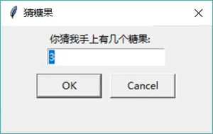
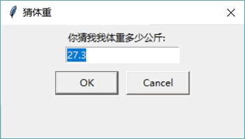
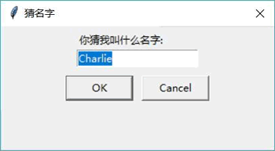

# Python Tkinter 输入对话框（附带实例讲解）

在 simpledialog 模块下还有如下便捷的工具函数，通过这些工具函数可以更方便地生成各种输入对话框：

*   askinteger：生成一个让用户输入整数的对话框。
*   askfloat：生成一个让用户输入浮点数的对话框。
*   askstring：生成一个让用户输入字符串的对话框。

上面三个工具函数的前两个参数分别指定对话框的标题和提示信息，后面还可以通过选项来设置对话框的初始值、最大值和最小值。

下面程序示范了 simpledialog 模块下三个工具函数的用法：

```
from tkinter import *
# 导入 ttk
from tkinter import ttk
# 导入 simpledialog
from tkinter import simpledialog
class App:
    def __init__(self, master):
        self.master = master
        self.initWidgets()
    def initWidgets(self):
        # 创建 3 个按钮，并为之绑定事件处理函数
        ttk.Button(self.master, text='输入整数对话框',
            command=self.open_integer # 绑定 open_integer 方法
            ).pack(side=LEFT, ipadx=5, ipady=5, padx= 10)
        ttk.Button(self.master, text='输入浮点数对话框',
            command=self.open_float # 绑定 open_integer 方法
            ).pack(side=LEFT, ipadx=5, ipady=5, padx= 10)
        ttk.Button(self.master, text='输入字符串对话框',
            command=self.open_string # 绑定 open_integer 方法
            ).pack(side=LEFT, ipadx=5, ipady=5, padx= 10)
    def open_integer(self):
         # 调用 askinteger 函数生成一个让用户输入整数的对话框
        print(simpledialog.askinteger("猜糖果", "你猜我手上有几个糖果:",
            initialvalue=3, minvalue=1, maxvalue=10))
    def open_float(self):
        # 调用 askfloat 函数生成一个让用户输入浮点数的对话框
        print(simpledialog.askfloat("猜体重", "你猜我我体重多少公斤:",
            initialvalue=27.3, minvalue=10, maxvalue=50))
    def open_string(self):
        # 调用 askstring 函数生成一个让用户输入字符串的对话框
        print(simpledialog.askstring("猜名字", "你猜我叫什么名字:",
            initialvalue='Charlie'))
root = Tk()
root.title("输入对话框测试")
App(root)
root.mainloop()
```

上面程序中第 23 行代码生成让用户输入整数的对话框；第 27 行代码生成让用户输入浮点数的对话框；第 31 行代码生成让用户输入字符串的对话框。

askinteger()、askfloat 和 askstring 这三个函数会返回用户输入的数据，因此上面三行代码打印了这三个函数的返回值，这样就可以打印出用户输入的内容。

运行该程序，单击界面上的“输入整数对话框”按钮，可以看到如图 1 所示的对话框。

图 1 输入整数的对话框
在图 1 所示的对话框中，用户只能输入整数，而且输入的整数必须在指定范围内；否则，系统会生成错误提示。当用户输入所允许范围内的整数并单击“OK”按钮后，可以看到控制台打印了用户输入的整数。

单击界面上的“输入浮点数对话框” 按钮，可以看到如图 2 所示的对话框。

图 2 输入浮点数的对话框
在图 2 所示的对话框中，用户只能输入浮点数，而且输入的浮点数必须在指定范围内； 否则，系统会生成错误提示。当用户输入所允许范围内的浮点数并单击“OK”按钮后，可以看到控制台打印了用户输入的浮点数。

单击界面上的“输入字符串对话框”按钮，可以看到如图 3 所示的对话框。

图 3 输入字符串的对话框
在图 3 所示的对话框中，用户只能输入字符串。当用户输入合适的字符串并单击“OK”按钮后，可以看到控制台打印了用户输入的字符串