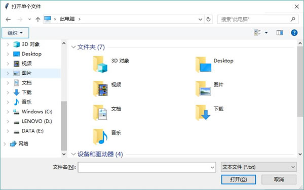

# Python Tkinter 文件对话框创建和使用

在 filedialog 模块下提供了各种用于生成文件对话框的工具函数，如下所示。这些工具函数有些返回用户所选择文件的路径，有些直接返回用户所选择文件的输入/输出流：

*   askopenfile()：生成打开单个文件的对话框，返回所选择文件的文件流，程序可通过该文件流来读取文件内容。
*   askopenfiles()：生成打开多个文件的对话框，返回多个所选择文件的文件流组成的列表，程序可通过这些文件流来读取文件内容。
*   askopenfilename()：生成打开单个文件的对话框，返回所选择文件的文件路径。
*   askopenfilenames()：生成打开多个文件的对话框，返回多个所选择文件的文件路径组成的元组。
*   asksaveasfile()：生成保存文件的对话框，返回所选择文件的文件输出流，程序可通过该文件输出流向文件写入数据。
*   asksaveasfilename()：生成保存文件的对话框，返回所选择文件的文件路径。
*   askdirectory()：生成打开目录的对话框。

上面的用于生成打开文件的对话框的工具函数支持如下选项：

*   defaultextension：指定默认扩展名。当用户没有输入扩展名时，系统会默认添加该选项指定的扩展名。
*   filetypes：指定在该文件对话框中能查看的文件类型。该选项值是一个序列，可指定多个文件类型。可以通过“*”指定浏览所有文件。
*   initialdir：指定初始打开的目录。
*   initialfile：指定所选择的文件。
*   parent：指定该对话框的属主窗口。
*   title：指定对话框的标题。
*   multiple：指定是否允许多选。

对于打开目录的对话框，还额外支持一个 mustexist 选项，该选项指定是否只允许打开己存在的目录。

下面程序示范了文件对话框的各工具函数的用法：

```
from tkinter import *
# 导入 ttk
from tkinter import ttk
# 导入 filedialog
from tkinter import filedialog
class App:
    def __init__(self, master):
        self.master = master
        self.initWidgets()
    def initWidgets(self):
        # 创建 7 个按钮，并为之绑定事件处理函数
        ttk.Button(self.master, text='打开单个文件',
            command=self.open_file # 绑定 open_file 方法
            ).pack(side=LEFT, ipadx=5, ipady=5, padx= 10)
        ttk.Button(self.master, text='打开多个文件',
            command=self.open_files # 绑定 open_files 方法
            ).pack(side=LEFT, ipadx=5, ipady=5, padx= 10)
        ttk.Button(self.master, text='获取单个打开文件的文件名',
            command=self.open_filename # 绑定 open_filename 方法
            ).pack(side=LEFT, ipadx=5, ipady=5, padx= 10)
        ttk.Button(self.master, text='获取多个打开文件的文件名',
            command=self.open_filenames # 绑定 open_filenames 方法
            ).pack(side=LEFT, ipadx=5, ipady=5, padx= 10)
        ttk.Button(self.master, text='获取保存文件',
            command=self.save_file # 绑定 save_file 方法
            ).pack(side=LEFT, ipadx=5, ipady=5, padx= 10)
        ttk.Button(self.master, text='获取保存文件的文件名',
            command=self.save_filename # 绑定 save_filename 方法
            ).pack(side=LEFT, ipadx=5, ipady=5, padx= 10)
        ttk.Button(self.master, text='打开路径',
            command=self.open_dir # 绑定 open_dir 方法
            ).pack(side=LEFT, ipadx=5, ipady=5, padx= 10)
    def open_file(self):
        # 调用 askopenfile 方法获取单个打开的文件
        print(filedialog.askopenfile(title='打开单个文件',
            filetypes=[("文本文件", "*.txt"), ('Python 源文件', '*.py')], # 只处理的文件类型
            initialdir='g:/')) # 初始目录
    def open_files(self):
        # 调用 askopenfile 方法获取多个打开的文件
        print(filedialog.askopenfiles(title='打开多个文件',
            filetypes=[("文本文件", "*.txt"), ('Python 源文件', '*.py')], # 只处理的文件类型
            initialdir='g:/')) # 初始目录
    def open_filename(self):
        # 调用 askopenfilename 方法获取单个文件的文件名
        print(filedialog.askopenfilename(title='打开单个文件',
            filetypes=[("文本文件", "*.txt"), ('Python 源文件', '*.py')], # 只处理的文件类型
            initialdir='g:/')) # 初始目录
    def open_filenames(self):
        # 调用 askopenfilenames 方法获取多个文件的文件名
        print(filedialog.askopenfilenames(title='打开多个文件',
            filetypes=[("文本文件", "*.txt"), ('Python 源文件', '*.py')], # 只处理的文件类型
            initialdir='g:/')) # 初始目录
    def save_file(self):
        # 调用 asksaveasfile 方法保存文件
        print(filedialog.asksaveasfile(title='保存文件',
            filetypes=[("文本文件", "*.txt"), ('Python 源文件', '*.py')], # 只处理的文件类型
            initialdir='g:/')) # 初始目录
    def save_filename(self):
        # 调用 asksaveasfilename 方法获取保存文件的文件名
        print(filedialog.asksaveasfilename(title='保存文件',
            filetypes=[("文本文件", "*.txt"), ('Python 源文件', '*.py')], # 只处理的文件类型
            initialdir='g:/')) # 初始目录
    def open_dir(self):
        # 调用 askdirectory 方法打开目录
        print(filedialog.askdirectory(title='打开目录',
            initialdir='g:/')) # 初始目录
root = Tk()
root.title("文件对话框测试")
App(root)
root.mainloop()
```

上面程序就是 filedialog 模块下不同函数的示范代码。运行上面程序，单击界面上的“打开单个文件”按钮，将会看到如图 1 所示的文件对话框：

图 1 打开单个文件的对话框
从图 1 所示的对话框可以看到，在该对话框中只能浏览文本文件和 Python 源文件，这正是程序通过 filetypes 选项设置的效果；该对话框默认的打开目录是 `G:/` 根目录，这是程序通过 initialdir 选项设置的效果。

通过 filedialog 模块下的工具函数打开的文件对话框依赖所在的平台，因此在不同的平台上看到的文件对话框是不同的。

当用户选择指定文件后，可以在控制台看到打印出类似于“<_io.TextIOWrapper name='xxx' mode='r' encoding='cp936'>”的输出信息，这就是被打开文件的文件流；如果用户单击“xxx 的文件名”按钮，通过文件对话框选择文件之后，将会在控制台看到只打印出所选择文件的文件路径。