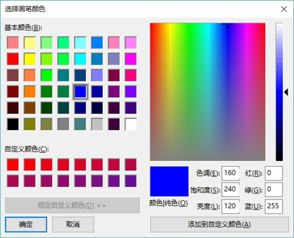

# Python Tkinter askcolor 颜色选择对话框用法

在 colorchooser 模块下提供了用于生成颜色选择对话框的 askcolor() 工具函数，为该工具函数可指定如下选项：

*   parent：指定该对话框的属主窗口。
*   title：指定该对话框的标题。
*   color：指定该对话框初始选择的颜色。

下面程序示范了颜色选择对话框的功能和用法：

```
from tkinter import *
# 导入 ttk
from tkinter import ttk
# 导入 colorchooser
from tkinter import colorchooser
class App:
    def __init__(self, master):
        self.master = master
        self.initWidgets()
    def initWidgets(self):
        # 创建 1 个按钮，并为之绑定事件处理函数
        ttk.Button(self.master, text='选择颜色',
            command=self.choose_color # 绑定 choose_color 方法
            ).pack(side=LEFT, ipadx=5, ipady=5, padx= 10)
    def choose_color(self):
        # 调用 askcolor 函数获取选中的颜色
        print(colorchooser.askcolor(parent=self.master, title='选择画笔颜色',
            color = 'blue')) # 初始颜色
root = Tk()
root.title("颜色对话框测试")
App(root)
root.mainloop()
```

上面程序中第 18 行代码就是调用 askcolor() 函数生成颜色选择对话框的关键代码。运行该程序，单击界面上的“选择颜色”按钮，将可以看到如图 1 所示的对话框。

图 1 颜色选择对话框

通过 colorchooser 模块下的工具函数打开的颜色选择对话框依赖所在的平台，因此在不同的平台上看到的颜色选择对话框是不同的。

当用户选择指定颜色，并单击颜色选择对话框中的“确定”按钮后，askcolor() 函数会返回用户所选择的颜色，因此可以在控制台看到用户所选择的颜色。