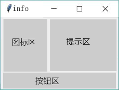
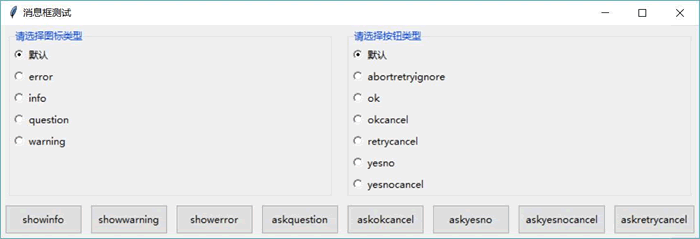
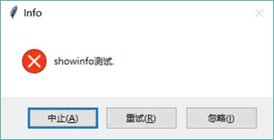

# Python Tkinter 消息框（附带实例讲解）

在 messagebox 模块下提供了大量工具函数来生成各种消息框，这些消息框的结构大致如图 1 所示。

图 1 消息框的结构
在默认情况下，开发者在调用 messagebox 的工具函数时只要设置提示区的字符串即可，图标区的图标、按钮区的按钮都有默认设置。

如果有必要，则完全可通过如下两个选项来定制图标和按钮：

*   icon：定制图标的选 I 页。该选项支持“error”、“info”、“question”、“warning”这几个选项值。
*   type：定制按钮的选项。该选项支持“abortretryignore”（取消、重试、忽略）、“ok”（确定）、“okcancel”（确定、取消）、“retrycancel”（重试、取消）、“yesno”（是、否）、“yesnocancel”（是、否、取消）这些选项值。

下面的示例程序不仅示范了 messagebox 的各工具函数的用法，而且还通过两组单选钮让用户动态选择不同的 icon 和 type 选项的效果。

```
from tkinter import *
# 导入 ttk
from tkinter import ttk
# 导入 messagebox
from tkinter import messagebox as msgbox
class App:
    def __init__(self, master):
        self.master = master
        self.initWidgets()
    def initWidgets(self):
        #-----------创建第 1 个 Labelframe，用于选择图标类型-----------
        topF = Frame(self.master)
        topF.pack(fill=BOTH)
        lf1 = ttk.Labelframe(topF, text='请选择图标类型')
        lf1.pack(side=LEFT, fill=BOTH, expand=YES, padx=10, pady=5)
        i = 0
        self.iconVar = IntVar()
        self.icons = [None, "error", "info", "question", "warning"]
        # 使用循环创建多个 Radiobutton，并放入 Labelframe 中
        for icon in self.icons:
            Radiobutton(lf1, text = icon if icon is not None else '默认',
            value=i,
            variable=self.iconVar).pack(side=TOP, anchor=W)
            i += 1
        self.iconVar.set(0)
        #-----------创建第二个 Labelframe，用于选择按钮类型-----------
        lf2 = ttk.Labelframe(topF, text='请选择按钮类型')
        lf2.pack(side=LEFT,fill=BOTH, expand=YES, padx=10, pady=5)
        i = 0
        self.typeVar = IntVar()
        # 定义所有按钮类型
        self.types = [None, "abortretryignore", "ok", "okcancel",
            "retrycancel", "yesno", "yesnocancel"]
        # 使用循环创建多个 Radiobutton，并放入 Labelframe 中
        for tp in self.types:
            Radiobutton(lf2, text= tp if tp is not None else '默认',
            value=i,
            variable=self.typeVar).pack(side=TOP, anchor=W)
            i += 1
        self.typeVar.set(0)
        #-----------创建 Frame,用于包含多个按钮来生成不同的消息框-----------
        bottomF = Frame(self.master)
        bottomF.pack(fill=BOTH)
        # 创建 8 个按钮，并为之绑定事件处理函数
        btn1 = ttk.Button(bottomF, text="showinfo",
            command=self.showinfo_clicked)
        btn1.pack(side=LEFT, fill=X, ipadx=5, ipady=5,
            pady=5, padx=5)
        btn2 = ttk.Button(bottomF, text="showwarning",
            command=self.showwarning_clicked)
        btn2.pack(side=LEFT, fill=X, ipadx=5, ipady=5,
            pady=5, padx=5)
        btn3 = ttk.Button(bottomF, text="showerror",
            command=self.showerror_clicked)
        btn3.pack(side=LEFT, fill=X, ipadx=5, ipady=5,
            pady=5, padx=5)
        btn4 = ttk.Button(bottomF, text="askquestion",
            command=self.askquestion_clicked)
        btn4.pack(side=LEFT, fill=X, ipadx=5, ipady=5,
            pady=5, padx=5)
        btn5 = ttk.Button(bottomF, text="askokcancel",
            command=self.askokcancel_clicked)
        btn5.pack(side=LEFT, fill=X, ipadx=5, ipady=5,
            pady=5, padx=5)
        btn6 = ttk.Button(bottomF, text="askyesno",
            command=self.askyesno_clicked)
        btn6.pack(side=LEFT, fill=X, ipadx=5, ipady=5,
            pady=5, padx=5)
        btn7 = ttk.Button(bottomF, text="askyesnocancel",
            command=self.askyesnocancel_clicked)
        btn7.pack(side=LEFT, fill=X, ipadx=5, ipady=5,
            pady=5, padx=5)
        btn8 = ttk.Button(bottomF, text="askretrycancel",
            command=self.askretrycancel_clicked)
        btn8.pack(side=LEFT, fill=X, ipadx=5, ipady=5,
            pady=5, padx=5)
    def showinfo_clicked(self):
        print(msgbox.showinfo("Info", "showinfo 测试.",
            icon=self.icons[self.iconVar.get()],
            type=self.types[self.typeVar.get()]))
    def showwarning_clicked(self):
        print(msgbox.showwarning("Warning", "showwarning 测试.",
            icon=self.icons[self.iconVar.get()],
            type=self.types[self.typeVar.get()]))
    def showerror_clicked(self):
        print(msgbox.showerror("Error", "showerror 测试.",
            icon=self.icons[self.iconVar.get()],
            type=self.types[self.typeVar.get()]))
    def askquestion_clicked(self):
        print(msgbox.askquestion("Question", "askquestion 测试.",
            icon=self.icons[self.iconVar.get()],
            type=self.types[self.typeVar.get()]))
    def askokcancel_clicked(self):
        print(msgbox.askokcancel("OkCancel", "askokcancel 测试.",
            icon=self.icons[self.iconVar.get()],
            type=self.types[self.typeVar.get()]))
    def askyesno_clicked(self):
        print(msgbox.askyesno("YesNo", "askyesno 测试.",
            icon=self.icons[self.iconVar.get()],
            type=self.types[self.typeVar.get()]))
    def askyesnocancel_clicked(self):
        print(msgbox.askyesnocancel("YesNoCancel", "askyesnocancel 测试.",
            icon=self.icons[self.iconVar.get()],
            type=self.types[self.typeVar.get()]))
    def askretrycancel_clicked(self):
        print(msgbox.askretrycancel("RetryCancel", "askretrycancel 测试.",
            icon=self.icons[self.iconVar.get()],
            type=self.types[self.typeVar.get()]))
root = Tk()
root.title("消息框测试")
App(root)
root.mainloop()
```

上面程序先创建了两组单选钮来让用户选择图标类型（通过 icon 选项改变）和按钮类型（通过 type 选项改变）。接下来的几行代码就是调用函数生成不同消息框的关键代码。

运行上面程序，可以看到如图 2 所示的界面。

图 2 生成消息框的程序界面
读者可通过左边的单选钮选择图标类型，通过右边的单选钮选择按钮类型。比如在左边选择“error”，在右边选择“abortretryignore”，然后单击“showinfo”按钮，将可以看到如图 3 所示的消息框。

图 3 定制的消息框
showinfo() 函数默认生成的消息框的图标应该是一个感叹号，下方也只有一个按钮（读者可通过两组单边钮都选择“默认”来看默认效果）：但从图 3 中看到通过 showinfo() 函数生成的消息框被改变了，这就是因为指定了 icon 和 type 选项的缘故。

上面程序打印出消息框返回的结果，这些消息框到底返回什么呢？。消息框返回的是用户单击的按钮，比如用户单击“中止”按钮，消息框就返回 'abort' 字符串；用户单击“重试”按钮，消息框就返回 'retry' 字符串……