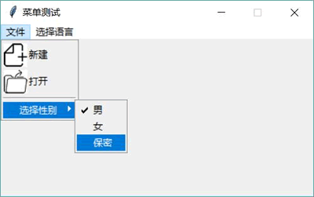
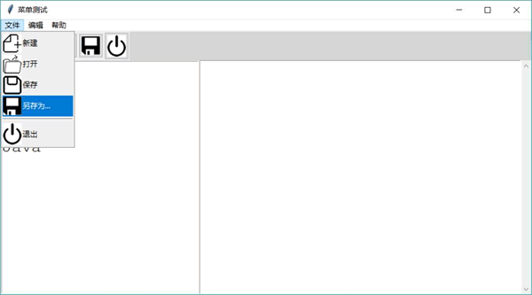
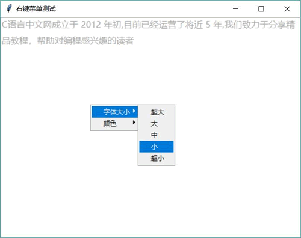

# Python Tkinter Menu 菜单（窗口菜单和右键菜单）使用详解

Tkinter 为菜单提供了 Menu 类，该类既可代表菜单条，也可代表菜单，还可代表上下文菜单（右键菜单）。简单来说，Menu 类就可以搞定所有菜单相关内容。

程序可调用 Menu 的构造方法来创建菜单，在创建菜单之后可通过如下方法添加菜单项：

*   add_command()：添加菜单项。
*   add_checkbutton()：添加复选框菜单项。
*   add_radiobutton()：添加单选钮菜单项。
*   add_separator()：添加菜单分隔条。

上面的前三个方法都用于添加菜单项，因此都支持如下常用选项：

*   label：指定菜单项的文本。
*   command：指定为菜单项绑定的事件处理方法。
*   image：指定菜单项的图标。
*   compound：指定在菜单项中图标位于文字的哪个方位。

有了菜单之后，接下来就是如何使用菜单了。菜单有两种用法：

1.  在窗口上方通过菜单条管理菜单。
2.  通过鼠标右键触发右键菜单（上下文菜单）。

## Menu 窗口菜单

在创建菜单之后，如果要将菜单设置为窗口的菜单条（Menu 对象可被当成菜单条使用），则只要将应菜单设为窗口的 menu 选项即可。例如如下代码：

```
from tkinter import *
# 导入 ttk
from tkinter import ttk
from tkinter import messagebox as msgbox

class App:
    def __init__(self, master):
        self.master = master
        self.init_menu()
    # 创建菜单
    def init_menu(self):
        # 创建 menubar，它被放入 self.master 中
        menubar = Menu(self.master)
        self.master.filenew_icon = PhotoImage(file='images/filenew.png')
        self.master.fileopen_icon = PhotoImage(file='images/fileopen.png')
        # 添加菜单条
        self.master['menu'] = menubar
        # 创建 file_menu 菜单，它被放入 menubar 中
        file_menu = Menu(menubar, tearoff=0)
        # 使用 add_cascade 方法添加 file_menu 菜单
        menubar.add_cascade(label='文件', menu=file_menu)
        # 创建 lang_menu 菜单，它被放入 menubar 中
        lang_menu = Menu(menubar, tearoff=0)
        # 使用 add_cascade 方法添加 lang_menu 菜单
        menubar.add_cascade(label='选择语言', menu=lang_menu)
        # 使用 add_command 方法为 file_menu 添加菜单项
        file_menu.add_command(label="新建", command = None,
            image=self.master.filenew_icon, compound=LEFT)
        file_menu.add_command(label="打开", command = None,
            image=self.master.fileopen_icon, compound=LEFT)
        # 使用 add_command 方法为 file_menu 添加分隔条
        file_menu.add_separator()
        # 为 file_menu 创建子菜单
        sub_menu = Menu(file_menu, tearoff=0)
        # 使用 add_cascade 方法添加 sub_menu 子菜单
        file_menu.add_cascade(label='选择性别', menu=sub_menu)
        self.genderVar = IntVar()
        # 使用循环为 sub_menu 子菜单添加菜单项
        for i, im in enumerate(['男', '女', '保密']):
            # 使用 add_radiobutton 方法为 sub_menu 子菜单添加单选菜单项
            # 绑定同一个变量，说明它们是一组
            sub_menu.add_radiobutton(label=im, command=self.choose_gender,
                variable=self.genderVar, value=i)
        self.langVars = [StringVar(), StringVar(), StringVar(), StringVar()]
        # 使用循环为 lang_menu 菜单添加菜单项
        for i, im in enumerate(('Python', 'Kotlin','Swift', 'Java')):
            # 使用 add_add_checkbutton 方法为 lang_menu 菜单添加多选菜单项
            lang_menu.add_checkbutton(label=im, command=self.choose_lang,
                onvalue=im, variable=self.langVars[i])
    def choose_gender(self):
        msgbox.showinfo(message=('选择的性别为: %s' % self.genderVar.get()))
    def choose_lang(self):
        rt_list = [e.get() for e in self.langVars]
        msgbox.showinfo(message=('选择的语言为: %s' % ','.join(rt_list)))
root = Tk()
root.title("菜单测试")
root.geometry('400x200') 
# 禁止改变窗口大小
root.resizable(width=False, height=False)
App(root)
root.mainloop()
```

上面程序中第 17 行代码将 Menu 设置为窗口的 menu 选项，这意味着该菜单变成了菜单条；第 21 行、25 行代码调用 add_cascade() 方法添加菜单，这意味着为菜单条添加了两个菜单。

接下来程序调用 add_command 方法为自 file_menu 添加多个菜单项，直到第 36 行代码调用 file_menu 的 add_cascade() 方法再次为 file_menu 添加子菜单。

第 42 行代码位于循环中，这样程序调用 add_radiobutton() 方法添加多个单选菜单项，这些单选菜单项都绑定了一个变量，因此它们就是一组的：第 48 行代码位于循环中，这样程序调用 add_checkbutton() 方法添加多个多边菜单项，每个多选菜单项都有单独的值，因此它们都需要绑定一个变量。

运行上面程序，可以看到如图 1 所示的效果。

图 1 生成菜单
由于程序为单选菜单项、多选菜单项都绑定了事件处理方法，因此单击这些菜单项，程序将会弹出消息框提示用户的选择。

下面将会实现一个功能更全面的菜单示例，而且该示例程序还会添加一个工具条（实际上 Tkinter 并未提供工具条组件，因此本教程将以 Frame 来实现工具条，以 Button 实现工具条上的按钮）。

```
from tkinter import *
# 导入 ttk
from tkinter import ttk
from collections import OrderedDict

class App:
    def __init__(self, master):
        self.master = master
        self.initWidgets()
    def initWidgets(self):
        # 初始化菜单、工具条用到的图标
        self.init_icons()
        # 调用 init_menu 初始化菜单
        self.init_menu()
        # 调用 init_toolbar 初始化工具条
        self.init_toolbar()
        #---------------------------------
        # 创建、添加左边的 Frame 容器
        leftframe = ttk.Frame(self.master, width=40)
        leftframe.pack(side=LEFT, fill=Y)
        # 在左边窗口放一个 Listbox
        lb = Listbox(leftframe, font=('Courier New', 20))
        lb.pack(fill=Y, expand=YES)
        for s in ('Python', 'Ruby', 'Swift', 'Kotlin', 'Java'):
            lb.insert(END, s)
        # 创建、添加右边的 Frame 容器
        mainframe = ttk.Frame(self.master)
        mainframe.pack(side=LEFT, fill=BOTH)
        text = Text(mainframe, width=40, font=('Courier New', 16))
        text.pack(side=LEFT, fill=BOTH)
        scroll = ttk.Scrollbar(mainframe)
        scroll.pack(side=LEFT,fill=Y)
        # 设置滚动条与 text 组件关联
        scroll['command'] = text.yview
        text.configure(yscrollcommand=scroll.set)
    # 创建菜单
    def init_menu(self):
        '初始化菜单的方法'
        # 定义菜单条所包含的 3 个菜单
        menus = ('文件', '编辑', '帮助')
        # 定义菜单数据
        items = (OrderedDict([
                # 每项对应一个菜单项，后面元组第一个元素是菜单图标，
                # 第二个元素是菜单对应的事件处理函数
                ('新建', (self.master.filenew_icon, None)),
                ('打开', (self.master.fileopen_icon, None)),
                ('保存', (self.master.save_icon, None)),
                ('另存为...', (self.master.saveas_icon, None)),
                ('-1', (None, None)),
                ('退出', (self.master.signout_icon, None)),
                ]),
            OrderedDict([('撤销',(None, None)),
                ('重做',(None, None)),
                ('-1',(None, None)),
                ('剪切',(None, None)),
                ('复制',(None, None)),
                ('粘贴',(None, None)),
                ('删除',(None, None)),
                ('选择',(None, None)),
                ('-2',(None, None)),
                # 二级菜单
                ('更多', OrderedDict([
                    ('显示数据',(None, None)),
                    ('显示统计',(None, None)),
                    ('显示图表',(None, None))
                    ]))
                ]),
            OrderedDict([('帮助主题',(None, None)),
                ('-1',(None, None)),
                ('关于', (None, None))]))
        # 使用 Menu 创建菜单条
        menubar = Menu(self.master)
        # 为窗口配置菜单条，也就是添加菜单条
        self.master['menu'] = menubar
        # 遍历 menus 元组
        for i, m_title in enumerate(menus):
            # 创建菜单
            m = Menu(menubar, tearoff=0)
            # 添加菜单
            menubar.add_cascade(label=m_title, menu=m)
            # 将当前正在处理的菜单数据赋值给 tm
            tm = items[i]
            # 遍历 OrderedDict,默认只遍历它的 key
            for label in tm:
                print(label)
                # 如果 value 又是 OrderedDict，说明是二级菜单
                if isinstance(tm[label], OrderedDict):
                    # 创建子菜单、并添加子菜单
                    sm = Menu(m, tearoff=0)
                    m.add_cascade(label=label, menu=sm)
                    sub_dict = tm[label]
                    # 再次遍历子菜单对应的 OrderedDict，默认只遍历它的 key
                    for sub_label in sub_dict:
                        if sub_label.startswith('-'):
                            # 添加分隔条
                            sm.add_separator()
                        else:
                            # 添加菜单项
                            sm.add_command(label=sub_label,image=sub_dict[sub_label][0],
                                command=sub_dict[sub_label][1], compound=LEFT)
                elif label.startswith('-'):
                    # 添加分隔条
                    m.add_separator()
                else:
                    # 添加菜单项
                    m.add_command(label=label,image=tm[label][0],
                        command=tm[label][1], compound=LEFT)
    # 生成所有需要的图标
    def init_icons(self):
        self.master.filenew_icon = PhotoImage(file='images/filenew.png')
        self.master.fileopen_icon = PhotoImage(file='images/fileopen.png')
        self.master.save_icon = PhotoImage(file='images/save.png')
        self.master.saveas_icon = PhotoImage(file='images/saveas.png')
        self.master.signout_icon = PhotoImage(file='images/signout.png')
    # 生成工具条
    def init_toolbar(self):
        # 创建并添加一个 Frame 作为工具条的容器
        toolframe = Frame(self.master, height=20, bg='lightgray')
        toolframe.pack(fill=X) # 该 Frame 容器放在窗口顶部
        # 再次创建并添加一个 Frame 作为工具按钮的容器
        frame = ttk.Frame(toolframe)
        frame.pack(side=LEFT) # 该 Frame 容器放在容器左边
        # 遍历 self.master 的全部数据，根据系统图标来创建工具栏按钮
        for i, e in enumerate(dir(self.master)):
            # 只处理属性名以 _icon 结尾的属性（这些属性都是图标）
            if e.endswith('_icon'):
                ttk.Button(frame, width=20, image=getattr(self.master, e),
                    command=None).grid(row=0, column=i, padx=1, pady=1, sticky=E)
root = Tk()
root.title("菜单测试")
# 禁止改变窗口大小
root.resizable(width=False, height=True)
App(root)
root.mainloop()
```

该程序比较实用，整个程序界面中的菜单并不是写死的，而是根据程序第 42~70 行代码自动生成的，这些代码中的每个 OrderdDict 代表一个菜单，它的每个 key-value 对代表一个菜单项，其中 key 是菜单文本，value 是一个元组，元组的第一个元素是菜单图标，第二个元素是为菜单绑定的事件处理函数。

因此，当开发者需要改变程序界面中的菜单时，并不需要修改后面的代码，只需修改第 42~70 行代码即可。

由于代码功能的限制，上面的第 42~70 行代码只能支持二级菜单，并不支持三级菜单。实际上 Tkinter 菜单完全支持三级，只是该程序没有做进一步处理。

上面程序也会自动生成工具条，只要为 self.master 添加了以 _icon 结尾的属性，程序就会自动把它们添加为工具条上的按钮。

运行上面程序，可以看到如图 2 所示的效果。

图 2 菜单和工具条

## Menu 右键菜单

实现右键菜单很简单，程序只要先创建菜单，然后为目标组件的右键单击事件绑定处理函数，当用户单击鼠标右键时，调用菜单的 post() 方法即可在指定位置弹出右键菜单。

如下程序示范了创建并添加右键菜单：

```
from tkinter import *
# 导入 ttk
from tkinter import ttk
from collections import OrderedDict
class App:
    def __init__(self, master):
        self.master = master
        self.initWidgets()
    def initWidgets(self):
        self.text = Text(self.master, height=12, width=60,
            foreground='darkgray',
            font=('微软雅黑', 12),
            spacing2=8, # 设置行间距
            spacing3=12) # 设置段间距
        self.text.pack()
        st = 'C 语言中文网成立于 2012 年初,' +\
            '目前已经运营了将近 5 年,' +\
            '我们致力于分享精品教程，帮助对编程感兴趣的读者\n'
        self.text.insert(END, st)
        # 为 text 组件的右键单击事件绑定处理方法
        self.text.bind('<Button-3>',self.popup)
        # 创建 Menu 对象，准备作为右键菜单
        self.popup_menu = Menu(self.master,tearoff = 0)
        self.my_items = (OrderedDict([('超大', 16), ('大',14), ('中',12),
            ('小',10), ('超小',8)]),
            OrderedDict([('红色','red'), ('绿色','green'), ('蓝色', 'blue')]))
        i = 0
        for k in ['字体大小','颜色']:
            m = Menu(self.popup_menu, tearoff = 0)
            # 添加子菜单
            self.popup_menu.add_cascade(label=k ,menu = m)
            # 遍历 OrderedDict 的 key（默认就是遍历 key）
            for im in self.my_items[i]:
                m.add_command(label=im, command=self.handlerAdaptor(self.choose, x=im))
            i += 1
    def popup(self, event):
        # 在指定位置显示菜单
        self.popup_menu.post(event.x_root,event.y_root)  #①
    def choose(self, x):
        # 如果用户选择修改字体大小的子菜单项
        if x in self.my_items[0].keys():
            # 改变字体大小
            self.text['font'] = ('微软雅黑', self.my_items[0][x])
        # 如果用户选择修改颜色的子菜单项
        if x in self.my_items[1].keys():
            # 改变颜色
            self.text['foreground'] = self.my_items[1][x]
    def handlerAdaptor(self, fun,**kwds):
        return lambda fun=fun, kwds=kwds: fun(**kwds)
root = Tk()
root.title("右键菜单测试")
App(root)
root.mainloop()
```

上面程序中，第 23-35 行代码用于创建一个 Menu，并为之添加菜单顷。这段代码与前面介绍的创建菜单、添加菜单项的代码并没有区别。

程序中 ① 号代码位于 Text 组件的右键单击事件的处理函数内，这行代码调用 Menu 对象的 post() 方法弹出右键菜单，这意味着当用户在 Text 组件内单击鼠标右键时，Text 组件就会弹出右键菜单。

运行该程序，在界面上的 Text 组件内单击鼠标右键，将可以看到如图 3 所示的右键菜单。

图 3 右键菜单