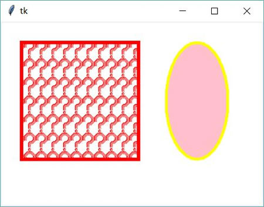
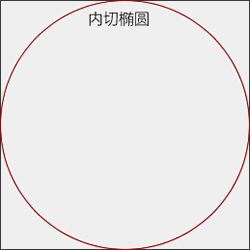
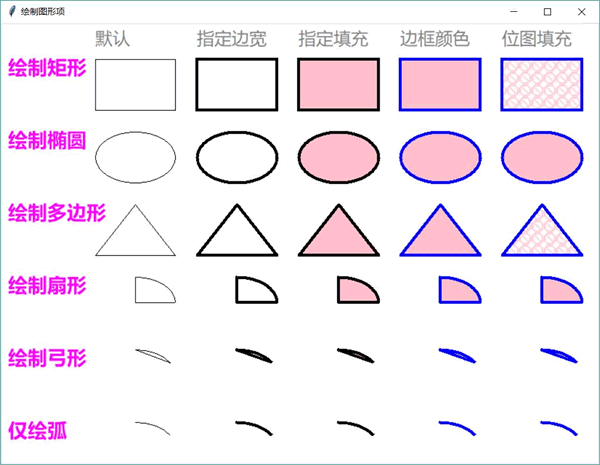
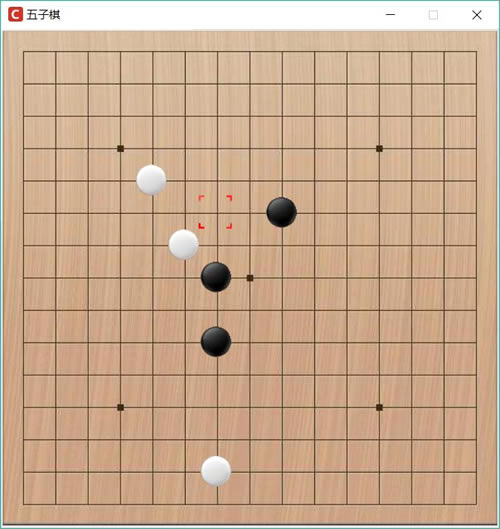

# Python tkinter Canvas 画布完全攻略（超级详细）

Tkinter 提供了 Canvas 组件来实现绘图。程序既可在 Canvas 中绘制直线、矩形、椭圆等各种几何图形，也可绘制图片、文字、UI 组件（如 Button）等。Canvas 允许重新改变这些图形项（Tkinter 将程序绘制的所有东西统称为 item）的属性，比如改变其坐标、外观等。

Canvas 组件的用法与其他 GUI 组件一样简单，程序只要创建并添加 Canvas 组件，然后调用该组件的方法来绘制图形即可。如下程序示范了最简单的 Canvas 绘图：

```
from tkinter import *

# 创建窗口
root = Tk()
# 创建并添加 Canvas
cv = Canvas(root, background='white')
cv.pack(fill=BOTH, expand=YES)
cv.create_rectangle(30, 30, 200, 200,
    outline='red', # 边框颜色
    stipple = 'question', # 填充的位图
    fill="red", # 填充颜色
    width=5 # 边框宽度
    )
cv.create_oval(240, 30, 330, 200,
    outline='yellow', # 边框颜色
    fill='pink', # 填充颜色
    width=4 # 边框宽度
    )
root.mainloop()
```

上面程序先创建并添加了 Canvas 组件，分别绘制了矩形和椭圆。运行上面程序，可以看到如图 1 所示的效果。

图 1 最简单的 Canvas 绘图
从上面程序可以看到，Canvas 提供了 create_rectangle() 方法绘制矩形和 create_oval() 方法绘制椭圆（包括圆，圆是椭圆的特例）。实际上，Canvas 还提供了如下方法来绘制各种图形：

*   create_arc：绘制弧。
*   create_bitmap：绘制位图。
*   create_image：绘制图片。
*   create_line()：绘制直线。
*   create_polygon：绘制多边形。
*   create_text：绘制文字。
*   create_window：绘制组件。

Canvas 的坐标系统是绘图的基础，其中点 (0,0) 位于 Canvas 组件的左上角，X 轴水平向右延伸，Y 轴垂直向下延伸。

绘制上面这些图形时需要简单的几何基础：

*   在使用 create_line() 绘制直线时，需要指定两个点的坐标，分别作为直线的起点和终点。
*   在使用 create_rectangle() 绘制矩形时，需要指定两个点的坐标，分别作为矩形左上角点和右下角点的坐标。
*   在使用 create_oval() 绘制椭圆时，需要指定两个点的坐标，分别作为左上角点和右下角点的坐标来确定一个矩形，而该方法则负责绘制该矩形的内切椭圆，如图 2 所示。


图 2 内切椭圆
从图 2 可以看出，只要矩形确定下来，该矩形的内切椭圆就能确定下来，而 create_oval() 方法所需要的两个坐标正是用于指定该矩形的左上角点和右下角点的坐标。

在使用 create_arc 绘制弧时，和 create_oval 的用法相似，因为弧是椭圆的一部分，因此同样也是指定左上角和右下角两个点的坐标，默认总是绘制从 3 点（0）开始，逆时针旋转 90° 的那一段弧。程序可通过 start 改变起始角度，也可通过 extent 改变转过的角度。

在使用 create_polygon 绘制多边形时，需要指定多个点的坐标来作为多边形的多个定点；在使用 create_bitmap、create_image、create_text、create_window 等方法时，只要指定一个坐标点，用于指定目标元素的绘制位置即可。

在绘制这些图形时可指定如下选项：

*   fill：指定填充颜色。如果不指定该选项，默认不填充。
*   outline：指定边框颜色。
*   width：指定边框宽度。如果不指定该选项，边框宽度默认为 1。
*   dash：指定边框使用虚线。该属性值既可为单独的整数，用于指定虚线中线段的长度；也可为形如（5,2,3）格式的元素，此时 5 指定虚线中线段的长度，2 指定间隔长度，3 指定虚线长度……依此类推。
*   stipple：使用位图平铺进行填充。该选项可与 fill 选项结合使用，fill 选项用于指定位图的颜色。
*   style：指定绘制弧的样式。该选项仅对 create_arc 方法起作用。该选项支持 PIESLICE（扇形）、CHORD（弓形）、ARC（仅绘制弧）选项值。
*   start：指定绘制弧的起始角度。该选项仅对 create_arc 方法起作用。
*   extent：指定绘制弧的角度。该选项仅对 create_arc 方法起作用。
*   arrow：指定绘制直线时两端是否有箭头。该选项支持 NONE（两端无箭头）、FIRST（开始端有箭头）、LAST（结束端有箭头）、BOTH（两端都有箭头）选项值。
*   arrowshape：指定箭头形状。该选项是一个形如 "20 20 10" 的字符串，字符串中的三个整数依次指定填充长度、箭头长度、箭头宽度。
*   joinstyle：指定直接连接点的风格。仅对绘制直线和多向形有效。该选项支持 METTER、ROUND、BEVEL 选项值。
*   anchor：指定绘制文字、GUI 组件的位置。该选项仅对 create_text()、create_window() 方法有效。
*   justify：指定文字的对齐方式。该选项支持 CENTER、LEFT、RIGHT 常量值，该选项仅对 create_text 方法有效。

下面程序示范了通过不同的方法来绘制不同的图形，这些图形分别使用不同的边框、不同的填充效果：

```
from tkinter import *

# 创建窗口
root = Tk()
root.title('绘制图形项')
# 创建并添加 Canvas
cv = Canvas(root, background='white', width=830, height=830)
cv.pack(fill=BOTH, expand=YES)
columnFont = ('微软雅黑', 18)
titleFont = ('微软雅黑', 20, 'bold')
# 使用循环绘制文字
for i, st in enumerate(['默认', '指定边宽', '指定填充', '边框颜色', '位图填充']):
    cv.create_text((130 + i * 140, 20),text = st,
    font = columnFont,
    fill='gray',
    anchor = W,
    justify = LEFT)
# 绘制文字
cv.create_text(10, 60, text = '绘制矩形',
    font = titleFont,
    fill='magenta',
    anchor = W,
    justify = LEFT)
# 定义列表，每个元素的 4 个值分别指定边框宽度、填充色、边框颜色、位图填充
options = [(None, None, None, None),
    (4, None, None, None),
    (4, 'pink', None, None),
    (4, 'pink', 'blue', None),
    (4, 'pink', 'blue', 'error')]
# 采用循环绘制 5 个矩形
for i, op in enumerate(options):
    cv.create_rectangle(130 + i * 140, 50, 240 + i * 140, 120,
        width = op[0], # 边框宽度
        fill = op[1], # 填充颜色
        outline = op[2], # 边框颜色
        stipple = op[3]) # 使用位图填充 
# 绘制文字
cv.create_text(10, 160, text = '绘制椭圆',
    font = titleFont,
    fill='magenta',
    anchor = W,
    justify = LEFT)
# 定义列表，每个元素的 4 个值分别指定边框宽度、填充色、边框颜色、位图填充
options = [(None, None, None, None),
    (4, None, None, None),
    (4, 'pink', None, None),
    (4, 'pink', 'blue', None),
    (4, 'pink', 'blue', 'error')]
# 采用循环绘制 5 个椭圆
for i, op in enumerate(options):
    cv.create_oval(130 + i * 140, 150, 240 + i * 140, 220,
        width = op[0], # 边框宽度
        fill = op[1], # 填充颜色
        outline = op[2], # 边框颜色
        stipple = op[3]) # 使用位图填充
# 绘制文字
cv.create_text(10, 260, text = '绘制多边形',
    font = titleFont,
    fill='magenta',
    anchor = W,
    justify = LEFT)
# 定义列表，每个元素的 4 个值分别指定边框宽度、填充色、边框颜色、位图填充
options = [(None, "", 'black', None),
    (4, "", 'black', None),
    (4, 'pink', 'black', None),
    (4, 'pink', 'blue', None),
    (4, 'pink', 'blue', 'error')]
# 采用循环绘制 5 个多边形
for i, op in enumerate(options):
    cv.create_polygon(130 + i * 140, 320, 185 + i * 140, 250, 240 + i * 140, 320,
        width = op[0], # 边框宽度
        fill = op[1], # 填充颜色
        outline = op[2], # 边框颜色
        stipple = op[3]) # 使用位图填充
# 绘制文字
cv.create_text(10, 360, text = '绘制扇形',
    font = titleFont,
    fill='magenta',
    anchor = W,
    justify = LEFT)
# 定义列表，每个元素的 4 个值分别指定边框宽度、填充色、边框颜色、位图填充
options = [(None, None, None, None),
    (4, None, None, None),
    (4, 'pink', None, None),
    (4, 'pink', 'blue', None),
    (4, 'pink', 'blue', 'error')]
# 采用循环绘制 5 个扇形
for i, op in enumerate(options):
    cv.create_arc(130 + i * 140, 350, 240 + i * 140, 420,
        width = op[0], # 边框宽度
        fill = op[1], # 填充颜色
        outline = op[2], # 边框颜色
        stipple = op[3]) # 使用位图填充
# 绘制文字
cv.create_text(10, 460, text = '绘制弓形',
    font = titleFont,
    fill='magenta',
    anchor = W,
    justify = LEFT)
# 定义列表，每个元素的 4 个值分别指定边框宽度、填充色、边框颜色、位图填充
options = [(None, None, None, None),
    (4, None, None, None),
    (4, 'pink', None, None),
    (4, 'pink', 'blue', None),
    (4, 'pink', 'blue', 'error')]
# 采用循环绘制 5 个弓形
for i, op in enumerate(options):
    cv.create_arc(130 + i * 140, 450, 240 + i * 140, 520,
        width = op[0], # 边框宽度
        fill = op[1], # 填充颜色
        outline = op[2], # 边框颜色
        stipple = op[3], # 使用位图填充
        start = 30, # 指定起始角度
        extent = 60, # 指定逆时针转过角度
        style = CHORD) # CHORD 指定绘制弓
# 绘制文字
cv.create_text(10, 560, text = '仅绘弧',
    font = titleFont,
    fill='magenta',
    anchor = W,
    justify = LEFT)
# 定义列表，每个元素的 4 个值分别指定边框宽度、填充色、边框颜色、位图填充
options = [(None, None, None, None),
    (4, None, None, None),
    (4, 'pink', None, None),
    (4, 'pink', 'blue', None),
    (4, 'pink', 'blue', 'error')]
# 采用循环绘制 5 个弧
for i, op in enumerate(options):
    cv.create_arc(130 + i * 140, 550, 240 + i * 140, 620,
        width = op[0], # 边框宽度
        fill = op[1], # 填充颜色
        outline = op[2], # 边框颜色
        stipple = op[3], # 使用位图填充
        start = 30, # 指定起始角度
        extent = 60, # 指定逆时针转过角度
        style = ARC) # ARC 指定仅绘制弧
# 绘制文字
cv.create_text(10, 660, text = '绘制直线',
    font = titleFont,
    fill='magenta',
    anchor = W,
    justify = LEFT)
# 定义列表，每个元素的 5 个值分别指定边框宽度、线条颜色、位图填充、箭头风格, 箭头形状
options = [(None, None, None, None, None),
    (6, None, None, BOTH, (20, 40, 10)),
    (6, 'pink', None, FIRST, (40, 40, 10)),
    (6, 'pink', None, LAST, (60, 50, 10)),
    (8, 'pink', 'error', None, None)]
# 采用循环绘制 5 个弧
for i, op in enumerate(options):
    cv.create_line(130 + i * 140, 650, 240 + i * 140, 720,
        width = op[0], # 边框宽度
        fill = op[1], # 填充颜色
        stipple = op[2], # 使用位图填充
        arrow = op[3], # 箭头风格
        arrowshape = op[4]) # 箭头形状
# 绘制文字
cv.create_text(10, 760, text = '绘制位图\n 图片、组件',
    font = titleFont,
    fill='magenta',
    anchor = W,
    justify = LEFT)
# 定义包括 create_bitmap, create_image, create_window 三个方法的数组
funcs = [Canvas.create_bitmap, Canvas.create_image, Canvas.create_window]
# 为上面 3 个方法定义选项
items = [{'bitmap' : 'questhead'}, {'image':PhotoImage(file='images/fklogo.gif')},
    {'window':Button(cv,text = '单击我', padx=10, pady=5,
        command = lambda :print('按钮单击')),'anchor': W}]
for i, func in enumerate(funcs):
    func(cv, 230 + i * 140, 780, **items[i])
root.mainloop()
```

上面程序示范了 Canvas 中不同的 create_xxx 方法的功能和用法，它们可用于创建矩形、椭圆、多边形、扇形、弓形、弧、直线、位图、图片和组件等。在绘制不同的图形时可指定不同的选项，从而实现丰富的绘制效果。

运行上面程序，可以看到如图 3 所示的效果。

图 3 使用 Canvas 绘制图形
掌握了上面的绘制方法之后，实际上已经可以实现一些简单的游戏了。比如前面介绍的控制台五子棋，之前程序是在控制台打印游戏状态的，实际上程序完全可以在界面上绘制游戏状态，这样就能看到图形界面的五子棋了。

此外，该五子棋还需要根据用户的鼠标动作来确定下棋坐标，因此程序会为游戏界面的 <Button-1>（左键单击）、<Motion>（鼠标移动）、<Leave>（鼠标移出）事件绑定事件处理函数。下面程序示范了实现图形界面的五子棋：

```
from tkinter import *
import random

BOARD_WIDTH = 535
BOARD_HEIGHT = 536
BOARD_SIZE = 15
# 定义棋盘坐标的像素值和棋盘数组之间的偏移距。
X_OFFSET = 21
Y_OFFSET = 23
# 定义棋盘坐标的像素值和棋盘数组之间的比率。
X_RATE = (BOARD_WIDTH - X_OFFSET * 2) / (BOARD_SIZE - 1)
Y_RATE = (BOARD_HEIGHT - Y_OFFSET * 2) / (BOARD_SIZE - 1)
BLACK_CHESS = "●"
WHITE_CHESS = "○"
board = []
# 把每个元素赋为"╋"，代表无棋
for i in range(BOARD_SIZE) :
    row = ["╋"] * BOARD_SIZE
    board.append(row)
# 创建窗口
root = Tk()
# 禁止改变窗口大小
root.resizable(width=False, height=False)
# 修改图标
root.iconbitmap('images/fklogo.ico')
# 设置窗口标题
root.title('五子棋')
# 创建并添加 Canvas
cv = Canvas(root, background='white',
    width=BOARD_WIDTH, height=BOARD_HEIGHT)
cv.pack()
bm = PhotoImage(file="images/board.png")
cv.create_image(BOARD_HEIGHT/2 + 1, BOARD_HEIGHT/2 + 1, image=bm)
selectedbm = PhotoImage(file="images/selected.gif")
# 创建选中框图片，但该图片默认不在棋盘中
selected = cv.create_image(-100, -100, image=selectedbm)
def move_handler(event):
    # 计算用户当前的选中点，并保证该选中点在 0～14 之间
    selectedX = max(0, min(round((event.x - X_OFFSET) / X_RATE), 14))
    selectedY = max(0, min(round((event.y - Y_OFFSET) / Y_RATE), 14))
    # 移动红色选择框
    cv.coords(selected,(selectedX * X_RATE + X_OFFSET,
        selectedY * Y_RATE + Y_OFFSET))
black = PhotoImage(file="images/black.gif")
white = PhotoImage(file="images/white.gif")
def click_handler(event):
    # 计算用户的下棋点，并保证该下棋点在 0～14 之间
    userX = max(0, min(round((event.x - X_OFFSET) / X_RATE), 14))
    userY = max(0, min(round((event.y - Y_OFFSET) / Y_RATE), 14))
    # 当下棋点没有棋子时，才能下棋子，用户才能下棋子
    if board[userY][userX] == "╋":
        cv.create_image(userX * X_RATE + X_OFFSET, userY * Y_RATE + Y_OFFSET,
            image=black)
        board[userY][userX] = "●"
        while(True):
            comX = random.randint(0, BOARD_SIZE - 1)
            comY = random.randint(0, BOARD_SIZE - 1)
            # 如果电脑要下棋的点没有棋子时，才能让电脑下棋
            if board[comY][comX] == "╋": break
        cv.create_image(comX * X_RATE + X_OFFSET, comY * Y_RATE + Y_OFFSET,
            image=white)
        board[comY][comX] = "○"
def leave_handler(event):
    # 将红色选中框移出界面
    cv.coords(selected, -100, -100)
# 为鼠标移动事件绑定事件处理函数
cv.bind('<Motion>', move_handler)
# 为鼠标点击事件绑定事件处理函数
cv.bind('<Button-1>', click_handler)
# 为鼠标移出事件绑定事件处理函数
cv.bind('<Leave>', leave_handler)
root.mainloop()
```

上面程序先绘制了五子棋的棋盘，该棋盘就是一张预先准备好的图片，然后绘制选择框，当用户鼠标在棋盘上移动时，该选择框显示用户鼠标当前停留在哪个下棋点上。

随后程序调用了 Canvas 的 coords() 方法，该方法负责重设选择框的坐标。这是 Tkinter 绘图的特别之处，绘制好的每一个图形项都不是固定的，程序后面完全可以修改它们。因此，程序将会控制选择框图片随着用户鼠标的移动而改变位置。

程序根据用户鼠标单击来绘制黑色棋子（也就是下黑棋）和白色棋子（也就是下白棋）。在绘制黑色棋子和白色棋子的同时，也改变了底层代表棋盘状态的 board 列表的数据，这样即可记录下棋状态，从而让程序在后面可以根据 board[] 列表来判断胜负（本来这个功能在 Charlie 的程序中是有的，此处为了突出绘图的主题，作者删除了这部分）。另外，也可以加入人工智能，根据 board[] 列表来决定电脑的下棋点。

运行该程序，可以看到如图 4 所示的效果：

图 4 五子棋

在上面这个程序中，电脑下棋采用的方式是随机下棋，因此下得比较“凌乱”。如果要让电脑下棋更加智能，则可通过简单的人工智能来实现，本教程暂不涉及。

## Canvas 操作图形项的标签

在 Canvas 中通过 create_xxx 方法绘制图形项之后，这些图形项井不是完全静态的图形，每个图形项都是一个独立的对象，程序完全可以动态地修改、删除这些图形项。

Canvas 以“堆叠”的形式来管理这些图形项，先绘制的图形项位于“堆叠”的下面，后绘制的图形项位于“堆叠”的上面。因此，如果两个图形项有重叠的部分，那么后绘制的图形项（位于上面）会遮挡先绘制的图形项。

为了修改、删除这些图形项，程序需要先获得这些图形项的引用。获得这些图形项的引用有两种方式：

1.  通过图形项的 id，也就是 Canvas 执行 create_xxx() 方法的返回值。一般来说，create_xxx() 会依次返回 1、2、3 等整数作为图形项的 id。
2.  通过图形项的 tag（标签）。

在 Canvas 中调用 create_xxx() 方法绘图时，还可传入一个 tags 选项，该选项可以为所绘制的图形项（比如矩形、椭圆、多边形等）添加一个或多个 tag（标签）。此外，Canvas 还允许调用方法为图形项添加 tag、删除 tag 等，这些 tag 也相当于该图形项的标识，程序完全可以根据 tag 来获取图形项。

总结来说，Canvas 提供了如下方法来为图形项添加 tag：

*   addtag_aboove(self, newtag, tagOrId)：为 tagOrId 对应图形项的上一个图形项添加新 tag。
*   addtag_all(self, newtag)：为所有图形项添加新 tag。
*   addtag_below(self, newtag, tagOrId)：为 tagOrId 对应图形项的下一个图形项添加新 tag。
*   addtag_closest(self, newtag, x, y)：为和 x、y 点最接近的图形项添加新 tag。
*   addtag_enclosed(self, newtag, x1, y1, x2, y2)：为指定矩形区域内最上面的图形项添加新 tag。其中 x1、y1 确定矩形区域的左上角坐标；x2、y2 确定矩形区域的右下角坐标。
*   addtag_overlapping(self, newtag, x1, y1, x2, y2)：为与指定矩形区域重叠的最上面的图形项添加 tag。
*   addtag_withtag(self, newtag, tagOrId)：为 tagOrId 对应图形项添加新 tag。

Canvas 提供了如下方法来删除图形项的 tag：

*   dtag(self, *args)：删除指定图形项的 tag。

Canvas 提供了如下方法来获取图形项的所有 tag：

*   gettags(self, *args)：获取指定图形项的所有 tag。

Canvas 提供了如下方法根据 tag 来获取其对应的所有图形项：

*   find_withtag(self, tagOrId)：获取 tagOrId 对应的所有图形项。

为了更好地理解上面方法的作用，下面用一个程序来进行演示：

```
from tkinter import *

# 创建窗口
root = Tk()
root.title('操作标签')
# 创建并添加 Canvas
cv = Canvas(root, background='white', width=620, height=250)
cv.pack(fill=BOTH, expand=YES)
# 绘制一个矩形框
rt = cv.create_rectangle(40, 40, 300, 220,
    outline='blue', width=2,
    tag = ('t1', 't2', 't3', 'tag4'))  # 为该图形项指定标签
# 访问图形项的 id，也就是编号
print(rt) # 1
# 绘制一个椭圆
oval = cv.create_oval(350, 50, 580, 200,
    fill='yellow', width=0,
    tag = ('g1', 'g2', 'g3', 'tag4'))  # 为该图形项指定标签
# 访问图形项的 id，也就是编号
print(oval) # 2
# 根据指定 tag 该 tag 对应的所有图形项
print(cv.find_withtag('tag4')) # (1, 2)
# 获取指定图形项的所有 tag
print(cv.gettags(rt))  # ('t1', 't2', 't3', 'tag4')
print(cv.gettags(2))  # ('g1', 'g2', 'g3', 'tag4')
cv.dtag(1, 't1') # 删除 id 为 1 的图形项上名为 t1 的 tag
cv.dtag(oval, 'g1') # 删除 id 为 oval 的图形项上名为 g1 的 tag
# 获取指定图形项的所有 tag
print(cv.gettags(rt))  # ('tag4', 't2', 't3')
print(cv.gettags(2))  # ('tag4', 'g2', 'g3')
# 为所有图形项添加 tag
cv.addtag_all('t5')
print(cv.gettags(1))  # ('tag4', 't2', 't3', 't5')
print(cv.gettags(oval))  # ('tag4', 'g2', 'g3', 't5')
# 为指定图形项添加 tag
cv.addtag_withtag('t6', 'g2')
# 获取指定图形项的所有 tag
print(cv.gettags(1))  # ('tag4', 't2', 't3', 't5')
print(cv.gettags(oval))  # ('tag4', 'g2', 'g3', 't5', 't6')
# 为指定图形项上面的图形项添加 tag, t2 上面的就是 oval 图形项
cv.addtag_above('t7', 't2')
print(cv.gettags(1))  # ('tag4', 't2', 't3', 't5')
print(cv.gettags(oval))  # ('tag4', 'g2', 'g3', 't5', 't6', 't7')
# 为指定图形项下面的图形项添加 tag, g2 下面的就是 rt 图形项
cv.addtag_below('t8', 'g2')
print(cv.gettags(1))  # ('tag4', 't2', 't3', 't5', 't8')
print(cv.gettags(oval))  # ('tag4', 'g2', 'g3', 't5', 't6', 't7')
# 为最接近指定点的图形项添加 tag，最接近 360、90 的图形项是 oval
cv.addtag_closest('t9', 360, 90)
print(cv.gettags(1))  # ('tag4', 't2', 't3', 't5', 't8')
print(cv.gettags(oval))  # ('tag4', 'g2', 'g3', 't5', 't6', 't7', 't9')
# 为位于指定区域内（几乎覆盖整个图形区）的最上面的图形项添加 tag
cv.addtag_closest('t10', 30, 30, 600, 240)
print(cv.gettags(1))  # ('tag4', 't2', 't3', 't5', 't8')
print(cv.gettags(oval))  # ('tag4', 'g2', 'g3', 't5', 't6', 't7', 't9', 't10')
# 为与指定区域内重合的最上面的图形项添加 tag
cv.addtag_closest('t11', 250, 30, 400, 240)
print(cv.gettags(1))  # ('tag4', 't2', 't3', 't5', 't8')
print(cv.gettags(oval))  # ('tag4', 'g2', 'g3', 't5', 't6', 't7', 't9', 't10', 't11')
root.mainloop()
```

上面程序示范了操作图形项的 tag 的方法，而且列出了每次操作之后的输出结果。因此，读者可以结合程序的运行结果来理解 Canvas 是如何管理图形项的 tag 的。

## 操作图形项

在 Canvas 中获取图形项之后，接下来可通过 Canvas 提供的大量方法来操作图形项。总结起来，Canvas 提供了如下方法在图形项“堆叠”中查找图形项：

*   find_above(self, tagOrId)：返回 tagOrId 对应图形项的上一个图形项。
*   find_all(self)：返回全部图形项。
*   find_below(self, tagOrId)：返回 tagOrId 对应图形项的下一个图形项。
*   find_closest(self, x, y)：返回和 x 、y 点最接近的图形项。
*   find_enclosed(self, x1, y1, x2, y2)：返回位于指定矩形区域内最上面的图形项。
*   find_overlapping(self, x1, y1, x2, y2)：返回与指定矩形区域重叠的最上面的图形项。
*   find_withtag(self, tagOrId)：返回 tagOrId 对应的全部图形项。

Canvas 提供了如下方法在图形项“堆叠”中移动图形项：

*   tag_lower(self, *args)|lower：将 args 的第一个参数对应的图形项移到“堆叠”的最下面。也可额外指定一个参数，代表移动到指定图形项的下面。
*   tag_raise(self, *args)|lift：将 args 的第一个参数对应的图形项移到“堆叠”的最上面。也可额外指定一个参数，代表移动到指定图形项的上面。

如果程序希望获取或修改图形项的选项，则可通过 Canvas 的如下方法来操作：

*   itemcget(self, tagOrId, option)：获取 tagOrId 对应图形项的 option 选项值。
*   itemconfig(self, tagOrId, cnf=None, **kw)：为 tagOrId 对应图形项配置选项。
*   itemconfigure：该方法与上一个方法完全相同。

Canvas 提供了如下方法来改变图形项的大小和位置：

*   coords(self, *args)：重设图形项的大小和位置。
*   move(self, *args)：移动图形项，但不能改变大小。简单来说，就是在图形项的 x、y 基础上加上新的 mx、my 参数。
*   scale(self, *args)：缩放图形项。该方法的 args 参数要传入 4 个值，其中前两个值指定缩放中心；后两个值指定 x、y 方向的缩放比。

此外，Canvas 还提供了如下方法来删除图形项或文字图形项（由 create_text 方法创建）中间的部分文字：

*   delete(self, *args)：删除指定 id 或 tag 对应的全部图形项。
*   dchars(self, *args)：删除文字图形项中间的部分文字。

下面程序示范了操作图形项的方法：

```
from tkinter import *
from tkinter import colorchooser
import threading

# 创建窗口
root = Tk()
root.title('操作图形项')
# 创建并添加 Canvas
cv = Canvas(root, background='white', width=400, height=350)
cv.pack(fill=BOTH, expand=YES)
# 该变量用于保存当前选中的图形项
current = None
# 该变量用于保存当前选中的图形项的边框颜色
current_outline = None
# 该变量用于保存当前选中的图形项的边框宽度
current_width = None
# 该函数用于高亮显示选中图形项（边框颜色会 red、yellow 之间切换）
def show_current():
    # 如果当前选中项不为 None
    if current is not None:
        # 如果当前选中图形项的边框色为 red，将它改为 yellow
        if cv.itemcget(current, 'outline') == 'red':
            cv.itemconfig(current, width=2,
                outline='yellow')
        # 否则，将颜色改为 red
        else:
             cv.itemconfig(current, width=2,
                outline='red')
    global t
    # 通过定时器指定 0.2 秒之后执行 show_current 函数
    t = threading.Timer(0.2, show_current)
    t.start()
# 通过定时器指定 0.2 秒之后执行 show_current 函数
t = threading.Timer(0.2, show_current)
t.start()
# 分别创建矩形、椭圆、和圆
rect = cv.create_rectangle(30, 30, 250, 200,
    fill='magenta', width='0')
oval = cv.create_oval(180, 50, 380, 180,
    fill='yellow', width='0')
circle = cv.create_oval(120, 150, 300, 330,
    fill='pink', width='0')
bottomF = Frame(root)
bottomF.pack(fill=X,expand=True)
liftbn = Button(bottomF, text='向上',
    # 将椭圆移动到它上面的 item 之上
    command=lambda : cv.tag_raise(oval, cv.find_above(oval)))
liftbn.pack(side=LEFT, ipadx=10, ipady=5, padx=3)
lowerbn = Button(bottomF, text='向下',
    # 将椭圆移动到它下面的 item 之下
    command=lambda : cv.tag_lower(oval, cv.find_below(oval)))
lowerbn.pack(side=LEFT, ipadx=10, ipady=5, padx=3)
def change_fill():
    # 弹出颜色选择框,让用户选择颜色
    fill_color = colorchooser.askcolor(parent=root,
        title='选择填充颜色',
        # 初始颜色设置为椭圆当前的填充色（fill 选项值）
        color =  cv.itemcget(oval, 'fill'))
    if fill_color is not None:
        cv.itemconfig(oval, fill=fill_color[1])
fillbn = Button(bottomF, text='改变填充色',
    # 该按钮触发 change_fill 函数
    command=change_fill)
fillbn.pack(side=LEFT, ipadx=10, ipady=5, padx=3)
def change_outline():
    # 弹出颜色选择框,让用户选择颜色
    outline_color = colorchooser.askcolor(parent=root,
        title='选择边框颜色',
        # 初始颜色设置为椭圆当前的边框色（outline 选项值）
        color = cv.itemcget(oval, 'outline'))
    if outline_color is not None:
        cv.itemconfig(oval, outline=outline_color[1],
            width=4)
outlinebn = Button(bottomF, text='改变边框色',
    # 该按钮触发 change_outline 函数
    command=change_outline)
outlinebn.pack(side=LEFT, ipadx=10, ipady=5, padx=3)
movebn = Button(bottomF, text='右下移动',
    # 调用 move 方法移动图形项
    command=lambda : cv.move(oval, 15, 10))
movebn.pack(side=LEFT, ipadx=10, ipady=5, padx=3)
coordsbn = Button(bottomF, text='位置复位',
    # 调用 coords 方法重设图形项的大小和位置
    command=lambda : cv.coords(oval, 180, 50, 380, 180))
coordsbn.pack(side=LEFT, ipadx=10, ipady=5, padx=3)
# 再次添加 Frame 容器
bottomF = Frame(root)
bottomF.pack(fill=X,expand=True)
zoomoutbn = Button(bottomF, text='缩小',
    # 调用 scale 方法对图形项进行缩放
    # 前面两个坐标指定缩放中心，后面两个参数指定横向、纵向的缩放比
    command=lambda : cv.scale(oval, 180, 50, 0.8, 0.8))
zoomoutbn.pack(side=LEFT, ipadx=10, ipady=5, padx=3)
zoominbn = Button(bottomF, text='放大',
    # 调用 scale 方法对图形项进行缩放
    # 前面两个坐标指定缩放中心，后面两个参数指定横向、纵向的缩放比
    command=lambda : cv.scale(oval, 180, 50, 1.2, 1.2))
zoominbn.pack(side=LEFT, ipadx=10, ipady=5, padx=3)
def select_handler(ct):
    global current, current_outline, current_width
    # 如果 ct 元组包含了选中项
    if ct is not None and len(ct) > 0:
        ct = ct[0]
        # 如果 current 对应的图形项不为空
        if current is not None:
            # 恢复 current 对应的图形项的边框
            cv.itemconfig(current, outline=current_outline,
                width = current_width)
        # 获取当前选中图形项的边框信息
        current_outline = cv.itemcget(ct, 'outline')
        current_width = cv.itemcget(ct, 'width')
        # 使用 current 保存当前选中项
        current = ct   
def click_handler(event):
    # 获取当前选中的图形项
    ct = cv.find_closest(event.x, event.y)
    # 调用 select _handler 处理选中图形项
    select_handler(ct)
def click_select():
    # 取消为“框选”绑定的两个事件处理函数
    cv.unbind('<B1-Motion>')
    cv.unbind('<ButtonRelease-1>')
    # 为“点选”绑定鼠标点击的事件处理函数
    cv.bind('<Button-1>', click_handler)
clickbn = Button(bottomF, text='点选图形项',
    # 该按钮触发 click_select 函数
    command=click_select)
clickbn.pack(side=LEFT, ipadx=10, ipady=5, padx=3)
# 记录鼠标拖动的第一个点的 x、y 坐标
firstx = firsty = None
# 记录前一次绘制的、代表选择区的虚线框
prev_select = None
def drag_handler(event):
    global firstx, firsty, prev_select
    # 刚开始拖动时，用鼠标位置为 firstx、firsty 赋值
    if firstx is None and firsty is None:
        firstx, firsty = event.x, event.y
    leftx, lefty = min(firstx, event.x), min(firsty, event.y)
    rightx, righty = max(firstx, event.x), max(firsty, event.y)
    # 删除上一次绘制的虚线选择框
    if prev_select is not None:
        cv.delete(prev_select)
    # 重新绘制虚线选择框
    prev_select = cv.create_rectangle(leftx, lefty, rightx, righty,
        dash=2)
def release_handler(event):
    global firstx, firsty
    if prev_select is not None:
        cv.delete(prev_select)
    if firstx is not None and firsty is not None:
        leftx, lefty = min(firstx, event.x), min(firsty, event.y)
        rightx, righty = max(firstx, event.x), max(firsty, event.y)
        firstx = firsty = None
        # 获取当前选中的图形项
        ct = cv.find_enclosed(leftx, lefty, rightx, righty)
        # 调用 select _handler 处理选中图形项
        select_handler(ct)
def rect_select():
    # 取消为“点选”绑定的事件处理函数
    cv.unbind('<Button-1>')
    # 为“框选”绑定鼠标拖动、鼠标释放的事件处理函数
    cv.bind('<B1-Motion>', drag_handler)
    cv.bind('<ButtonRelease-1>', release_handler)
rectbn = Button(bottomF, text='框选图形项',
    # 该按钮触发 rect_select 函数
    command=rect_select)
rectbn.pack(side=LEFT, ipadx=10, ipady=5, padx=3)
deletebn = Button(bottomF, text='删除',
    # 删除图形项
    command=lambda : cv.delete(oval))
deletebn.pack(side=LEFT, ipadx=10, ipady=5, padx=3)
root.mainloop()
```

读者可自定运行此程序，查看运行效果。