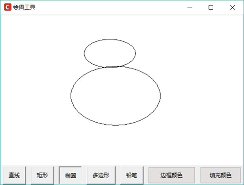

# tkinter Canvas tag_bind：指定图形项绑定事件处理函数或方法

Canvas 提供了一个 tag_bind() 方法，该方法用于为指定图形项绑定事件处理函数或方法，这样图形项就可以响应用户动作了。

下面程序示范了为矩形的单击事件绑定事件处理函数：

```
from tkinter import *

root = Tk()
# 创建一个 Canvas，设置其背景色为白色
cv = Canvas(root,bg = 'white')
cv.pack()
# 创建一个 rectangle
cv.create_rectangle(30, 30, 220, 150,
    width = 8,
    tags = ('r1','r2','r3'))
def first(event):
    print('第一次的函数')
def second(event):
    print('第二次的函数')
# 为指定图形项的左键单击事件绑定处理函数
cv.tag_bind('r1','<Button-1>', first)
# 为指定图形项的左键单击事件绑定处理函数
cv.tag_bind('r1','<Button-1>', second, add=True) # add 为 True 是添加，否则是替代
root.mainloop()
```

上面程序中第 16 行代码为 r1 对应的图形项的左键单击事件绑定事件处理函数，第 18 行代码依然为 r1 对应的图形项的左键单击事件绑定事件处理函数，其中的 add 选项为 True，表示为该图形项再次添加一个事件处理函数（即为该图形项的单击事件绑定两个事件处理函数），如果将 add 选项设为 False，则表示第二次添加的事件处理函数会取代第一次添加的事件处理函数。

下面将开发一个功能相对完善的绘图程序，该程序可以让用户绘制直线、矩形、椭圆、多边形，用户还可以通过鼠标左键单击来选中所绘制的图形，也可以通过鼠标右键拖动来移动图形项。程序代码如下：

```
from tkinter import *
# 导入 ttk
from tkinter import ttk
from tkinter import colorchooser
import threading

class App:
    def __init__(self, master):
        self.master = master
        # 保存设置初始的边框宽度
        self.width = IntVar()
        self.width.set(1)
        # 保存设置初始的边框颜色
        self.outline = 'black'
        # 保存设置初始的填充颜色
        self.fill = None
        # 记录拖动时前一个点的 x、y 坐标
        self.prevx = self.prevy = -10
        # 记录拖动开始的第一个点的 x、y 坐标
        self.firstx = self.firsty = -10
        # 记录拖动右键来移动图形时前一个点的 x、y 坐标
        self.mv_prevx = self.mv_prevy = -10
        # item_type 记录要绘制哪种图形
        self.item_type = 0
        self.points = []
        self.init_widgets()
        self.temp_item = None
        self.temp_items = []
        # 初始化选中的图形项
        self.choose_item = None
    # 创建界面组件
    def init_widgets(self):
        self.cv = Canvas(root, background='white')
        self.cv.pack(fill=BOTH, expand=True)
        # 为鼠标左键拖动事件、鼠标左键释放事件绑定处理函数
        self.cv.bind('<B1-Motion>', self.drag_handler)
        self.cv.bind('<ButtonRelease-1>', self.release_handler)
        # 为鼠标左键双击事件绑定处理函数
        self.cv.bind('<Double-1>', self.double_handler)
        f = ttk.Frame(self.master)
        f.pack(fill=X)
        self.bns = []
        # 采用循环创建多个按钮，用于绘制不同的图形
        for i, lb in enumerate(('直线', '矩形', '椭圆', '多边形', '铅笔')):
            bn = Button(f, text=lb, command=lambda i=i: self.choose_type(i))
            bn.pack(side=LEFT, ipadx=8,ipady=5, padx=5)
            self.bns.append(bn)
        # 默认选中直线
        self.bns[self.item_type]['relief'] = SUNKEN
        ttk.Button(f, text='边框颜色',
            command=self.choose_outline).pack(side=LEFT, ipadx=8,ipady=5, padx=5)
        ttk.Button(f, text='填充颜色',
            command=self.choose_fill).pack(side=LEFT, ipadx=8,ipady=5, padx=5)        
        om = ttk.OptionMenu(f,
            self.width, # 绑定变量
            '1', # 设置初始选中值
            '0', # 以下多个值用于设置菜单项
            '1',
            '2',
            '3',
            '4',
            '5',
            '6',
            '7',
            '8',
            command = None)
        om.pack(side=LEFT, ipadx=8,ipady=5, padx=5)
    def choose_type(self, i):
        # 将所有按钮恢复默认状态
        for b in self.bns: b['relief'] = RAISED
        # 将当前按钮设置选中样式
        self.bns[i]['relief'] = SUNKEN
        # 设置要绘制的图形
        self.item_type = i
    # 处理选择边框颜色的方法
    def choose_outline(self):
        # 弹出颜色选择对话框
        select_color = colorchooser.askcolor(parent=self.master,
            title="请选择边框颜色", color=self.outline)
        if select_color is not None:
            self.outline = select_color[1]
    # 处理选择填充颜色的方法
    def choose_fill(self):
        # 弹出颜色选择对话框
        select_color = colorchooser.askcolor(parent=self.master,
            title="请选择填充颜色", color=self.fill)
        if select_color is not None:
            self.fill = select_color[1]
        else:
            self.fill = None
    def drag_handler(self, event):
        # 如果是绘制直线
        if self.item_type == 0:
            # 如果第一个点不存在（self.firstx 和 self.firsty 都小于 0）
            if self.firstx < -1 and self.firsty < -1:
                self.firstx, self.firsty = event.x, event.y
            # 删除上一次绘制的虚线图形
            if self.temp_item is not None:
                self.cv.delete(self.temp_item)
            # 重新绘制虚线
            self.temp_item = self.cv.create_line(self.firstx, self.firsty,
                event.x, event.y, dash=2)
        # 如果是绘制矩形或椭圆
        if self.item_type == 1 or self.item_type == 2:
            # 如果第一个点不存在（self.firstx 和 self.firsty 都小于 0）
            if self.firstx < -1 and self.firsty < -1:
                self.firstx, self.firsty = event.x, event.y
            # 删除上一次绘制的虚线图形
            if self.temp_item is not None:
                self.cv.delete(self.temp_item)
            leftx, lefty = min(self.firstx, event.x), min(self.firsty, event.y)
            rightx, righty = max(self.firstx, event.x), max(self.firsty, event.y)
            # 重新绘制虚线选择框
            self.temp_item = self.cv.create_rectangle(leftx, lefty, rightx, righty,
                dash=2)
        if self.item_type == 3:
            self.draw_polygon = True
            # 如果第一个点不存在（self.firstx 和 self.firsty 都小于 0）
            if self.firstx < -1 and self.firsty < -1:
                self.firstx, self.firsty = event.x, event.y
            # 删除上一次绘制的虚线图形
            if self.temp_item is not None:
                self.cv.delete(self.temp_item)
            # 重新绘制虚线
            self.temp_item = self.cv.create_line(self.firstx, self.firsty,
                event.x, event.y, dash=2)           
        if self.item_type == 4:
            # 如果前一个点存在（self.prevx 和 self.prevy 都大于 0）
            if self.prevx > 0 and self.prevy > 0:
                self.cv.create_line(self.prevx, self.prevy, event.x, event.y,
                    fill=self.outline, width=self.width.get())
            self.prevx, self.prevy = event.x, event.y
    def item_bind(self, t):
        # 为鼠标右键拖动事件绑定处理函数
        self.cv.tag_bind(t, '<B3-Motion>', self.move)
        # 为鼠标右键释放事件绑定处理函数
        self.cv.tag_bind(t, '<ButtonRelease-3>', self.move_end)
    def release_handler(self, event):
        # 删除临时绘制的虚线图形项
        if self.temp_item is not None:
            # 如果不是绘制多边形
            if self.item_type != 3:
                self.cv.delete(self.temp_item)
            # 如果绘制多边形，将之前绘制的虚线先保存下来，以便后面删除它们
            else:
                self.temp_items.append(self.temp_item)
        self.temp_item = None
       # 如果是绘制直线
        if self.item_type == 0:
            # 如果第一个点存在（self.firstx 和 self.firsty 都大于 0）
            if self.firstx > 0 and self.firsty > 0:
                # 绘制实际的直线
                t = self.cv.create_line(self.firstx, self.firsty,
                    event.x, event.y, fill=self.outline, width=self.width.get())
                # 为鼠标左键单击事件绑定处理函数，用于选择被单击的图形项
                self.cv.tag_bind(t, '<Button-1>',
                    lambda event=event, t=t: self.choose_item_handler(event,t))
                self.item_bind(t)
        # 如果是绘制矩形或椭圆
        if self.item_type == 1 or self.item_type == 2:
            # 如果第一个点存在（self.firstx 和 self.firsty 都大于 0）
            if self.firstx > 0 and self.firsty > 0:
                leftx, lefty = min(self.firstx, event.x), min(self.firsty, event.y)
                rightx, righty = max(self.firstx, event.x), max(self.firsty, event.y)
                if self.item_type == 1:
                    # 绘制实际的矩形
                    t = self.cv.create_rectangle(leftx, lefty, rightx, righty,
                        outline=self.outline, fill=self.fill, width=self.width.get())
                if self.item_type == 2:
                    # 绘制实际的椭圆
                    t = self.cv.create_oval(leftx, lefty, rightx, righty,
                        outline=self.outline, fill=self.fill, width=self.width.get())
                # 为鼠标左键单击事件绑定处理函数，用于选择被单击的图形项
                self.cv.tag_bind(t, '<Button-1>',
                    lambda event=event, t=t: self.choose_item_handler(event,t))
                self.item_bind(t)
        if self.item_type != 3:
            self.prevx = self.prevy = -10
            self.firstx = self.firsty = -10
        # 如果正在绘制多边形
        elif(self.draw_polygon):
            # 将第一个点添加到列表中
            self.points.append((self.firstx, self.firsty))
            self.firstx, self.firsty = event.x, event.y
    def double_handler(self, event):
        # 只处理绘制多边形的情形
        if self.item_type == 3:
            t = self.cv.create_polygon(*self.points,
                outline=self.outline, fill="" if self.fill is None else self.fill,
                width=self.width.get())
            # 为鼠标左键单击事件绑定处理函数，用于选择被单击的图形项
            self.cv.tag_bind(t, '<Button-1>',
                lambda event=event, t=t: self.choose_item_handler(event,t))
            self.item_bind(t)
            # 清空所有保存的点数据
            self.points.clear()
            # 将 self.firstx = self.firsty 设置为-10，停止绘制
            self.firstx = self.firsty = -10
            # 删除所有临时的虚线框
            for it in self.temp_items: self.cv.delete(it)
            self.temp_items.clear()
            self.draw_polygon = False
    # 根据传入的参数 t 来选中对应的图形项
    def choose_item_handler(self, event, t):
        # 使用 self.choose_item 保存当前选中项
        self.choose_item = t
    # 定义移动图形项的方法
    def move(self, event):
        # 如果被选中图形项不为空，才可以执行移动
        if self.choose_item is not None:
            # 如果前一个点存在（self.mv_prevx 和 self.mv_prevy 都大于 0）
            if self.mv_prevx > 0 and self.mv_prevy > 0:
                # 移动选中的图形项
                self.cv.move(self.choose_item, event.x - self.mv_prevx,
                    event.y - self.mv_prevy)
            self.mv_prevx, self.mv_prevy = event.x, event.y
    # 结束移动的方法
    def move_end(self, event):
        self.mv_prevx = self.mv_prevy = -10
    def delete_item(self, event):
        # 如果被选中的 item 不为空，删除被选中的图形项
        if self.choose_item is not None:
            self.cv.delete(self.choose_item)
root = Tk()
root.title("绘图工具")
root.iconbitmap('images/fklogo.ico')
root.geometry('800x680') 
app = App(root)
root.bind('<Delete>', app.delete_item)
root.mainloop()
```

上面程序稍微有点复杂，这是由于该程序并不是简单地绘制图形，而是当用户拖动鼠标时可以动态地绘制虚线图形，只有当用户松开鼠标时才真正完成绘制，因此该程序完全是一个很实用的绘图工具。

程序中第 135 行代码为鼠标右键拖动事件绑定事件处理函数，该事件处理函数会根据用户的鼠标拖动来移动图形项：第 137 行代码为鼠标右键松开事件绑定事件处理函数，该事件处理函数会结束鼠标拖动行为。

接下来程序完成一件事情，即为程序绘制的图形项的鼠标左键单击事件绑定事件处理函数，当用户在图形项上单击鼠标时，程序会选中该图形项由于程序为所有图形项的鼠标左键单击事件都绑定了事件处理函数，因此不管用户单击哪个图形项，程序都会选择该图形项，接下来就可以操作和删除该图形项了。

程序中还为 Delete 按键事件绑定了事件处理函数，当用户按 Delete 键时，程序会删除当前所选择的图形项。运行上面程序，用户完全可以按照自己的意愿进行创作，绘制各种图形。随意创作后的效果如图 1 所示。

图 1 绘图工具