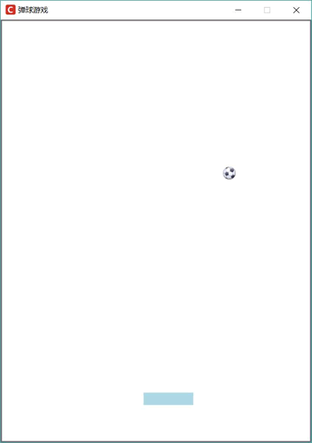

# Python tkinter Canvas 绘制动画

其实前面程序中的高亮显示已经是动画效果了。程序会用红色、黄色交替显示几何图形的边框，这样看上去就是动画效果了。实现其他动画效果也是这个原理，程序只要增加一个定时器，周期性地改变界面上图形项的颜色、大小、位置等选项，用户看上去就是所谓的“动画”了。

下面以一个简单的桌面弹球游戏来介绍使用 Canvas 绘制动画。在游戏界面上会有一个小球，该小球会在界面上滚动，遇到边界或用户挡板就会反弹。该程序涉及两个动画：

*   小球转动：小球转动是一个“逐帧动画”，程序会循环显示多张转动的小球图片，这样用户就会看到小球转动的效果。
*   小球移动：只要改变小球的坐标程序就可以控制小球移动。

为了让用户控制挡板移动，程序还为 Canvas 的向左箭头、向右箭头绑定了事件处理函数。下面是桌面弹球游戏的程序：

```
from tkinter import *
from tkinter import messagebox
import threading
import random
GAME_WIDTH = 500
GAME_HEIGHT = 680
BOARD_X = 230
BOARD_Y = 600
BOARD_WIDTH = 80
BALL_RADIUS = 9
class App:
    def __init__(self, master):
        self.master = master
        # 记录小球动画的第几帧
        self.ball_index = 0
        # 记录游戏是否失败的旗标
        self.is_lose = False
        # 初始化记录小球位置的变量
        self.curx = 260
        self.cury = 30
        self.boardx = BOARD_X
        self.init_widgets()
        self.vx = random.randint(3, 6) # x 方向的速度
        self.vy = random.randint(5, 10) # y 方向的速度
        # 通过定时器指定 0.1 秒之后执行 moveball 函数
        self.t = threading.Timer(0.1, self.moveball)
        self.t.start()
    # 创建界面组件
    def init_widgets(self):
        self.cv = Canvas(root, background='white',
            width=GAME_WIDTH, height=GAME_HEIGHT)
        self.cv.pack()
        # 让画布得到焦点，从而可以响应按键事件
        self.cv.focus_set()
        self.cv.bms = []
        # 初始化小球的动画帧
        for i in range(8):
            self.cv.bms.append(PhotoImage(file='images/ball_' + str(i+1) + '.gif'))
        # 绘制小球
        self.ball = self.cv.create_image(self.curx, self.cury,
            image=self.cv.bms[self.ball_index])
        self.board = self.cv.create_rectangle(BOARD_X, BOARD_Y,
            BOARD_X + BOARD_WIDTH, BOARD_Y + 20, width=0, fill='lightblue')
        # 为向左箭头按键绑定事件，挡板左移
        self.cv.bind('<Left>', self.move_left)
        # 为向右箭头按键绑定事件，挡板右移
        self.cv.bind('<Right>', self.move_right)
    def move_left(self, event):
        if self.boardx <= 0:
            return
        self.boardx -= 5
        self.cv.coords(self.board, self.boardx, BOARD_Y,
            self.boardx + BOARD_WIDTH, BOARD_Y + 20)
    def move_right(self, event):
        if self.boardx + BOARD_WIDTH >= GAME_WIDTH:
            return
        self.boardx += 5
        self.cv.coords(self.board, self.boardx, BOARD_Y,
            self.boardx + BOARD_WIDTH, BOARD_Y + 20)
    def moveball(self):
        self.curx += self.vx
        self.cury += self.vy
        # 小球到了右边墙壁，转向
        if self.curx + BALL_RADIUS >= GAME_WIDTH:
            self.vx = -self.vx
        # 小球到了左边墙壁，转向
        if self.curx - BALL_RADIUS <= 0:
            self.vx = -self.vx
        # 小球到了上边墙壁，转向
        if self.cury - BALL_RADIUS <= 0:
            self.vy = -self.vy
        # 小球到了挡板处
        if self.cury + BALL_RADIUS >= BOARD_Y:
            # 如果在挡板范围内
            if self.boardx <= self.curx <= (self.boardx + BOARD_WIDTH):
                self.vy = -self.vy
            else:
                messagebox.showinfo(title='失败', message='您已经输了')
                self.is_lose = True
        self.cv.coords(self.ball, self.curx, self.cury)
        self.ball_index += 1
        self.cv.itemconfig(self.ball, image=self.cv.bms[self.ball_index % 8])
        # 如果游戏还未失败，让定时器继续执行
        if not self.is_lose:
            # 通过定时器指定 0.1 秒之后执行 moveball 函数
            self.t = threading.Timer(0.1, self.moveball)
            self.t.start()
root = Tk()
root.title("弹球游戏")
root.iconbitmap('images/fklogo.ico')
root.geometry('%dx%d' % (GAME_WIDTH, GAME_HEIGHT)) 
# 禁止改变窗口大小
root.resizable(width=False, height=False)
App(root)
root.mainloop()
```

上面程序中第 26、27 行代码通过线程启动了一个定时器，该定时器控制 moveball() 方法每隔 0.1 秒执行一次，而 moveball() 方法中通过改变小球的坐标可以实现小球移动的效果；通过改变小球的图片，可以实现小球滚动的效果。

运行上面程序，可以看到如图 1 所示的游戏效果：

图 1 桌面弹球游戏

如果读者对使用 Python 开发游戏有很浓厚的兴趣，则不要局限于使用简单的 Tkinter 和 Canvas 画布。记住 Python 的优势是拥有大量的工具和库。如果想使用 Python 开发游戏，则尽量考虑使用专业的游戏工具库，比如 Pygame。