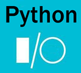

# 第十二章 Python 文件操作（I/O）

Python 文件 I/O（输入/输出）是比较乏味的事情，因为看不到明显的运行效果，但 I/O 是所有程序都必需的部分，使用输入机制，允许程序读取外部数据（包括来自磁盘、光盘等存储设备的数据），用户输入数据；使用输出机制，允许程序记录运行状态，将程序数据输出到磁盘、光盘等存储设备中；

Python 提供有非常丰富的文件 I/O 支持，它既提供了 pathlib 和 os.path 来操作各种路径，也提供了全局的 open() 函数来打开文件（在打开文件之后，程序既可读取文件的内容，也可向文件输出内容）。而且 Python 提供了多种方式来读取文件内容，因此非常简单、灵活。

此外，在 Python 的 os 模块下也包含了大量进行文件 I/O 的函数，使用这些函数来读取、写入文件也很方便，因此读者可以根据需要选择不同的方式来读写文件。

Pyhon 还提供了 tempfile 模块来创建临时文件和临时目录，tempfile 模块下的高级 API 会自动管理临时文件的创建和删除；当程序不再使用临时文件和临时目录时，程序会自动删除临时文件和临时目录。