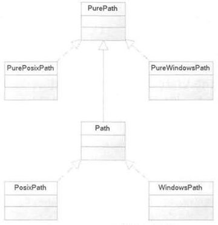

# Python pathlib 模块用法详解

pathlib 模块提供了一组面向对象的类，这些类可代表各种操作系统上的路径，程序可通过这些类操作路径。pathlib 模块下的类如图 1 所示。

图 1 pathlib 模块下的类
PurePath 代表并不访问实际文件系统的“纯路径”。简单来说，PurePath 只是负责对路径字符串执行操作，至于该字符串是否对应实际的路径，它并不关心。

PurePath 有两个子类，即 PurePosixPath 和 PureWindowsPath，分别代表 UNIX 风格的路径（包括 Mac OS X）和 Windows 风格的路径。

UNIX 风格的路径和 Windows 风格路径的主要区别在于根路径和路径分隔符，UNIX 风格路径的根路径是斜杠（/），而 Windows 风格路径的根路径是盘符（c:）；UNIX 风格的路径的分隔符是斜杠（/），而 Windows 风格路径的分隔符是反斜杠（\）。

Path 代表访问实际文件系统的“真正路径”。Path 对象可用于判断对应的文件是否存在、是否为文件、是否为目录等。Path 同样有两个子类，即 PosixPath 和 WindowsPath。

## PurePath 的基本功能

程序可使用 PurePath 或它的两个子类来创建 PurePath 对象，如果在 UNIX 或 Mac OS X 系统上使用 PurePath 创建对象，程序实际返回 PurePosixPath 对象；如果在 Windows 系统上使用 PurePath 创建对象，程序实际返回 PureWindowsPath 对象。

如果程序明确希望创建 PurePosixPath 或 PureWindowsPath 对象，则应该直接使用 PurePath 的子类。

程序在创建 PurePath 和 Path 时，既可传入单个路径字符串，也可传入多个路径字符串，PurePath 会将它们拼接成一个字符串。例如如下程序：

```
from pathlib import *

# 创建 PurePath，实际上使用 PureWindowsPath
pp = PurePath('setup.py')
print(type(pp))  # <class 'pathlib.PureWindowsPath'>
pp = PurePath('crazyit', 'some/path', 'info')
# 看到输出 Windows 风格的路径
print(pp) # 'crazyit\some\path\info'
pp = PurePath(Path('crazyit'), Path('info'))
# 看到输出 Windows 风格的路径
print(pp) # 'crazyit\info'
# 明确指定创建 PurePosixPath
pp = PurePosixPath('crazyit', 'some/path', 'info')
# 看到输出 Unix 风格的路径
print(pp) # crazyit/some/path/info
```

如果在创建 PurePath 时不传入任何参数，系统默认创建代表当前路径的 PurePath，相当于传入点号（代表当前路径）作为参数。例如如下代码：

```
# 如果不传入参数，默认使用当前路径
pp = PurePath()
print(pp) # .
```

如果在创建 PurePath 时传入的参数包含多个根路径，则只有最后一个根路径及后面的子路径生效。例如如下代码：

```
# 如果传入参数包含多个根路径，则只有最后一个根路径及后面子路径生效
pp = PurePosixPath('/etc', '/usr', 'lib64')
print(pp) # /usr/lib64
pp = PureWindowsPath('c:/Windows', 'd:info')
print(pp) # d:info
```

需要说明的是，在 Windows 风格的路径中，只有盘符才能算根路径，仅有斜杠是不算的。例如如下代码：

```
# 在 Windows 风格路径中，只有盘符才算根路径
pp = PureWindowsPath('c:/Windows', '/Program Files')
print(pp) # c:\Program Files
```

如果在创建 PurePath 时传入的路径字相串中包含多余的斜杠和点号，系统会直接忽略它们。但不会忽略两点，因为两点在路径中有实际意义（两点代表上一级路径）。例如如下代码：

```
# 路径字符串中多出来的斜杠和点号（代表当前路径）都会被忽略
pp = PurePath('crazyit//info')
print(pp) # crazyit\info
pp = PurePath('crazyit/./info')
print(pp) # crazyit\info
pp = PurePath('crazyit/../info')
print(pp) # crazyit\..\info，相当于找和 crazyit 同一级的 info 路径
```

PurePath 对象支持各种比较运算符，它们既可比较是否相等，也可比较大小（实际上就是比较它们的路径字符串）。

PurePath 只是代表特定平台的路径字符串，读者可以把它们看做包装后的字符串（它们本质上就是字符串）。

下面程序示范了 PurePath 对象的比较运算：

```
from pathlib import *

# 比较两个 Unix 风格的路径，区分大小写
print(PurePosixPath('info') == PurePosixPath('INFO')) # False
# 比较两个 Windows 风格的路径，不区分大小写
print(PureWindowsPath('info') == PureWindowsPath('INFO')) # True
# Windows 风格的路径不区分大小写
print(PureWindowsPath('INFO') in { PureWindowsPath('info') })#True
# Unix 风格的路径区分大小写,所以'D:'小于'c:'
print(PurePosixPath('D:') < PurePosixPath('c:')) # True
# Windows 风格的路径不区分大小写,所以'd:'（D:）大于'c:'
print(PureWindowsPath('D:') > PureWindowsPath('c:')) #True
```

对于不同风格的 PurePath，它们依然可以比较是否相等（结果总是返回 False），但不能比较大小，否则会引发错误。例如如下代码：

```
# 不同风格的路径可以判断是否相等（总不相等）
print(PureWindowsPath('crazyit') == PurePosixPath('crazyit')) # False
# 不同风格的路径不能判断大小，否则会引发异常
#print(PureWindowsPath('info') < PurePosixPath('info')) # TypeError
```

PurePath 对象支持斜杠（/）作为运算符，该运算符的作用是将多个路径连接起来。不管是 UNIX 风格的路径，还是 Windows 风格的路径，都是使用斜杠作为连接运算符的：

```
pp = PureWindowsPath('abc')
# 将多个路径拼起来（Windows 风格的路径）
print(pp / 'xyz' / 'wawa') # abc\xyz\wawa
pp = PurePosixPath('abc')
# 将多个路径拼起来（Unix 风格的路径）
print(pp / 'xyz' / 'wawa') # abc/xyz/wawa
pp2 = PurePosixPath('haha', 'hehe')
# 将 pp、pp2 两个路径连接起来
print(pp / pp2) # abc/haha/hehe
```

正如从上面程序中代码所看到的，程序将使用斜杠来连接多个 Windows 路径，连接完成后可以看到 Windows 路径的分隔符依然是反斜杠。

PurePath 的本质其实就是字符串，因此程序可使用 str() 将它们恢复成字符串对象。在恢复成字符串对象时会转换为对应平台风格的字符串。例如如下代码：

```
pp = PureWindowsPath('abc', 'xyz', 'wawa')
print(str(pp)) # abc\xyz\wawa
pp = PurePosixPath('abc', 'xyz', 'wawa')
print(str(pp)) # abc/xyz/wawa
```

上面程序在创建 PurePath 时传入的参数完全相同，但在创建 PureWindowsPath 对象后路径字符串使用反斜杠作为分隔符；在创建 PurePosixPath 对象后路径字符串使用斜杠作为分隔符。

## PurePath 的属性和方法

PurePath 提供了不少属性和方法，这些属性和方法主要还是用于操作路径字符串。由于 PurePath 并不真正执行底层的文件操作，也不理会路径字符串在底层是否有对应的路径，因此这些操作有点类似于字符串方法：

*   PurePath.parts：该属性返回路径字符串中所包含的各部分。
*   PurePath.drive：该属性返回路径字符串中的驱动器盘符。
*   PurePath.root：该属性返回路径字符串中的根路径。
*   PurePath.anchor：该属性返回路径字符串中的盘符和根路径。
*   PurePath.parents：该属性返回当前路径的全部父路径。
*   PurPath.parent：该属性返回当前路径的上一级路径，相当于 parents[0] 的返回值。
*   PurePath.name：该属性返回当前路径中的文件名。
*   PurePath.suffixes：该属性返回当前路径中的文件所有后缀名。
*   PurePath.suffix：该属性返回当前路径中的文件后缀名。相当于 suffixes 属性返回的列表的最后一个元素。
*   PurePath.stem：该属性返回当前路径中的主文件名。
*   PurePath.as_posix()：将当前路径转换成 UNIX 风格的路径。
*   PurePath.as_uri()：将当前路径转换成 URI。只有绝对路径才能转换，否则将会引发 ValueError。
*   PurePath.is_absolute()：判断当前路径是否为绝对路径。
*   PurePath.joinpath(*other)：将多个路径连接在一起，作用类似于前面介绍的斜杠运算符。
*   PurePath.match(pattern)：判断当前路径是否匹配指定通配符。
*   PurePath.relative_to(*other)：获取当前路径中去除基准路径之后的结果。
*   PurePath.with_name(name)：将当前路径中的文件名替换成新文件名。如果当前路径中没有文件名，则会引发 ValueError。
*   PurePath.with_suffix(suffix)：将当前路径中的文件后缀名替换成新的后缀名。如果当前路径中没有后缀名，则会添加新的后缀名。

下面程序大致测试了上面属性和方法的用法：

```
from pathlib import *

# 访问 drive 属性
print(PureWindowsPath('c:/Program Files/').drive) # c:
print(PureWindowsPath('/Program Files/').drive) # ''
print(PurePosixPath('/etc').drive) # ''

# 访问 root 属性
print(PureWindowsPath('c:/Program Files/').root) # \
print(PureWindowsPath('c:Program Files/').root) # ''
print(PurePosixPath('/etc').root) # /

# 访问 anchor 属性
print(PureWindowsPath('c:/Program Files/').anchor) # c:\
print(PureWindowsPath('c:Program Files/').anchor) # c:
print(PurePosixPath('/etc').anchor) # /

# 访问 parents 属性
pp = PurePath('abc/xyz/wawa/haha')
print(pp.parents[0]) # abc\xyz\wawa
print(pp.parents[1]) # abc\xyz
print(pp.parents[2]) # abc
print(pp.parents[3]) # .
# 访问 parent 属性
print(pp.parent) # abc\xyz\wawa

# 访问 name 属性
print(pp.name) # haha
pp = PurePath('abc/wawa/bb.txt')
print(pp.name) # bb.txt

pp = PurePath('abc/wawa/bb.txt.tar.zip')
# 访问 suffixes 属性
print(pp.suffixes[0]) # .txt
print(pp.suffixes[1]) # .tar
print(pp.suffixes[2]) # .zip
# 访问 suffix 属性
print(pp.suffix) # .zip
print(pp.stem) # bb.txt.tar

pp = PurePath('abc', 'xyz', 'wawa', 'haha')
print(pp) # abc\xyz\wawa\haha
# 转成 Unix 风格的路径
print(pp.as_posix()) # abc/xyz/wawa/haha
# 将相对路径转换成 Uri 引发异常
#print(pp.as_uri()) # ValueError
# 创建绝对路径
pp = PurePath('d:/', 'Python', 'Python3.6')
# 将绝对路径转换成 Uri
print(pp.as_uri()) # file:///d:/Python/Python3.6

# 判断当前路径是否匹配指定模式
print(PurePath('a/b.py').match('*.py')) # True
print(PurePath('/a/b/c.py').match('b/*.py')) # True
print(PurePath('/a/b/c.py').match('a/*.py')) # False

pp = PurePosixPath('c:/abc/xyz/wawa')
# 测试 relative_to 方法
print(pp.relative_to('c:/'))  # abc\xyz\wawa
print(pp.relative_to('c:/abc'))  # xyz\wawa
print(pp.relative_to('c:/abc/xyz'))  # wawa

# 测试 with_name 方法
p = PureWindowsPath('e:/Downloads/pathlib.tar.gz')
print(p.with_name('fkit.py')) # e:\Downloads\fkit.py
p = PureWindowsPath('c:/')
#print(p.with_name('fkit.py')) # ValueError

# 测试 with_suffix 方法
p = PureWindowsPath('e:/Downloads/pathlib.tar.gz')
print(p.with_suffix('.zip'))  # e:\Downloads\pathlib.tar.zip
p = PureWindowsPath('README')
print(p.with_suffix('.txt'))  # README.txt
```

上面程序在测试每个方法后都给出了对应的输出结果，读者可结合程序的输出结果来理解 PurePath 各属性和方法的功能。

## Path 的功能和用法

Path 是 PurePath 的子类，它除支持 PurePath 的各种操作、属性和方法之外，还会真正访问底层的文件系统，包括判断 Path 对应的路径是否存在，获取 Path 对应路径的各种属性（如是否只读、是文件还是文件夹等），甚至可以对文件进行读写。

PurePath 和 Path 最根本的区别在于，PurePath 的本事依然是字符串，而 Path 则会真正访问底层的文件路径，因此它提供了属性和方法来访问底层的文件系统。

关于 Path 的大量属性和方法本章不再详细列出，读者可参考 [`docs.python.org/3/library/pathlib.html`](https://docs.python.org/3/library/pathlib.html) 进行查阅。

Path 同样提供了两个子类，PosixPath 和 WindowsPath，其中前者代表 UNIX 风格的路径，后者代表 Windows 风格的路径。

Path 对象包含了大量 is_xxx() 方法，用于判断该 Path 对应的路径是否为 xxx。Path 包含一个 exists() 方法，用于判断该 Path 对应的目录是否存在。

Path 还包含一个很常用的 iterdir() 方法，该方法可返回 Path 对应目录下的所有子目录和文件。此外，Path 还包含一个 glob() 方法，用于获取 Path 对应目录及其子目录下匹配指定模式的所有文件。借助于 glob() 方法，可以非常方便地查找指定文件。

下面程序示范了 Path 的简单用法：

```
from pathlib import *

# 获取当前目录
p = Path('.')
# 遍历当前目录下所有文件和子目录
for x in p.iterdir():
    print(x)

# 获取上一级目录
p = Path('../')
# 获取上级目录及其所有子目录下的的 py 文件
for x in p.glob('**/*.py'):
    print(x)

# 获取 g:/publish/codes 对应的目录
p = Path('g:/publish/codes')
# 获取上级目录及其所有子目录下的的 py 文件
for x in p.glob('**/Path_test1.py'):
    print(x)
```

上面程序中第 6 行代码调用了 Path 的 iterdir() 方法，该方法将会返回当前目录下的所有文件和子目录；第 12 行代码调用了 glob() 方法，获取上一级目录及其所有子目录下的 *.py 文件；第 16 行代码用于获取 `g:/publish/codes` 目录及其所有子目录下的 Path_test1.py 文件。

运行上面程序，可以看到如下输出结果：

Path_test1.py
PurePath_test1.py
PurePath_test2.py
PurePath_test3.py
..\12.1\Path_test1.py
..\12.1\PurePath_test1.py
..\12.1\PurePath_test2.py
..\12.1\PurePath_test3.py
g:\publish\codes\12\12.1\path_test1.py

从上面的输出结果来看，不管是遍历当前目录下的文件和子目录，还是搜索指定目录及其子目录，Path 对象都能用一个方法搞定，对于不少语言来说，Path 的 glob() 方法所实现的功能，其他语言往往要通过递归才能实现，这可能就是 Python 的魅力所在。

此外，Path 还提供了 `read_bytes()` 和 `read_text(encoding=None, errors=None)` 方法，分别用于读取该 Path 对应文件的字节数据（二进制数据）和文本数据；也提供了 `write_bytes(data)` 和 `Path.write_text(data, encoding=None, errors=None)` 方法来输出字节数据（二进制数据）和文本数据。

下面程序示范了使用 Path 来读写文件：

```
from pathlib import *

p = Path('a_test.txt')
# 以 GBK 字符集输出文本内容
result = p.write_text('''有一个美丽的新世界
它在远方等我
那里有天真的孩子
还有姑娘的酒窝''',  encoding='GBK')
# 返回输出的字符数
print(result)

# 指定以 GBK 字符集读取文本内容
content = p.read_text(encoding='GBK')
# 输出读取的文本内容
print(content)

# 读取字节内容
bb = p.read_bytes()
print(bb)
```

上面程序中第 4 行代码使用 GBK 字符集调用 write_text() 方法输出字符串内容，该方法将会返回实际输出的字符个数；第 12 行代码使用 GBK 字符集读取文件的字符串内容，该方法将会返回整个文件的内容，也就是刚刚输出的内容。