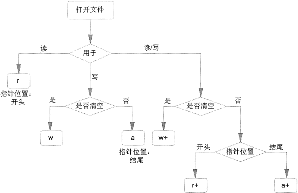

# Python open 函数详解：打开指定文件

掌握了各种操作目录字符串或目录的函数之后，接下来可以准备读写文件了。在进行文件读写之前，首先要打开文件。

Python 提供了一个内置的 open() 函数，该函数用于打开指定文件。

open() 函数的语法格式如下：

open(file_name [, access_mode] [, buffering])

在上面的语法格式中，只有第一个参数是必需的，该参数代表要打开文件的路径。access_mode 和 bufering 参数都是可选的。

在打开文件之后，就可调用文件对象的属性和方法了。文件对象支持如下常见的属性：

*   file.closed：该属性返回文件是否己经关闭。
*   file.mode：该属性返回被打开文件的访问模式。
*   file.name：该属性返回文件的名称。

如下程序简单示范了如何打开文件和访问被打开文件的属性：

```
# 以默认方式打开文件
f = open('open_test.py')
# 访问文件的编码方式
print(f.encoding) # cp936
# 访问文件的访问模式
print(f.mode) # r
# 访问文件是否已经关闭
print(f.closed) # False
# 访问文件对象打开的文件名
print(f.name) # open_test.py
```

上面程序使用 open() 内置函数打开了 open_test.py 文件，接下来程序访问了被打开文件的各属性。运行上面程序，可以看到如下输出结果：

cp936
r
False
open_test.py

从上面的输出结果可以看出，open() 函数默认打开文件的模式是“r”，也就是只读模式。下面详细讲解 open() 函数支持的不同模式。

## 文件打开模式

open() 函数支持的文件打开模式如表 1 所示。

表 1 open 函数支持的文件打开模式

| 模式 | 意义 |
| r | 只读模式 |
| w | 写模式 |
| a | 追加模式 |
| + | 读写模式，可与其他模式结合使用。比如 r+ 代表读写模式，w+ 也代表读写模式 |
| b | 二进制模式，可与其他模式结合使用。比如 rb 代表二进制只读模式，rb+ 代表二进制读写模式，ab 代表二进制追加模式 |

可能有读者感到疑惑，w 本身就代表写模式，w+ 还有什么意义呢？

简单来说，w 只是代表写模式，而 w+ 则代表读写模式，但实际上它们的差别并不大。因为不管是 w 还是 w+ 模式，当使用这两种模式打开指定文件时，open() 函数都会立即清空文件内容，实际上都无法读取文件内容。

根据上面的介绍不难看出，如果希望调用 open() 函数打开指定文件后，该文件中的内容能被保留下来，那么程序就不能使用 w 或 w+ 模式。

图 2 说明了不同文件打开模式的功能。

图 2 不同文件打开模式的功能
需要指出的是，如果程序使用 r 或 r+ 模式打开文件，则要求被打开的文件本身是存在的。也就是说，使用 r 或 r+ 模式都不能创建文件。但如果使用 w、w+、a、a+ 模式打开文件，则该文件可以是不存在的，open() 函数会自动创建新文件。

b 模式可被迫加到其他模式上，用于代表以二进制的方式来读写文件内容。对于计算机中的文件来说，文本文件只有很少的一部分，大部分文件其实都是二进制文件，包括图片文件、音频文件、视频文件等。

如果使用文本方式来操作二进制文件，则往往无法得到正确的文件内容。道理很简单，比如强行以文本方式打开一个音频文件，则势必会出现乱码。因此，如果程序需要读写文本文件以外的其他文件，则都应该添加 b 模式。

## 缓冲

众所周知，计算机外设（比如硬盘、网络）的 I/O 速度远远低于访问内存的速度，而程序执行 I/O 时要么将内存中的数据写入外设，要么将外设中的数据读取到内存，如果不使用缓冲，就必须等外设输入或输出一个字节后，内存中的程序才能输出或输入一个字节，这意味着内存中的程序大部分时间都处于等待状态。

内存中程序的读写速度很快，如果不使用缓冲，则程序必须等待外设进行同步读写。打个形象的比喻，就像在一条堵车的马路上开着跑车，必须等前面的车开一点，跑车才能前进一点。

因此，一般建议打开缓冲。在打开缓冲之后，当程序执行输出时，程序会先将数据输出到缓冲区中，而不用等待外设同步输出，当程序把所有数据都输出到缓冲区中之后，程序就可以去干其他事情了，留着缓冲区慢慢同步到外设即可；反过来，当程序执行输入时，程序会先等外设将数据读入缓冲区中，而不用等待外设同步输入。

在使用 open() 函数时，如果其第三个参数是 0（或 False），那么该函数打开的文件就是不带缓冲的；如果其第三个参数是 1（或 True），则该函数打开的文件就是带缓冲的，此时程序执行 I/O 将具有更好的性能。如果其第三个参数是大于 1 的整数，则该整数用于指定缓冲区的大小（单位是字节）；如果其第三个参数为任何负数，则代表使用默认的缓冲区大小。

在打开文件之后，接下来就可以开始读取文件内容了。