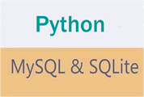

# 第十三章 Python 数据库编程

数据库适用于保存数据量巨大且具有复杂关系的数据，Python 为操作不同的数据库提供了不同的模块，但各位读者不用担心，这些模块内 API 的设计大同小异，因此掌握 Python 的一个数据库模块之后，再看其他数据库模块时就会有似曾相识的感觉。

为了让读者体会使用 Python 操作不同数据库的相似性，本章会分别介绍如何使用 Python 操作 SQLite 内置数据库和开源的 MySQL 数据库。

Python3.6 默认内置了操作 SQLite 数据库的模块，但如果 Python 程序需要操作 MySQL 数据库，则需要自行下载操作 MySQL 数据库的 Python 模块。